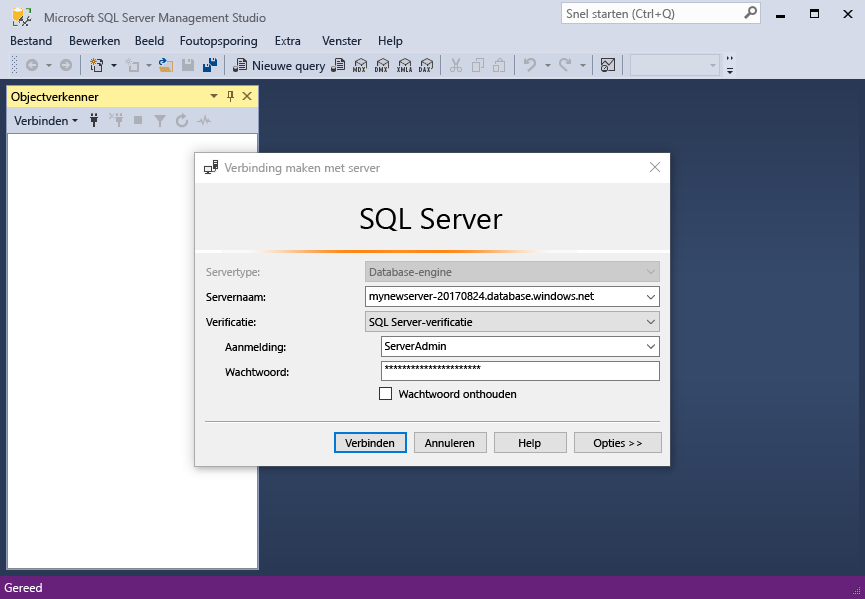
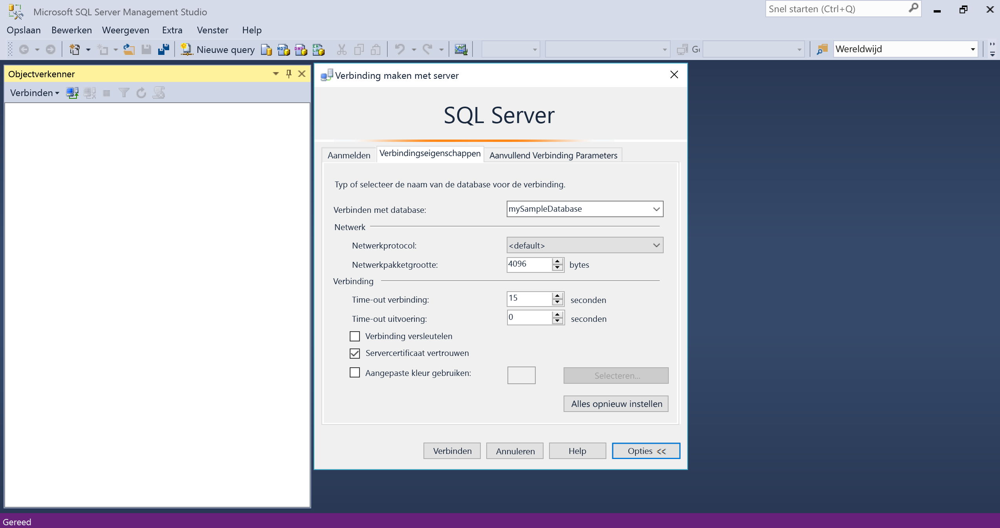
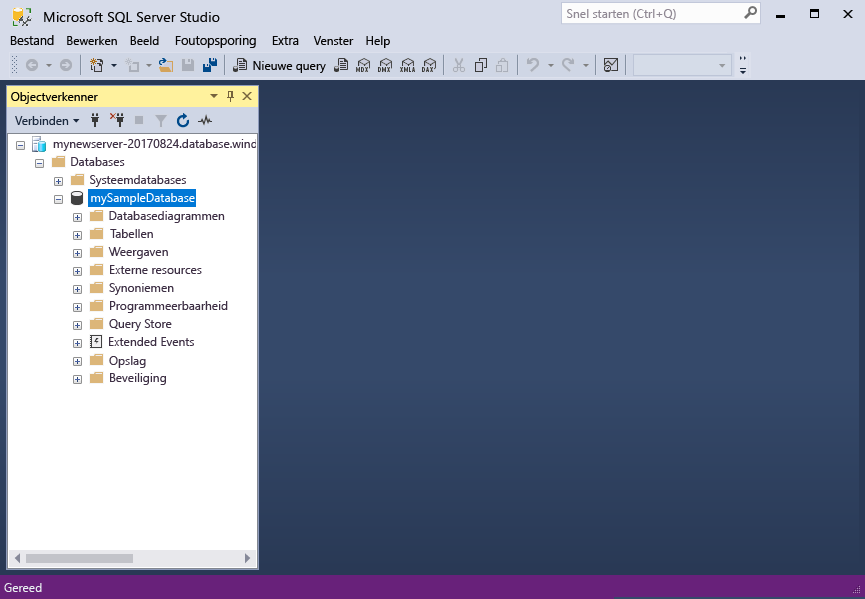
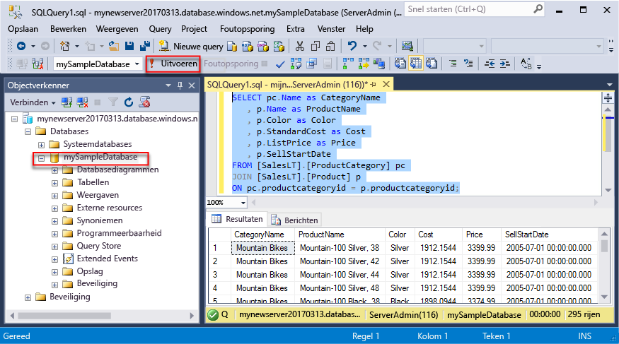
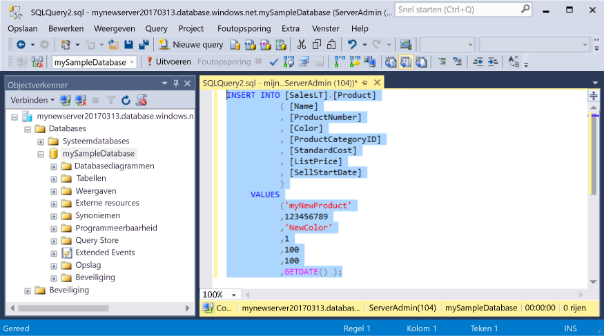
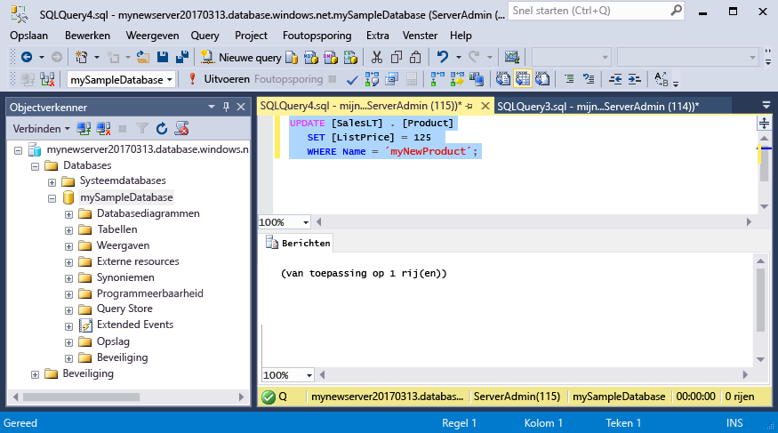
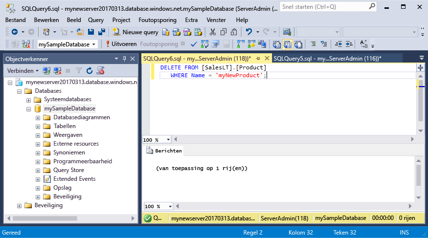

# <a name="azure-sql-database-use-sql-server-management-studio-tooconnect-and-query-data"></a><span data-ttu-id="a3fa5-105">Azure SQL Database: Gebruik SQL Server Management Studio tooconnect en query-gegevens</span><span class="sxs-lookup"><span data-stu-id="a3fa5-105">Azure SQL Database: Use SQL Server Management Studio tooconnect and query data</span></span>

<span data-ttu-id="a3fa5-106">[SQL Server Management Studio](https://msdn.microsoft.com/library/ms174173.aspx) (SSMS) is een geïntegreerde omgeving voor het beheren van elke SQL-infrastructuur van tooSQL van SQL Server-Database voor Microsoft Windows.</span><span class="sxs-lookup"><span data-stu-id="a3fa5-106">[SQL Server Management Studio](https://msdn.microsoft.com/library/ms174173.aspx) (SSMS) is an integrated environment for managing any SQL infrastructure, from SQL Server tooSQL Database for Microsoft Windows.</span></span> <span data-ttu-id="a3fa5-107">Deze snel starten laat zien hoe toouse SSMS tooconnect tooan Azure SQL database en vervolgens gebruik Transact-SQL-instructies tooquery, invoegen, bijwerken en verwijderen van gegevens in Hallo-database.</span><span class="sxs-lookup"><span data-stu-id="a3fa5-107">This quick start demonstrates how toouse SSMS tooconnect tooan Azure SQL database, and then use Transact-SQL statements tooquery, insert, update, and delete data in hello database.</span></span> 

## <a name="prerequisites"></a><span data-ttu-id="a3fa5-108">Vereisten</span><span class="sxs-lookup"><span data-stu-id="a3fa5-108">Prerequisites</span></span>

<span data-ttu-id="a3fa5-109">Deze snel starten wordt gebruikt als het eerste punt Hallo resources gemaakt in een van deze snel aan de slag:</span><span class="sxs-lookup"><span data-stu-id="a3fa5-109">This quick start uses as its starting point hello resources created in one of these quick starts:</span></span>

- [<span data-ttu-id="a3fa5-110">Database maken - Portal</span><span class="sxs-lookup"><span data-stu-id="a3fa5-110">Create DB - Portal</span></span>](sql-database-get-started-portal.md)
- [<span data-ttu-id="a3fa5-111">Database maken - CLI</span><span class="sxs-lookup"><span data-stu-id="a3fa5-111">Create DB - CLI</span></span>](sql-database-get-started-cli.md)
- [<span data-ttu-id="a3fa5-112">Database maken - PowerShell</span><span class="sxs-lookup"><span data-stu-id="a3fa5-112">Create DB - PowerShell</span></span>](sql-database-get-started-powershell.md)

<span data-ttu-id="a3fa5-113">Voordat u begint, moet u de nieuwste versie Hallo van hebben geïnstalleerd [SSMS](https://msdn.microsoft.com/library/mt238290.aspx).</span><span class="sxs-lookup"><span data-stu-id="a3fa5-113">Before you start, make sure you have installed hello newest version of [SSMS](https://msdn.microsoft.com/library/mt238290.aspx).</span></span> 

## <a name="sql-server-connection-information"></a><span data-ttu-id="a3fa5-114">SQL Server-verbindingsgegevens</span><span class="sxs-lookup"><span data-stu-id="a3fa5-114">SQL server connection information</span></span>

<span data-ttu-id="a3fa5-115">Hallo verbinding informatie die nodig is tooconnect toohello Azure SQL-database worden opgehaald.</span><span class="sxs-lookup"><span data-stu-id="a3fa5-115">Get hello connection information needed tooconnect toohello Azure SQL database.</span></span> <span data-ttu-id="a3fa5-116">U moet Hallo volledig gekwalificeerde servernaam, databasenaam en aanmeldingsgegevens in de volgende procedures Hallo.</span><span class="sxs-lookup"><span data-stu-id="a3fa5-116">You will need hello fully qualified server name, database name, and login information in hello next procedures.</span></span>

1. <span data-ttu-id="a3fa5-117">Meld u bij toohello [Azure-portal](https://portal.azure.com/).</span><span class="sxs-lookup"><span data-stu-id="a3fa5-117">Log in toohello [Azure portal](https://portal.azure.com/).</span></span>
2. <span data-ttu-id="a3fa5-118">Selecteer **SQL-Databases** Hallo links menu en klik op de database op Hallo **SQL-databases** pagina.</span><span class="sxs-lookup"><span data-stu-id="a3fa5-118">Select **SQL Databases** from hello left-hand menu, and click your database on hello **SQL databases** page.</span></span> 
3. <span data-ttu-id="a3fa5-119">Op Hallo **overzicht** pagina voor uw database, controleert u de volledig gekwalificeerde servernaam Hallo zoals weergegeven in onderstaande afbeelding voor Hallo.</span><span class="sxs-lookup"><span data-stu-id="a3fa5-119">On hello **Overview** page for your database, review hello fully qualified server name as shown in hello image below.</span></span> <span data-ttu-id="a3fa5-120">U kunt de muisaanwijzer op Hallo server name toobring up Hallo **klikt u op toocopy** optie.</span><span class="sxs-lookup"><span data-stu-id="a3fa5-120">You can hover over hello server name toobring up hello **Click toocopy** option.</span></span>

    

4. <span data-ttu-id="a3fa5-122">Als u Hallo aanmeldingsgegevens voor uw Azure SQL Database-server bent vergeten, navigeer toohello SQL server pagina tooview Hallo beheerder databaseservernaam en, indien nodig, opnieuw ingesteld wachtwoord Hallo.</span><span class="sxs-lookup"><span data-stu-id="a3fa5-122">If you have forgotten hello login information for your Azure SQL Database server, navigate toohello SQL Database server page tooview hello server admin name and, if necessary, reset hello password.</span></span> 

## <a name="connect-tooyour-database"></a><span data-ttu-id="a3fa5-123">Verbinding maken met database tooyour</span><span class="sxs-lookup"><span data-stu-id="a3fa5-123">Connect tooyour database</span></span>

<span data-ttu-id="a3fa5-124">Gebruik SQL Server Management Studio tooestablish een verbinding tooyour Azure SQL Database-server.</span><span class="sxs-lookup"><span data-stu-id="a3fa5-124">Use SQL Server Management Studio tooestablish a connection tooyour Azure SQL Database server.</span></span> 

> [!IMPORTANT]
> <span data-ttu-id="a3fa5-125">Een logische Azure SQL Database-server luistert naar poort 1433.</span><span class="sxs-lookup"><span data-stu-id="a3fa5-125">An Azure SQL Database logical server listens on port 1433.</span></span> <span data-ttu-id="a3fa5-126">Als u tooconnect tooan Azure SQL Database logische server vanuit een bedrijfsfirewall probeert, moet deze poort openen in de bedrijfsfirewall Hallo voor u toosuccessfully verbinding maken.</span><span class="sxs-lookup"><span data-stu-id="a3fa5-126">If you are attempting tooconnect tooan Azure SQL Database logical server from within a corporate firewall, this port must be open in hello corporate firewall for you toosuccessfully connect.</span></span>
>

1. <span data-ttu-id="a3fa5-127">Open SQL Server Management Studio.</span><span class="sxs-lookup"><span data-stu-id="a3fa5-127">Open SQL Server Management Studio.</span></span>

2. <span data-ttu-id="a3fa5-128">In Hallo **tooServer verbinding** dialoogvenster Voer Hallo volgende informatie:</span><span class="sxs-lookup"><span data-stu-id="a3fa5-128">In hello **Connect tooServer** dialog box, enter hello following information:</span></span>

   | <span data-ttu-id="a3fa5-129">Instelling</span><span class="sxs-lookup"><span data-stu-id="a3fa5-129">Setting</span></span>       | <span data-ttu-id="a3fa5-130">Voorgestelde waarde</span><span class="sxs-lookup"><span data-stu-id="a3fa5-130">Suggested value</span></span> | <span data-ttu-id="a3fa5-131">Beschrijving</span><span class="sxs-lookup"><span data-stu-id="a3fa5-131">Description</span></span> | 
   | ------------ | ------------------ | ------------------------------------------------- | 
   | <span data-ttu-id="a3fa5-132">**Servertype**</span><span class="sxs-lookup"><span data-stu-id="a3fa5-132">**Server type**</span></span> | <span data-ttu-id="a3fa5-133">Database-engine</span><span class="sxs-lookup"><span data-stu-id="a3fa5-133">Database engine</span></span> | <span data-ttu-id="a3fa5-134">Deze waarde is verplicht.</span><span class="sxs-lookup"><span data-stu-id="a3fa5-134">This value is required.</span></span> |
   | <span data-ttu-id="a3fa5-135">**Servernaam**</span><span class="sxs-lookup"><span data-stu-id="a3fa5-135">**Server name**</span></span> | <span data-ttu-id="a3fa5-136">de volledig gekwalificeerde servernaam Hallo</span><span class="sxs-lookup"><span data-stu-id="a3fa5-136">hello fully qualified server name</span></span> | <span data-ttu-id="a3fa5-137">Hallo naam moet er ongeveer als volgt: **mynewserver20170313.database.windows.net**.</span><span class="sxs-lookup"><span data-stu-id="a3fa5-137">hello name should be something like this: **mynewserver20170313.database.windows.net**.</span></span> |
   | <span data-ttu-id="a3fa5-138">**Verificatie**</span><span class="sxs-lookup"><span data-stu-id="a3fa5-138">**Authentication**</span></span> | <span data-ttu-id="a3fa5-139">SQL Server-verificatie</span><span class="sxs-lookup"><span data-stu-id="a3fa5-139">SQL Server Authentication</span></span> | <span data-ttu-id="a3fa5-140">SQL-verificatie is Hallo alleen verificatie die we in deze zelfstudie hebt geconfigureerd.</span><span class="sxs-lookup"><span data-stu-id="a3fa5-140">SQL Authentication is hello only authentication type that we have configured in this tutorial.</span></span> |
   | <span data-ttu-id="a3fa5-141">**Aanmelding**</span><span class="sxs-lookup"><span data-stu-id="a3fa5-141">**Login**</span></span> | <span data-ttu-id="a3fa5-142">Hallo server-beheerdersaccount</span><span class="sxs-lookup"><span data-stu-id="a3fa5-142">hello server admin account</span></span> | <span data-ttu-id="a3fa5-143">Dit is Hallo-account die u hebt opgegeven tijdens het Hallo-server maken.</span><span class="sxs-lookup"><span data-stu-id="a3fa5-143">This is hello account that you specified when you created hello server.</span></span> |
   | <span data-ttu-id="a3fa5-144">**Wachtwoord**</span><span class="sxs-lookup"><span data-stu-id="a3fa5-144">**Password**</span></span> | <span data-ttu-id="a3fa5-145">Hallo-wachtwoord voor uw server admin-account</span><span class="sxs-lookup"><span data-stu-id="a3fa5-145">hello password for your server admin account</span></span> | <span data-ttu-id="a3fa5-146">Dit is Hallo wachtwoord die u hebt opgegeven tijdens het Hallo-server maken.</span><span class="sxs-lookup"><span data-stu-id="a3fa5-146">This is hello password that you specified when you created hello server.</span></span> |

     

3. <span data-ttu-id="a3fa5-148">Klik op **opties** in Hallo **tooserver verbinding** in het dialoogvenster.</span><span class="sxs-lookup"><span data-stu-id="a3fa5-148">Click **Options** in hello **Connect tooserver** dialog box.</span></span> <span data-ttu-id="a3fa5-149">In Hallo **verbinding toodatabase** sectie, voert u **mySampleDatabase** tooconnect toothis database.</span><span class="sxs-lookup"><span data-stu-id="a3fa5-149">In hello **Connect toodatabase** section, enter **mySampleDatabase** tooconnect toothis database.</span></span>

     

4. <span data-ttu-id="a3fa5-151">Klik op **Verbinden**.</span><span class="sxs-lookup"><span data-stu-id="a3fa5-151">Click **Connect**.</span></span> <span data-ttu-id="a3fa5-152">Hallo Object Explorer-venster wordt geopend in SSMS.</span><span class="sxs-lookup"><span data-stu-id="a3fa5-152">hello Object Explorer window opens in SSMS.</span></span> 

     

5. <span data-ttu-id="a3fa5-154">Vouw in Object Explorer **Databases** en vouw vervolgens **mySampleDatabase** tooview Hallo objecten in Hallo-voorbeelddatabase.</span><span class="sxs-lookup"><span data-stu-id="a3fa5-154">In Object Explorer, expand **Databases** and then expand **mySampleDatabase** tooview hello objects in hello sample database.</span></span>

## <a name="query-data"></a><span data-ttu-id="a3fa5-155">Querygegevens</span><span class="sxs-lookup"><span data-stu-id="a3fa5-155">Query data</span></span>

<span data-ttu-id="a3fa5-156">Gebruik Hallo volgende code tooquery voor Hallo top 20 producten per categorie met Hallo [Selecteer](https://msdn.microsoft.com/library/ms189499.aspx) Transact-SQL-instructie.</span><span class="sxs-lookup"><span data-stu-id="a3fa5-156">Use hello following code tooquery for hello top 20 products by category using hello [SELECT](https://msdn.microsoft.com/library/ms189499.aspx) Transact-SQL statement.</span></span>

1. <span data-ttu-id="a3fa5-157">Klik in Objectverkenner met de rechtermuisknop op **mySampleDatabase** en klik vervolgens op **Nieuwe query**.</span><span class="sxs-lookup"><span data-stu-id="a3fa5-157">In Object Explorer, right-click **mySampleDatabase** and click **New Query**.</span></span> <span data-ttu-id="a3fa5-158">Een lege queryvenster wordt geopend die verbonden tooyour database.</span><span class="sxs-lookup"><span data-stu-id="a3fa5-158">A blank query window opens that is connected tooyour database.</span></span>
2. <span data-ttu-id="a3fa5-159">Voer in het queryvenster hello, Hallo query te volgen:</span><span class="sxs-lookup"><span data-stu-id="a3fa5-159">In hello query window, enter hello following query:</span></span>

   ```sql
   SELECT pc.Name as CategoryName, p.name as ProductName
   FROM [SalesLT].[ProductCategory] pc
   JOIN [SalesLT].[Product] p
   ON pc.productcategoryid = p.productcategoryid;
   ```

3. <span data-ttu-id="a3fa5-160">Op de werkbalk Hallo **Execute** tooretrieve gegevens uit Hallo Product en ProductCategory.</span><span class="sxs-lookup"><span data-stu-id="a3fa5-160">On hello toolbar, click **Execute** tooretrieve data from hello Product and ProductCategory tables.</span></span>

    

## <a name="insert-data"></a><span data-ttu-id="a3fa5-162">Gegevens invoegen</span><span class="sxs-lookup"><span data-stu-id="a3fa5-162">Insert data</span></span>

<span data-ttu-id="a3fa5-163">Gebruik Hallo volgende code tooinsert een nieuw product in Hallo SalesLT.Product tabel met Hallo [invoegen](https://msdn.microsoft.com/library/ms174335.aspx) Transact-SQL-instructie.</span><span class="sxs-lookup"><span data-stu-id="a3fa5-163">Use hello following code tooinsert a new product into hello SalesLT.Product table using hello [INSERT](https://msdn.microsoft.com/library/ms174335.aspx) Transact-SQL statement.</span></span>

1. <span data-ttu-id="a3fa5-164">In het queryvenster hello, kunt u Hallo vorige query vervangen door Hallo query te volgen:</span><span class="sxs-lookup"><span data-stu-id="a3fa5-164">In hello query window, replace hello previous query with hello following query:</span></span>

   ```sql
   INSERT INTO [SalesLT].[Product]
           ( [Name]
           , [ProductNumber]
           , [Color]
           , [ProductCategoryID]
           , [StandardCost]
           , [ListPrice]
           , [SellStartDate]
           )
     VALUES
           ('myNewProduct'
           ,123456789
           ,'NewColor'
           ,1
           ,100
           ,100
           ,GETDATE() );
   ```

2. <span data-ttu-id="a3fa5-165">Op de werkbalk Hallo **Execute** tooinsert een nieuwe rij in de tabel Hallo-Product.</span><span class="sxs-lookup"><span data-stu-id="a3fa5-165">On hello toolbar, click **Execute**  tooinsert a new row in hello Product table.</span></span>

    

## <a name="update-data"></a><span data-ttu-id="a3fa5-166">Gegevens bijwerken</span><span class="sxs-lookup"><span data-stu-id="a3fa5-166">Update data</span></span>

<span data-ttu-id="a3fa5-167">Gebruik Hallo volgende code tooupdate Hallo nieuw product dat u eerder hebt toegevoegd met behulp van Hallo [UPDATE](https://msdn.microsoft.com/library/ms177523.aspx) Transact-SQL-instructie.</span><span class="sxs-lookup"><span data-stu-id="a3fa5-167">Use hello following code tooupdate hello new product that you previously added using hello [UPDATE](https://msdn.microsoft.com/library/ms177523.aspx) Transact-SQL statement.</span></span>

1. <span data-ttu-id="a3fa5-168">In het queryvenster hello, kunt u Hallo vorige query vervangen door Hallo query te volgen:</span><span class="sxs-lookup"><span data-stu-id="a3fa5-168">In hello query window, replace hello previous query with hello following query:</span></span>

   ```sql
   UPDATE [SalesLT].[Product]
   SET [ListPrice] = 125
   WHERE Name = 'myNewProduct';
   ```

2. <span data-ttu-id="a3fa5-169">Op de werkbalk Hallo **Execute** tooupdate Hallo opgegeven rij in de tabel Hallo-Product.</span><span class="sxs-lookup"><span data-stu-id="a3fa5-169">On hello toolbar, click **Execute** tooupdate hello specified row in hello Product table.</span></span>

    

## <a name="delete-data"></a><span data-ttu-id="a3fa5-170">Gegevens verwijderen</span><span class="sxs-lookup"><span data-stu-id="a3fa5-170">Delete data</span></span>

<span data-ttu-id="a3fa5-171">Gebruik Hallo volgende code toodelete Hallo nieuw product dat u eerder hebt toegevoegd met behulp van Hallo [verwijderen](https://msdn.microsoft.com/library/ms189835.aspx) Transact-SQL-instructie.</span><span class="sxs-lookup"><span data-stu-id="a3fa5-171">Use hello following code toodelete hello new product that you previously added using hello [DELETE](https://msdn.microsoft.com/library/ms189835.aspx) Transact-SQL statement.</span></span>

1. <span data-ttu-id="a3fa5-172">In het queryvenster hello, kunt u Hallo vorige query vervangen door Hallo query te volgen:</span><span class="sxs-lookup"><span data-stu-id="a3fa5-172">In hello query window, replace hello previous query with hello following query:</span></span>

   ```sql
   DELETE FROM [SalesLT].[Product]
   WHERE Name = 'myNewProduct';
   ```

2. <span data-ttu-id="a3fa5-173">Op de werkbalk Hallo **Execute** toodelete Hallo opgegeven rij in de tabel Hallo-Product.</span><span class="sxs-lookup"><span data-stu-id="a3fa5-173">On hello toolbar, click **Execute** toodelete hello specified row in hello Product table.</span></span>

    

## <a name="next-steps"></a><span data-ttu-id="a3fa5-174">Volgende stappen</span><span class="sxs-lookup"><span data-stu-id="a3fa5-174">Next steps</span></span>

- <span data-ttu-id="a3fa5-175">toolearn over het maken en beheren van servers en databases met Transact-SQL, Zie [meer informatie over Azure SQL Database-servers en databases](sql-database-servers-databases.md).</span><span class="sxs-lookup"><span data-stu-id="a3fa5-175">toolearn about creating and managing servers and databases with Transact-SQL, see [Learn about Azure SQL Database servers and databases](sql-database-servers-databases.md).</span></span>
- <span data-ttu-id="a3fa5-176">Zie [SQL Server Management Studio gebruiken](https://msdn.microsoft.com/library/ms174173.aspx) voor meer informatie over SSMS.</span><span class="sxs-lookup"><span data-stu-id="a3fa5-176">For information about SSMS, see [Use SQL Server Management Studio](https://msdn.microsoft.com/library/ms174173.aspx).</span></span>
- <span data-ttu-id="a3fa5-177">Zie tooconnect en query met Visual Studio Code [Connect en query met Visual Studio Code](sql-database-connect-query-vscode.md).</span><span class="sxs-lookup"><span data-stu-id="a3fa5-177">tooconnect and query using Visual Studio Code, see [Connect and query with Visual Studio Code](sql-database-connect-query-vscode.md).</span></span>
- <span data-ttu-id="a3fa5-178">Zie tooconnect en query met .NET, [Connect en query met .NET](sql-database-connect-query-dotnet.md).</span><span class="sxs-lookup"><span data-stu-id="a3fa5-178">tooconnect and query using .NET, see [Connect and query with .NET](sql-database-connect-query-dotnet.md).</span></span>
- <span data-ttu-id="a3fa5-179">Zie tooconnect en query met PHP, [Connect en query met PHP](sql-database-connect-query-php.md).</span><span class="sxs-lookup"><span data-stu-id="a3fa5-179">tooconnect and query using PHP, see [Connect and query with PHP](sql-database-connect-query-php.md).</span></span>
- <span data-ttu-id="a3fa5-180">Zie tooconnect en query met behulp van Node.js, [Connect en query met behulp van Node.js](sql-database-connect-query-nodejs.md).</span><span class="sxs-lookup"><span data-stu-id="a3fa5-180">tooconnect and query using Node.js, see [Connect and query with Node.js](sql-database-connect-query-nodejs.md).</span></span>
- <span data-ttu-id="a3fa5-181">Zie tooconnect en query met Java, [Connect en query met Java](sql-database-connect-query-java.md).</span><span class="sxs-lookup"><span data-stu-id="a3fa5-181">tooconnect and query using Java, see [Connect and query with Java](sql-database-connect-query-java.md).</span></span>
- <span data-ttu-id="a3fa5-182">Zie tooconnect en query met behulp van Python, [Connect en query met behulp van Python](sql-database-connect-query-python.md).</span><span class="sxs-lookup"><span data-stu-id="a3fa5-182">tooconnect and query using Python, see [Connect and query with Python](sql-database-connect-query-python.md).</span></span>
- <span data-ttu-id="a3fa5-183">Zie tooconnect en query met Ruby, [Connect en query met Ruby](sql-database-connect-query-ruby.md).</span><span class="sxs-lookup"><span data-stu-id="a3fa5-183">tooconnect and query using Ruby, see [Connect and query with Ruby](sql-database-connect-query-ruby.md).</span></span>
