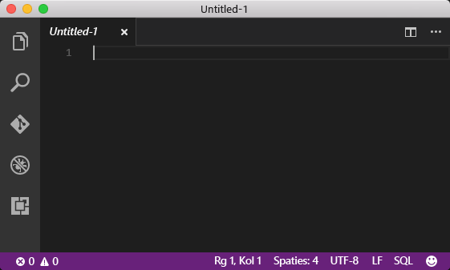
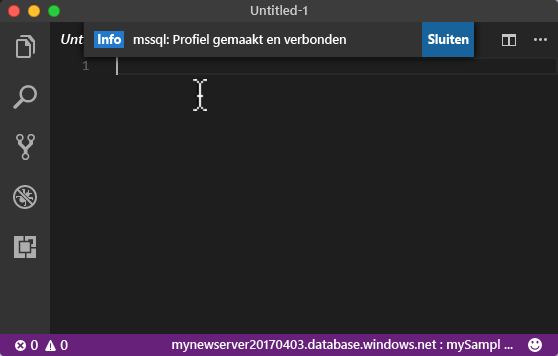
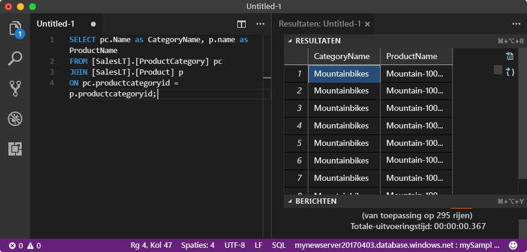

# <a name="azure-sql-database-use-visual-studio-code-tooconnect-and-query-data"></a><span data-ttu-id="3f5b7-105">Azure SQL Database: Gebruik Visual Studio Code tooconnect en query-gegevens</span><span class="sxs-lookup"><span data-stu-id="3f5b7-105">Azure SQL Database: Use Visual Studio Code tooconnect and query data</span></span>

<span data-ttu-id="3f5b7-106">[Visual Studio Code](https://code.visualstudio.com/docs) is een grafische code-editor voor Linux, Mac OS, en Windows die ondersteuning biedt voor extensies, met inbegrip Hallo [mssql-extensie](https://aka.ms/mssql-marketplace) voor query's in Microsoft SQL Server, Azure SQL Database en SQL Data Warehouse.</span><span class="sxs-lookup"><span data-stu-id="3f5b7-106">[Visual Studio Code](https://code.visualstudio.com/docs) is a graphical code editor for Linux, macOS, and Windows that supports extensions, including hello [mssql extension](https://aka.ms/mssql-marketplace) for querying Microsoft SQL Server, Azure SQL Database, and SQL Data Warehouse.</span></span> <span data-ttu-id="3f5b7-107">Deze snel starten laat zien hoe toouse Visual Studio Code tooconnect tooan Azure SQL database en vervolgens gebruik Transact-SQL-instructies tooquery, invoegen, bijwerken en verwijderen van gegevens in Hallo-database.</span><span class="sxs-lookup"><span data-stu-id="3f5b7-107">This quick start demonstrates how toouse Visual Studio Code tooconnect tooan Azure SQL database, and then use Transact-SQL statements tooquery, insert, update, and delete data in hello database.</span></span>

## <a name="prerequisites"></a><span data-ttu-id="3f5b7-108">Vereisten</span><span class="sxs-lookup"><span data-stu-id="3f5b7-108">Prerequisites</span></span>

<span data-ttu-id="3f5b7-109">Deze snel starten wordt gebruikt als het eerste punt Hallo resources gemaakt in een van deze snel aan de slag:</span><span class="sxs-lookup"><span data-stu-id="3f5b7-109">This quick start uses as its starting point hello resources created in one of these quick starts:</span></span>

- [<span data-ttu-id="3f5b7-110">Database maken - Portal</span><span class="sxs-lookup"><span data-stu-id="3f5b7-110">Create DB - Portal</span></span>](sql-database-get-started-portal.md)
- [<span data-ttu-id="3f5b7-111">Database maken - CLI</span><span class="sxs-lookup"><span data-stu-id="3f5b7-111">Create DB - CLI</span></span>](sql-database-get-started-cli.md)
- [<span data-ttu-id="3f5b7-112">Database maken - PowerShell</span><span class="sxs-lookup"><span data-stu-id="3f5b7-112">Create DB - PowerShell</span></span>](sql-database-get-started-powershell.md)

<span data-ttu-id="3f5b7-113">Voordat u begint, moet u de nieuwste versie Hallo van hebben geïnstalleerd [Visual Studio Code](https://code.visualstudio.com/Download) en geladen hello [mssql-extensie](https://aka.ms/mssql-marketplace).</span><span class="sxs-lookup"><span data-stu-id="3f5b7-113">Before you start, make sure you have installed hello newest version of [Visual Studio Code](https://code.visualstudio.com/Download) and loaded hello [mssql extension](https://aka.ms/mssql-marketplace).</span></span> <span data-ttu-id="3f5b7-114">Zie voor instructies voor Hallo mssql extensie installatie [VS-Code installeren](https://docs.microsoft.com/sql/linux/sql-server-linux-develop-use-vscode#install-vs-code) en Zie [mssql voor Visual Studio Code](https://marketplace.visualstudio.com/items?itemName=ms-mssql.mssql).</span><span class="sxs-lookup"><span data-stu-id="3f5b7-114">For installation guidance for hello mssql extension, see [Install VS Code](https://docs.microsoft.com/sql/linux/sql-server-linux-develop-use-vscode#install-vs-code) and see [mssql for Visual Studio Code](https://marketplace.visualstudio.com/items?itemName=ms-mssql.mssql).</span></span> 

## <a name="configure-vs-code"></a><span data-ttu-id="3f5b7-115">VS-code configureren</span><span class="sxs-lookup"><span data-stu-id="3f5b7-115">Configure VS Code</span></span> 

### <a name="mac-os"></a><span data-ttu-id="3f5b7-116">**Mac OS**</span><span class="sxs-lookup"><span data-stu-id="3f5b7-116">**Mac OS**</span></span>
<span data-ttu-id="3f5b7-117">Voor Mac OS moet u tooinstall OpenSSL die een bij vereisten voor DotNet Core die mssql-extensie gebruikt.</span><span class="sxs-lookup"><span data-stu-id="3f5b7-117">For macOS, you need tooinstall OpenSSL which is a prerequiste for DotNet Core that mssql extention uses.</span></span> <span data-ttu-id="3f5b7-118">Open de terminal en Voer Hallo opdrachten tooinstall na **brew** en **OpenSSL**.</span><span class="sxs-lookup"><span data-stu-id="3f5b7-118">Open your terminal and enter hello following commands tooinstall **brew** and **OpenSSL**.</span></span> 

```bash
ruby -e "$(curl -fsSL https://raw.githubusercontent.com/Homebrew/install/master/install)"
brew update
brew install openssl
mkdir -p /usr/local/lib
ln -s /usr/local/opt/openssl/lib/libcrypto.1.0.0.dylib /usr/local/lib/
ln -s /usr/local/opt/openssl/lib/libssl.1.0.0.dylib /usr/local/lib/
```

### <a name="linux-ubuntu"></a><span data-ttu-id="3f5b7-119">**Linux (Ubuntu)**</span><span class="sxs-lookup"><span data-stu-id="3f5b7-119">**Linux (Ubuntu)**</span></span>

<span data-ttu-id="3f5b7-120">Er is geen speciale configuratie vereist.</span><span class="sxs-lookup"><span data-stu-id="3f5b7-120">No special configuration needed.</span></span>

### <a name="windows"></a><span data-ttu-id="3f5b7-121">**Windows**</span><span class="sxs-lookup"><span data-stu-id="3f5b7-121">**Windows**</span></span>

<span data-ttu-id="3f5b7-122">Er is geen speciale configuratie vereist.</span><span class="sxs-lookup"><span data-stu-id="3f5b7-122">No special configuration needed.</span></span>

## <a name="sql-server-connection-information"></a><span data-ttu-id="3f5b7-123">SQL Server-verbindingsgegevens</span><span class="sxs-lookup"><span data-stu-id="3f5b7-123">SQL server connection information</span></span>

<span data-ttu-id="3f5b7-124">Hallo verbinding informatie die nodig is tooconnect toohello Azure SQL-database worden opgehaald.</span><span class="sxs-lookup"><span data-stu-id="3f5b7-124">Get hello connection information needed tooconnect toohello Azure SQL database.</span></span> <span data-ttu-id="3f5b7-125">U moet Hallo volledig gekwalificeerde servernaam, databasenaam en aanmeldingsgegevens in de volgende procedures Hallo.</span><span class="sxs-lookup"><span data-stu-id="3f5b7-125">You will need hello fully qualified server name, database name, and login information in hello next procedures.</span></span>

1. <span data-ttu-id="3f5b7-126">Meld u bij toohello [Azure-portal](https://portal.azure.com/).</span><span class="sxs-lookup"><span data-stu-id="3f5b7-126">Log in toohello [Azure portal](https://portal.azure.com/).</span></span>
2. <span data-ttu-id="3f5b7-127">Selecteer **SQL-Databases** Hallo links menu en klik op de database op Hallo **SQL-databases** pagina.</span><span class="sxs-lookup"><span data-stu-id="3f5b7-127">Select **SQL Databases** from hello left-hand menu, and click your database on hello **SQL databases** page.</span></span> 
3. <span data-ttu-id="3f5b7-128">Op Hallo **overzicht** servernaam pagina voor de database, bekijk Hallo volledig gekwalificeerd zoals weergegeven in Hallo installatiekopie te volgen.</span><span class="sxs-lookup"><span data-stu-id="3f5b7-128">On hello **Overview** page for your database, review hello fully qualified server name as shown in hello following image.</span></span> <span data-ttu-id="3f5b7-129">U kunt de muisaanwijzer op Hallo server name toobring up Hallo **klikt u op toocopy** optie.</span><span class="sxs-lookup"><span data-stu-id="3f5b7-129">You can hover over hello server name toobring up hello **Click toocopy** option.</span></span>

    

4. <span data-ttu-id="3f5b7-131">Als u Hallo aanmeldingsgegevens voor uw Azure SQL Database-server bent vergeten, navigeer toohello SQL server pagina tooview Hallo beheerder databaseservernaam en, indien nodig, opnieuw ingesteld wachtwoord Hallo.</span><span class="sxs-lookup"><span data-stu-id="3f5b7-131">If you have forgotten hello login information for your Azure SQL Database server, navigate toohello SQL Database server page tooview hello server admin name and, if necessary, reset hello password.</span></span> 

## <a name="set-language-mode-toosql"></a><span data-ttu-id="3f5b7-132">Set language modus tooSQL</span><span class="sxs-lookup"><span data-stu-id="3f5b7-132">Set language mode tooSQL</span></span>

<span data-ttu-id="3f5b7-133">Hallo taalmodus is ingesteld, te**SQL** in Visual Studio Code tooenable mssql opdrachten en IntelliSense T-SQL.</span><span class="sxs-lookup"><span data-stu-id="3f5b7-133">Set hello language mode is set too**SQL** in Visual Studio Code tooenable mssql commands and T-SQL IntelliSense.</span></span>

1. <span data-ttu-id="3f5b7-134">Open een nieuw Visual Studio Code venster.</span><span class="sxs-lookup"><span data-stu-id="3f5b7-134">Open a new Visual Studio Code window.</span></span> 

2. <span data-ttu-id="3f5b7-135">Klik op **tekst zonder opmaak** in Hallo rechterbenedenhoek van de statusbalk Hallo.</span><span class="sxs-lookup"><span data-stu-id="3f5b7-135">Click **Plain Text** in hello lower right-hand corner of hello status bar.</span></span>
3. <span data-ttu-id="3f5b7-136">In Hallo **modus van de geselecteerde taal** vervolgkeuzelijst dat wordt geopend, type **SQL**, en druk vervolgens op **ENTER** tooset Hallo taal modus tooSQL.</span><span class="sxs-lookup"><span data-stu-id="3f5b7-136">In hello **Select language mode** drop-down menu that opens, type **SQL**, and then press **ENTER** tooset hello language mode tooSQL.</span></span> 

   

## <a name="connect-tooyour-database"></a><span data-ttu-id="3f5b7-138">Verbinding maken met database tooyour</span><span class="sxs-lookup"><span data-stu-id="3f5b7-138">Connect tooyour database</span></span>

<span data-ttu-id="3f5b7-139">Gebruik Visual Studio Code tooestablish een verbinding tooyour Azure SQL Database-server.</span><span class="sxs-lookup"><span data-stu-id="3f5b7-139">Use Visual Studio Code tooestablish a connection tooyour Azure SQL Database server.</span></span>

> [!IMPORTANT]
> <span data-ttu-id="3f5b7-140">Voordat u doorgaat, zorgt u ervoor dat u uw server-, database- en aanmeldingsgegevens bij de hand hebt.</span><span class="sxs-lookup"><span data-stu-id="3f5b7-140">Before continuing, make sure that you have your server, database, and login information ready.</span></span> <span data-ttu-id="3f5b7-141">Nadat u begint met Hallo-verbindingsgegevens profiel invoeren als u de focus van Visual Studio Code wijzigt, hebt u toorestart maken Hallo-verbindingsprofiel.</span><span class="sxs-lookup"><span data-stu-id="3f5b7-141">Once you begin entering hello connection profile information, if you change your focus from Visual Studio Code, you have toorestart creating hello connection profile.</span></span>
>

1. <span data-ttu-id="3f5b7-142">Druk in VS-Code op **CTRL + SHIFT + P** (of **F1**) tooopen Hallo opdracht palet.</span><span class="sxs-lookup"><span data-stu-id="3f5b7-142">In VS Code, press **CTRL+SHIFT+P** (or **F1**) tooopen hello Command Palette.</span></span>

2. <span data-ttu-id="3f5b7-143">Typ **sqlcon** en druk op **ENTER**.</span><span class="sxs-lookup"><span data-stu-id="3f5b7-143">Type **sqlcon** and press **ENTER**.</span></span>

3. <span data-ttu-id="3f5b7-144">Druk op **ENTER** tooselect **verbindingsprofiel maken**.</span><span class="sxs-lookup"><span data-stu-id="3f5b7-144">Press **ENTER** tooselect **Create Connection Profile**.</span></span> <span data-ttu-id="3f5b7-145">Hiermee wordt een verbindingsprofiel gemaakt voor uw exemplaar van SQL Server.</span><span class="sxs-lookup"><span data-stu-id="3f5b7-145">This creates a connection profile for your SQL Server instance.</span></span>

4. <span data-ttu-id="3f5b7-146">Ga als volgt Hallo prompts toospecify Hallo verbindingseigenschappen voor de nieuwe verbindingsprofiel Hallo.</span><span class="sxs-lookup"><span data-stu-id="3f5b7-146">Follow hello prompts toospecify hello connection properties for hello new connection profile.</span></span> <span data-ttu-id="3f5b7-147">Druk na elke waarde opgeeft, op **ENTER** toocontinue.</span><span class="sxs-lookup"><span data-stu-id="3f5b7-147">After specifying each value, press **ENTER** toocontinue.</span></span> 

   | <span data-ttu-id="3f5b7-148">Instelling</span><span class="sxs-lookup"><span data-stu-id="3f5b7-148">Setting</span></span>       | <span data-ttu-id="3f5b7-149">Voorgestelde waarde</span><span class="sxs-lookup"><span data-stu-id="3f5b7-149">Suggested value</span></span> | <span data-ttu-id="3f5b7-150">Beschrijving</span><span class="sxs-lookup"><span data-stu-id="3f5b7-150">Description</span></span> |
   | ------------ | ------------------ | ------------------------------------------------- | 
   | <span data-ttu-id="3f5b7-151">**Servernaam</span><span class="sxs-lookup"><span data-stu-id="3f5b7-151">**Server name</span></span> | <span data-ttu-id="3f5b7-152">de volledig gekwalificeerde servernaam Hallo</span><span class="sxs-lookup"><span data-stu-id="3f5b7-152">hello fully qualified server name</span></span> | <span data-ttu-id="3f5b7-153">Hallo naam moet er ongeveer als volgt: **mynewserver20170313.database.windows.net**.</span><span class="sxs-lookup"><span data-stu-id="3f5b7-153">hello name should be something like this: **mynewserver20170313.database.windows.net**.</span></span> |
   | <span data-ttu-id="3f5b7-154">**Databasenaam**</span><span class="sxs-lookup"><span data-stu-id="3f5b7-154">**Database name**</span></span> | <span data-ttu-id="3f5b7-155">mySampleDatabase</span><span class="sxs-lookup"><span data-stu-id="3f5b7-155">mySampleDatabase</span></span> | <span data-ttu-id="3f5b7-156">Hallo-naam van Hallo database toowhich tooconnect.</span><span class="sxs-lookup"><span data-stu-id="3f5b7-156">hello name of hello database toowhich tooconnect.</span></span> |
   | <span data-ttu-id="3f5b7-157">**Verificatie**</span><span class="sxs-lookup"><span data-stu-id="3f5b7-157">**Authentication**</span></span> | <span data-ttu-id="3f5b7-158">SQL-aanmelding</span><span class="sxs-lookup"><span data-stu-id="3f5b7-158">SQL Login</span></span>| <span data-ttu-id="3f5b7-159">SQL-verificatie is Hallo alleen verificatie die we in deze zelfstudie hebt geconfigureerd.</span><span class="sxs-lookup"><span data-stu-id="3f5b7-159">SQL Authentication is hello only authentication type that we have configured in this tutorial.</span></span> |
   | <span data-ttu-id="3f5b7-160">**Gebruikersnaam**</span><span class="sxs-lookup"><span data-stu-id="3f5b7-160">**User name**</span></span> | <span data-ttu-id="3f5b7-161">Hallo server-beheerdersaccount</span><span class="sxs-lookup"><span data-stu-id="3f5b7-161">hello server admin account</span></span> | <span data-ttu-id="3f5b7-162">Dit is Hallo-account die u hebt opgegeven tijdens het Hallo-server maken.</span><span class="sxs-lookup"><span data-stu-id="3f5b7-162">This is hello account that you specified when you created hello server.</span></span> |
   | <span data-ttu-id="3f5b7-163">**Wachtwoord (SQL-aanmelding)**</span><span class="sxs-lookup"><span data-stu-id="3f5b7-163">**Password (SQL Login)**</span></span> | <span data-ttu-id="3f5b7-164">Hallo-wachtwoord voor uw server admin-account</span><span class="sxs-lookup"><span data-stu-id="3f5b7-164">hello password for your server admin account</span></span> | <span data-ttu-id="3f5b7-165">Dit is Hallo wachtwoord die u hebt opgegeven tijdens het Hallo-server maken.</span><span class="sxs-lookup"><span data-stu-id="3f5b7-165">This is hello password that you specified when you created hello server.</span></span> |
   | <span data-ttu-id="3f5b7-166">**Wachtwoord opslaan?**</span><span class="sxs-lookup"><span data-stu-id="3f5b7-166">**Save Password?**</span></span> | <span data-ttu-id="3f5b7-167">Ja of nee</span><span class="sxs-lookup"><span data-stu-id="3f5b7-167">Yes or No</span></span> | <span data-ttu-id="3f5b7-168">Selecteer Ja als u dat tooenter Hallo wachtwoord niet elke keer wilt.</span><span class="sxs-lookup"><span data-stu-id="3f5b7-168">Select Yes if you do not want tooenter hello password each time.</span></span> |
   | <span data-ttu-id="3f5b7-169">**Voer een naam in voor dit profiel**</span><span class="sxs-lookup"><span data-stu-id="3f5b7-169">**Enter a name for this profile**</span></span> | <span data-ttu-id="3f5b7-170">Een profielnaam, zoals **mySampleDatabase**</span><span class="sxs-lookup"><span data-stu-id="3f5b7-170">A profile name, such as **mySampleDatabase**</span></span> | <span data-ttu-id="3f5b7-171">Een opgeslagen profiel zorgt ervoor dat de verbinding sneller tot stand komt bij toekomstige aanmeldingen.</span><span class="sxs-lookup"><span data-stu-id="3f5b7-171">A saved profile name speeds your connection on subsequent logins.</span></span> | 

5. <span data-ttu-id="3f5b7-172">Druk op Hallo **ESC** key tooclose Hallo infobericht wordt gemeld dat Hallo-profiel is gemaakt en is verbonden.</span><span class="sxs-lookup"><span data-stu-id="3f5b7-172">Press hello **ESC** key tooclose hello info message that informs you that hello profile is created and connected.</span></span>

6. <span data-ttu-id="3f5b7-173">Controleer of de verbinding in de statusbalk Hallo.</span><span class="sxs-lookup"><span data-stu-id="3f5b7-173">Verify your connection in hello status bar.</span></span>

   

## <a name="query-data"></a><span data-ttu-id="3f5b7-175">Querygegevens</span><span class="sxs-lookup"><span data-stu-id="3f5b7-175">Query data</span></span>

<span data-ttu-id="3f5b7-176">Gebruik Hallo volgende code tooquery voor Hallo top 20 producten per categorie met Hallo [Selecteer](https://msdn.microsoft.com/library/ms189499.aspx) Transact-SQL-instructie.</span><span class="sxs-lookup"><span data-stu-id="3f5b7-176">Use hello following code tooquery for hello top 20 products by category using hello [SELECT](https://msdn.microsoft.com/library/ms189499.aspx) Transact-SQL statement.</span></span>

1. <span data-ttu-id="3f5b7-177">In Hallo **Editor** venster, voer de volgende query in de lege queryvenster Hallo Hallo:</span><span class="sxs-lookup"><span data-stu-id="3f5b7-177">In hello **Editor** window, enter hello following query in hello empty query window:</span></span>

   ```sql
   SELECT pc.Name as CategoryName, p.name as ProductName
   FROM [SalesLT].[ProductCategory] pc
   JOIN [SalesLT].[Product] p
   ON pc.productcategoryid = p.productcategoryid;
   ```

2. <span data-ttu-id="3f5b7-178">Druk op **CTRL + SHIFT + E** tooretrieve gegevens uit Hallo Product en ProductCategory.</span><span class="sxs-lookup"><span data-stu-id="3f5b7-178">Press **CTRL+SHIFT+E** tooretrieve data from hello Product and ProductCategory tables.</span></span>

    

## <a name="insert-data"></a><span data-ttu-id="3f5b7-180">Gegevens invoegen</span><span class="sxs-lookup"><span data-stu-id="3f5b7-180">Insert data</span></span>

<span data-ttu-id="3f5b7-181">Gebruik Hallo volgende code tooinsert een nieuw product in Hallo SalesLT.Product tabel met Hallo [invoegen](https://msdn.microsoft.com/library/ms174335.aspx) Transact-SQL-instructie.</span><span class="sxs-lookup"><span data-stu-id="3f5b7-181">Use hello following code tooinsert a new product into hello SalesLT.Product table using hello [INSERT](https://msdn.microsoft.com/library/ms174335.aspx) Transact-SQL statement.</span></span>

1. <span data-ttu-id="3f5b7-182">In Hallo **Editor** venster Hallo vorige query en Voer Hallo query te volgen:</span><span class="sxs-lookup"><span data-stu-id="3f5b7-182">In hello **Editor** window, delete hello previous query and enter hello following query:</span></span>

   ```sql
   INSERT INTO [SalesLT].[Product]
           ( [Name]
           , [ProductNumber]
           , [Color]
           , [ProductCategoryID]
           , [StandardCost]
           , [ListPrice]
           , [SellStartDate]
           )
     VALUES
           ('myNewProduct'
           ,123456789
           ,'NewColor'
           ,1
           ,100
           ,100
           ,GETDATE() );
   ```

2. <span data-ttu-id="3f5b7-183">Druk op **CTRL + SHIFT + E** tooinsert een nieuwe rij in de tabel Hallo-Product.</span><span class="sxs-lookup"><span data-stu-id="3f5b7-183">Press **CTRL+SHIFT+E** tooinsert a new row in hello Product table.</span></span>

## <a name="update-data"></a><span data-ttu-id="3f5b7-184">Gegevens bijwerken</span><span class="sxs-lookup"><span data-stu-id="3f5b7-184">Update data</span></span>

<span data-ttu-id="3f5b7-185">Gebruik Hallo volgende code tooupdate Hallo nieuw product dat u eerder hebt toegevoegd met behulp van Hallo [UPDATE](https://msdn.microsoft.com/library/ms177523.aspx) Transact-SQL-instructie.</span><span class="sxs-lookup"><span data-stu-id="3f5b7-185">Use hello following code tooupdate hello new product that you previously added using hello [UPDATE](https://msdn.microsoft.com/library/ms177523.aspx) Transact-SQL statement.</span></span>

1.  <span data-ttu-id="3f5b7-186">In Hallo **Editor** venster Hallo vorige query en Voer Hallo query te volgen:</span><span class="sxs-lookup"><span data-stu-id="3f5b7-186">In hello **Editor** window, delete hello previous query and enter hello following query:</span></span>

   ```sql
   UPDATE [SalesLT].[Product]
   SET [ListPrice] = 125
   WHERE Name = 'myNewProduct';
   ```

2. <span data-ttu-id="3f5b7-187">Druk op **CTRL + SHIFT + E** tooupdate Hallo opgegeven rij in de tabel Hallo-Product.</span><span class="sxs-lookup"><span data-stu-id="3f5b7-187">Press **CTRL+SHIFT+E** tooupdate hello specified row in hello Product table.</span></span>

## <a name="delete-data"></a><span data-ttu-id="3f5b7-188">Gegevens verwijderen</span><span class="sxs-lookup"><span data-stu-id="3f5b7-188">Delete data</span></span>

<span data-ttu-id="3f5b7-189">Gebruik Hallo volgende code toodelete Hallo nieuw product dat u eerder hebt toegevoegd met behulp van Hallo [verwijderen](https://msdn.microsoft.com/library/ms189835.aspx) Transact-SQL-instructie.</span><span class="sxs-lookup"><span data-stu-id="3f5b7-189">Use hello following code toodelete hello new product that you previously added using hello [DELETE](https://msdn.microsoft.com/library/ms189835.aspx) Transact-SQL statement.</span></span>

1. <span data-ttu-id="3f5b7-190">In Hallo **Editor** venster Hallo vorige query en Voer Hallo query te volgen:</span><span class="sxs-lookup"><span data-stu-id="3f5b7-190">In hello **Editor** window, delete hello previous query and enter hello following query:</span></span>

   ```sql
   DELETE FROM [SalesLT].[Product]
   WHERE Name = 'myNewProduct';
   ```

2. <span data-ttu-id="3f5b7-191">Druk op **CTRL + SHIFT + E** toodelete Hallo opgegeven rij in de tabel Hallo-Product.</span><span class="sxs-lookup"><span data-stu-id="3f5b7-191">Press **CTRL+SHIFT+E** toodelete hello specified row in hello Product table.</span></span>

## <a name="next-steps"></a><span data-ttu-id="3f5b7-192">Volgende stappen</span><span class="sxs-lookup"><span data-stu-id="3f5b7-192">Next steps</span></span>

- <span data-ttu-id="3f5b7-193">Zie tooconnect en query met SQL Server Management Studio [Connect en query met SSMS](sql-database-connect-query-ssms.md).</span><span class="sxs-lookup"><span data-stu-id="3f5b7-193">tooconnect and query using SQL Server Management Studio, see [Connect and query with SSMS](sql-database-connect-query-ssms.md).</span></span>
- <span data-ttu-id="3f5b7-194">Zie het blogbericht [Create a database IDE with MSSQL extension](https://msdn.microsoft.com/magazine/mt809115) voor een MSDN-artikel over het gebruik van Visual Studio Code.</span><span class="sxs-lookup"><span data-stu-id="3f5b7-194">For an MSDN magazine article on using Visual Studio Code, see [Create a database IDE with MSSQL extension blog post](https://msdn.microsoft.com/magazine/mt809115).</span></span>
