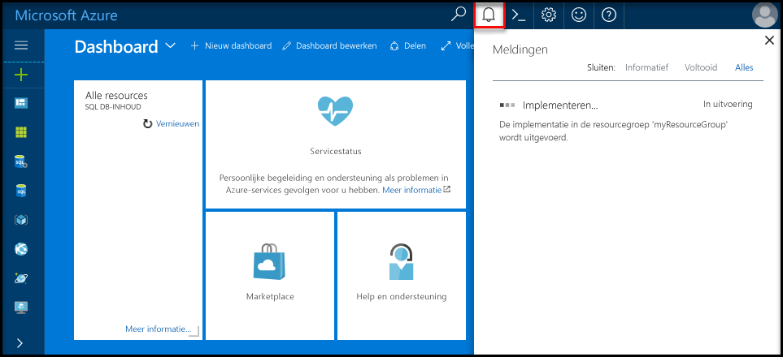
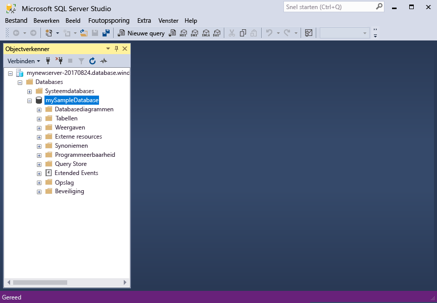

# <a name="design-your-first-azure-sql-database"></a><span data-ttu-id="f0dc5-103">Ontwerp van uw eerste Azure SQL database</span><span class="sxs-lookup"><span data-stu-id="f0dc5-103">Design your first Azure SQL database</span></span>

<span data-ttu-id="f0dc5-104">Azure SQL-Database is een relationele database als een service (DBaaS) in Hallo Microsoft Cloud ('Azure').</span><span class="sxs-lookup"><span data-stu-id="f0dc5-104">Azure SQL Database is a relational database-as-a service (DBaaS) in hello Microsoft Cloud ("Azure").</span></span> <span data-ttu-id="f0dc5-105">In deze zelfstudie leert u hoe toouse hello Azure-portal en [SQL Server Management Studio](https://msdn.microsoft.com/library/ms174173.aspx) (SSMS) naar:</span><span class="sxs-lookup"><span data-stu-id="f0dc5-105">In this tutorial, you learn how toouse hello Azure portal and [SQL Server Management Studio](https://msdn.microsoft.com/library/ms174173.aspx) (SSMS) to:</span></span> 

> [!div class="checklist"]
> * <span data-ttu-id="f0dc5-106">Maak een database in hello Azure-portal</span><span class="sxs-lookup"><span data-stu-id="f0dc5-106">Create a database in hello Azure portal</span></span>
> * <span data-ttu-id="f0dc5-107">Een firewallregel op serverniveau in hello Azure-portal instellen</span><span class="sxs-lookup"><span data-stu-id="f0dc5-107">Set up a server-level firewall rule in hello Azure portal</span></span>
> * <span data-ttu-id="f0dc5-108">Verbinding maken met toohello database met SSMS</span><span class="sxs-lookup"><span data-stu-id="f0dc5-108">Connect toohello database with SSMS</span></span>
> * <span data-ttu-id="f0dc5-109">Tabellen maken met SSMS</span><span class="sxs-lookup"><span data-stu-id="f0dc5-109">Create tables with SSMS</span></span>
> * <span data-ttu-id="f0dc5-110">Gegevens voor bulksgewijs laden met BCP</span><span class="sxs-lookup"><span data-stu-id="f0dc5-110">Bulk load data with BCP</span></span>
> * <span data-ttu-id="f0dc5-111">Opvragen van die gegevens met SSMS</span><span class="sxs-lookup"><span data-stu-id="f0dc5-111">Query that data with SSMS</span></span>
> * <span data-ttu-id="f0dc5-112">Hallo database tooa vorige herstellen [wijst naar een bepaald tijstip](sql-database-recovery-using-backups.md#point-in-time-restore) in hello Azure-portal</span><span class="sxs-lookup"><span data-stu-id="f0dc5-112">Restore hello database tooa previous [point in time restore](sql-database-recovery-using-backups.md#point-in-time-restore) in hello Azure portal</span></span>

<span data-ttu-id="f0dc5-113">Als u een Azure-abonnement geen [een gratis account maken](https://azure.microsoft.com/free/) voordat u begint.</span><span class="sxs-lookup"><span data-stu-id="f0dc5-113">If you don't have an Azure subscription, [create a free account](https://azure.microsoft.com/free/) before you begin.</span></span>

## <a name="prerequisites"></a><span data-ttu-id="f0dc5-114">Vereisten</span><span class="sxs-lookup"><span data-stu-id="f0dc5-114">Prerequisites</span></span>

<span data-ttu-id="f0dc5-115">toocomplete deze zelfstudie, zorg ervoor dat u hebt geïnstalleerd:</span><span class="sxs-lookup"><span data-stu-id="f0dc5-115">toocomplete this tutorial, make sure you have installed:</span></span>
- <span data-ttu-id="f0dc5-116">de nieuwste versie Hallo van [SQL Server Management Studio](https://msdn.microsoft.com/library/ms174173.aspx) (SSMS).</span><span class="sxs-lookup"><span data-stu-id="f0dc5-116">hello newest version of [SQL Server Management Studio](https://msdn.microsoft.com/library/ms174173.aspx) (SSMS).</span></span>
- <span data-ttu-id="f0dc5-117">de nieuwste versie Hallo van [BCP en SQLCMD](https://www.microsoft.com/download/details.aspx?id=36433).</span><span class="sxs-lookup"><span data-stu-id="f0dc5-117">hello newest version of [BCP and SQLCMD](https://www.microsoft.com/download/details.aspx?id=36433).</span></span>

## <a name="log-in-toohello-azure-portal"></a><span data-ttu-id="f0dc5-118">Meld u bij toohello Azure-portal</span><span class="sxs-lookup"><span data-stu-id="f0dc5-118">Log in toohello Azure portal</span></span>

<span data-ttu-id="f0dc5-119">Meld u bij toohello [Azure-portal](https://portal.azure.com/).</span><span class="sxs-lookup"><span data-stu-id="f0dc5-119">Log in toohello [Azure portal](https://portal.azure.com/).</span></span>

## <a name="create-a-blank-sql-database"></a><span data-ttu-id="f0dc5-120">Een lege SQL-database maken</span><span class="sxs-lookup"><span data-stu-id="f0dc5-120">Create a blank SQL database</span></span>

<span data-ttu-id="f0dc5-121">Een Azure SQL-database wordt gemaakt met een gedefinieerde set [reken- en opslagresources](sql-database-service-tiers.md).</span><span class="sxs-lookup"><span data-stu-id="f0dc5-121">An Azure SQL database is created with a defined set of [compute and storage resources](sql-database-service-tiers.md).</span></span> <span data-ttu-id="f0dc5-122">Hallo-database wordt gemaakt binnen een [Azure-resourcegroep](../azure-resource-manager/resource-group-overview.md) en in een [logische Azure SQL Database-server](sql-database-features.md).</span><span class="sxs-lookup"><span data-stu-id="f0dc5-122">hello database is created within an [Azure resource group](../azure-resource-manager/resource-group-overview.md) and in an [Azure SQL Database logical server](sql-database-features.md).</span></span> 

<span data-ttu-id="f0dc5-123">Volg deze stappen toocreate een lege SQL-database.</span><span class="sxs-lookup"><span data-stu-id="f0dc5-123">Follow these steps toocreate a blank SQL database.</span></span> 

1. <span data-ttu-id="f0dc5-124">Klik op Hallo **nieuw** knop gevonden op Hallo linkerbovenhoek Hallo Azure-portal.</span><span class="sxs-lookup"><span data-stu-id="f0dc5-124">Click hello **New** button found on hello upper left-hand corner of hello Azure portal.</span></span>

2. <span data-ttu-id="f0dc5-125">Selecteer **Databases** van Hallo **nieuw** pagina en selecteer **SQL-Database** van Hallo **Databases** pagina.</span><span class="sxs-lookup"><span data-stu-id="f0dc5-125">Select **Databases** from hello **New** page, and select **SQL Database** from hello **Databases** page.</span></span> 

   

3. <span data-ttu-id="f0dc5-127">Hallo SQL-Database formulier invullen Hello volgende informatie, zoals wordt weergegeven op Hallo voorafgaand aan de installatiekopie:</span><span class="sxs-lookup"><span data-stu-id="f0dc5-127">Fill out hello SQL Database form with hello following information, as shown on hello preceding image:</span></span>   

   | <span data-ttu-id="f0dc5-128">Instelling</span><span class="sxs-lookup"><span data-stu-id="f0dc5-128">Setting</span></span>       | <span data-ttu-id="f0dc5-129">Voorgestelde waarde</span><span class="sxs-lookup"><span data-stu-id="f0dc5-129">Suggested value</span></span> | <span data-ttu-id="f0dc5-130">Beschrijving</span><span class="sxs-lookup"><span data-stu-id="f0dc5-130">Description</span></span> | 
   | ------------ | ------------------ | ------------------------------------------------- | 
   | <span data-ttu-id="f0dc5-131">**Databasenaam**</span><span class="sxs-lookup"><span data-stu-id="f0dc5-131">**Database name**</span></span> | <span data-ttu-id="f0dc5-132">mySampleDatabase</span><span class="sxs-lookup"><span data-stu-id="f0dc5-132">mySampleDatabase</span></span> | <span data-ttu-id="f0dc5-133">Zie [Database-id's](https://docs.microsoft.com/sql/relational-databases/databases/database-identifiers) voor geldige databasenamen.</span><span class="sxs-lookup"><span data-stu-id="f0dc5-133">For valid database names, see [Database Identifiers](https://docs.microsoft.com/sql/relational-databases/databases/database-identifiers).</span></span> | 
   | <span data-ttu-id="f0dc5-134">**Abonnement**</span><span class="sxs-lookup"><span data-stu-id="f0dc5-134">**Subscription**</span></span> | <span data-ttu-id="f0dc5-135">Uw abonnement</span><span class="sxs-lookup"><span data-stu-id="f0dc5-135">Your subscription</span></span>  | <span data-ttu-id="f0dc5-136">Zie [Abonnementen](https://account.windowsazure.com/Subscriptions) voor meer informatie over uw abonnementen.</span><span class="sxs-lookup"><span data-stu-id="f0dc5-136">For details about your subscriptions, see [Subscriptions](https://account.windowsazure.com/Subscriptions).</span></span> |
   | <span data-ttu-id="f0dc5-137">**Resourcegroep**</span><span class="sxs-lookup"><span data-stu-id="f0dc5-137">**Resource group**</span></span> | <span data-ttu-id="f0dc5-138">myResourceGroup</span><span class="sxs-lookup"><span data-stu-id="f0dc5-138">myResourceGroup</span></span> | <span data-ttu-id="f0dc5-139">Zie [Naming conventions](https://docs.microsoft.com/azure/architecture/best-practices/naming-conventions) (Naamgevingsconventies) voor geldige resourcegroepnamen.</span><span class="sxs-lookup"><span data-stu-id="f0dc5-139">For valid resource group names, see [Naming rules and restrictions](https://docs.microsoft.com/azure/architecture/best-practices/naming-conventions).</span></span> |
   | <span data-ttu-id="f0dc5-140">**Bron selecteren**</span><span class="sxs-lookup"><span data-stu-id="f0dc5-140">**Select source**</span></span> | <span data-ttu-id="f0dc5-141">Lege database</span><span class="sxs-lookup"><span data-stu-id="f0dc5-141">Blank database</span></span> | <span data-ttu-id="f0dc5-142">Hiermee geeft u op dat een lege database moet worden gemaakt.</span><span class="sxs-lookup"><span data-stu-id="f0dc5-142">Specifies that a blank database should be created.</span></span> |

4. <span data-ttu-id="f0dc5-143">Klik op **Server** toocreate en een nieuwe server configureren voor de nieuwe database.</span><span class="sxs-lookup"><span data-stu-id="f0dc5-143">Click **Server** toocreate and configure a new server for your new database.</span></span> <span data-ttu-id="f0dc5-144">Hallo invullen **nieuwe serverformulier** Hello volgende informatie:</span><span class="sxs-lookup"><span data-stu-id="f0dc5-144">Fill out hello **New server form** with hello following information:</span></span> 

   | <span data-ttu-id="f0dc5-145">Instelling</span><span class="sxs-lookup"><span data-stu-id="f0dc5-145">Setting</span></span>       | <span data-ttu-id="f0dc5-146">Voorgestelde waarde</span><span class="sxs-lookup"><span data-stu-id="f0dc5-146">Suggested value</span></span> | <span data-ttu-id="f0dc5-147">Beschrijving</span><span class="sxs-lookup"><span data-stu-id="f0dc5-147">Description</span></span> | 
   | ------------ | ------------------ | ------------------------------------------------- | 
   | <span data-ttu-id="f0dc5-148">**Servernaam**</span><span class="sxs-lookup"><span data-stu-id="f0dc5-148">**Server name**</span></span> | <span data-ttu-id="f0dc5-149">Een wereldwijd unieke naam</span><span class="sxs-lookup"><span data-stu-id="f0dc5-149">Any globally unique name</span></span> | <span data-ttu-id="f0dc5-150">Zie [Naming conventions](https://docs.microsoft.com/azure/architecture/best-practices/naming-conventions) (Naamgevingsconventies) voor geldige servernamen.</span><span class="sxs-lookup"><span data-stu-id="f0dc5-150">For valid server names, see [Naming rules and restrictions](https://docs.microsoft.com/azure/architecture/best-practices/naming-conventions).</span></span> | 
   | <span data-ttu-id="f0dc5-151">**Aanmeldgegevens van serverbeheerder**</span><span class="sxs-lookup"><span data-stu-id="f0dc5-151">**Server admin login**</span></span> | <span data-ttu-id="f0dc5-152">Een geldige naam</span><span class="sxs-lookup"><span data-stu-id="f0dc5-152">Any valid name</span></span> | <span data-ttu-id="f0dc5-153">Zie [Database-id's](https://docs.microsoft.com/sql/relational-databases/databases/database-identifiers) voor geldige aanmeldingsnamen.</span><span class="sxs-lookup"><span data-stu-id="f0dc5-153">For valid login names, see [Database Identifiers](https://docs.microsoft.com/sql/relational-databases/databases/database-identifiers).</span></span>|
   | <span data-ttu-id="f0dc5-154">**Wachtwoord**</span><span class="sxs-lookup"><span data-stu-id="f0dc5-154">**Password**</span></span> | <span data-ttu-id="f0dc5-155">Een geldig wachtwoord</span><span class="sxs-lookup"><span data-stu-id="f0dc5-155">Any valid password</span></span> | <span data-ttu-id="f0dc5-156">Uw wachtwoord moet ten minste 8 tekens bestaan en moet tekens bevatten uit drie van de volgende categorieën Hallo: hoofdletters, kleine letters, cijfers en niet-alfanumerieke tekens.</span><span class="sxs-lookup"><span data-stu-id="f0dc5-156">Your password must have at least 8 characters and must contain characters from three of hello following categories: upper case characters, lower case characters, numbers, and non-alphanumeric characters.</span></span> |
   | <span data-ttu-id="f0dc5-157">**Locatie**</span><span class="sxs-lookup"><span data-stu-id="f0dc5-157">**Location**</span></span> | <span data-ttu-id="f0dc5-158">Een geldige locatie</span><span class="sxs-lookup"><span data-stu-id="f0dc5-158">Any valid location</span></span> | <span data-ttu-id="f0dc5-159">Zie [Azure-regio's](https://azure.microsoft.com/regions/) voor informatie over regio's.</span><span class="sxs-lookup"><span data-stu-id="f0dc5-159">For information about regions, see [Azure Regions](https://azure.microsoft.com/regions/).</span></span> |

   

5. <span data-ttu-id="f0dc5-161">Klik op **Selecteren**.</span><span class="sxs-lookup"><span data-stu-id="f0dc5-161">Click **Select**.</span></span>

6. <span data-ttu-id="f0dc5-162">Klik op **prijscategorie** toospecify Hallo prijscategorie en prestatieniveau serviceniveau voor de nieuwe database.</span><span class="sxs-lookup"><span data-stu-id="f0dc5-162">Click **Pricing tier** toospecify hello service tier and performance level for your new database.</span></span> <span data-ttu-id="f0dc5-163">Selecteer voor deze zelfstudie **20 dtu's** en **250** GB aan opslagruimte.</span><span class="sxs-lookup"><span data-stu-id="f0dc5-163">For this tutorial, select **20 DTUs** and **250** GB of storage.</span></span>

   

7. <span data-ttu-id="f0dc5-165">Klik op **Toepassen**.</span><span class="sxs-lookup"><span data-stu-id="f0dc5-165">Click **Apply**.</span></span>  

8. <span data-ttu-id="f0dc5-166">Selecteer een **sortering** voor Hallo lege database (voor deze zelfstudie gebruik Hallo standaardwaarde).</span><span class="sxs-lookup"><span data-stu-id="f0dc5-166">Select a **collation** for hello blank database (for this tutorial, use hello default value).</span></span> <span data-ttu-id="f0dc5-167">Zie voor meer informatie over sorteringen [sorteringen](https://docs.microsoft.com/sql/t-sql/statements/collations)</span><span class="sxs-lookup"><span data-stu-id="f0dc5-167">For more information about collations, see [Collations](https://docs.microsoft.com/sql/t-sql/statements/collations)</span></span>

9. <span data-ttu-id="f0dc5-168">Klik op **maken** tooprovision Hallo-database.</span><span class="sxs-lookup"><span data-stu-id="f0dc5-168">Click **Create** tooprovision hello database.</span></span> <span data-ttu-id="f0dc5-169">Neemt over een minuut en een halve toocomplete inrichten.</span><span class="sxs-lookup"><span data-stu-id="f0dc5-169">Provisioning takes about a minute and a half toocomplete.</span></span> 

10. <span data-ttu-id="f0dc5-170">Op de werkbalk Hallo **meldingen** toomonitor Hallo-implementatieproces.</span><span class="sxs-lookup"><span data-stu-id="f0dc5-170">On hello toolbar, click **Notifications** toomonitor hello deployment process.</span></span>

   

## <a name="create-a-server-level-firewall-rule"></a><span data-ttu-id="f0dc5-172">Een serverfirewallregel maken</span><span class="sxs-lookup"><span data-stu-id="f0dc5-172">Create a server-level firewall rule</span></span>

<span data-ttu-id="f0dc5-173">Hallo SQL Database-service maakt een firewall op Hallo-serverniveau waarmee wordt voorkomen dat externe toepassingen en hulpprogramma's verbinden toohello server of een database op de server Hallo tenzij een firewallregel tooopen Hallo firewall voor specifieke IP-adressen is gemaakt.</span><span class="sxs-lookup"><span data-stu-id="f0dc5-173">hello SQL Database service creates a firewall at hello server-level that prevents external applications and tools from connecting toohello server or any databases on hello server unless a firewall rule is created tooopen hello firewall for specific IP addresses.</span></span> <span data-ttu-id="f0dc5-174">Volg deze stappen toocreate een [SQL-Database firewallregel op serverniveau](sql-database-firewall-configure.md) voor uw client-IP-adressen en inschakelen van externe connectiviteit via Hallo SQL Database-firewall voor uw IP-adres.</span><span class="sxs-lookup"><span data-stu-id="f0dc5-174">Follow these steps toocreate a [SQL Database server-level firewall rule](sql-database-firewall-configure.md) for your client's IP address and enable external connectivity through hello SQL Database firewall for your IP address only.</span></span> 

> [!NOTE]
> <span data-ttu-id="f0dc5-175">SQL Database communiceert via poort 1433.</span><span class="sxs-lookup"><span data-stu-id="f0dc5-175">SQL Database communicates over port 1433.</span></span> <span data-ttu-id="f0dc5-176">Als u tooconnect van binnen een bedrijfsnetwerk probeert, kan uitgaand verkeer via poort 1433 niet worden toegestaan door de firewall van uw netwerk.</span><span class="sxs-lookup"><span data-stu-id="f0dc5-176">If you are trying tooconnect from within a corporate network, outbound traffic over port 1433 may not be allowed by your network's firewall.</span></span> <span data-ttu-id="f0dc5-177">Als dit het geval is, kunt u tooyour Azure SQL Database-server kan geen verbinding tenzij uw IT-afdeling poort 1433 wordt geopend.</span><span class="sxs-lookup"><span data-stu-id="f0dc5-177">If so, you cannot connect tooyour Azure SQL Database server unless your IT department opens port 1433.</span></span>
>

1. <span data-ttu-id="f0dc5-178">Nadat het Hallo-implementatie is voltooid, klikt u op **SQL-databases** van Hallo links menu en klik vervolgens op **mySampleDatabase** op Hallo **SQL-databases** pagina.</span><span class="sxs-lookup"><span data-stu-id="f0dc5-178">After hello deployment completes, click **SQL databases** from hello left-hand menu and then click **mySampleDatabase** on hello **SQL databases** page.</span></span> <span data-ttu-id="f0dc5-179">Hallo overzichtspagina voor uw database wordt geopend, waarin u Hallo volledig gekwalificeerde servernaam (zoals **mynewserver20170313.database.windows.net**) en biedt opties voor verdere configuratie.</span><span class="sxs-lookup"><span data-stu-id="f0dc5-179">hello overview page for your database opens, showing you hello fully qualified server name (such as **mynewserver20170313.database.windows.net**) and provides options for further configuration.</span></span> <span data-ttu-id="f0dc5-180">Kopieer deze volledig gekwalificeerde servernaam voor later gebruik.</span><span class="sxs-lookup"><span data-stu-id="f0dc5-180">Copy this fully qualified server name for use later.</span></span>

   > [!IMPORTANT]
   > <span data-ttu-id="f0dc5-181">U moet deze server volledig gekwalificeerde naam tooconnect tooyour server en de databases in de volgende snel aan de slag.</span><span class="sxs-lookup"><span data-stu-id="f0dc5-181">You need this fully qualified server name tooconnect tooyour server and its databases in subsequent quick starts.</span></span>
   > 

    

2. <span data-ttu-id="f0dc5-183">Klik op **serverfirewall ingesteld** op Hallo werkbalk zoals weergegeven in de vorige afbeelding Hallo.</span><span class="sxs-lookup"><span data-stu-id="f0dc5-183">Click **Set server firewall** on hello toolbar as shown in hello previous image.</span></span> <span data-ttu-id="f0dc5-184">Hallo **Firewall-instellingen** pagina voor Hallo SQL Database-server wordt geopend.</span><span class="sxs-lookup"><span data-stu-id="f0dc5-184">hello **Firewall settings** page for hello SQL Database server opens.</span></span> 

    


3. <span data-ttu-id="f0dc5-186">Klik op **client-IP toevoegen** op Hallo werkbalk tooadd nieuwe firewallregel tooa van uw huidige IP-adressen.</span><span class="sxs-lookup"><span data-stu-id="f0dc5-186">Click **Add client IP** on hello toolbar tooadd your current IP address tooa new firewall rule.</span></span> <span data-ttu-id="f0dc5-187">Een firewallregel kan poort 1433 openen voor een afzonderlijk IP-adres of voor een aantal IP-adressen.</span><span class="sxs-lookup"><span data-stu-id="f0dc5-187">A firewall rule can open port 1433 for a single IP address or a range of IP addresses.</span></span>

4. <span data-ttu-id="f0dc5-188">Klik op **Opslaan**.</span><span class="sxs-lookup"><span data-stu-id="f0dc5-188">Click **Save**.</span></span> <span data-ttu-id="f0dc5-189">Een firewallregel op serverniveau is gemaakt voor uw huidige IP-adres poort 1433 op Hallo logische server te openen.</span><span class="sxs-lookup"><span data-stu-id="f0dc5-189">A server-level firewall rule is created for your current IP address opening port 1433 on hello logical server.</span></span>

    

4. <span data-ttu-id="f0dc5-191">Klik op **OK** en sluit vervolgens Hallo **Firewall-instellingen** pagina.</span><span class="sxs-lookup"><span data-stu-id="f0dc5-191">Click **OK** and then close hello **Firewall settings** page.</span></span>

<span data-ttu-id="f0dc5-192">U kunt nu verbinding toohello SQL Database-server en de databases met SQL Server Management Studio of een ander hulpprogramma naar keuze van deze IP-adres met Hallo beheerder serveraccount eerder hebt gemaakt.</span><span class="sxs-lookup"><span data-stu-id="f0dc5-192">You can now connect toohello SQL Database server and its databases using SQL Server Management Studio or another tool of your choice from this IP address using hello server admin account created previously.</span></span>

> [!IMPORTANT]
> <span data-ttu-id="f0dc5-193">Toegang via Hallo SQL Database-firewall is standaard ingeschakeld voor alle Azure-services.</span><span class="sxs-lookup"><span data-stu-id="f0dc5-193">By default, access through hello SQL Database firewall is enabled for all Azure services.</span></span> <span data-ttu-id="f0dc5-194">Klik op **OFF** op deze pagina toodisable voor alle Azure-services.</span><span class="sxs-lookup"><span data-stu-id="f0dc5-194">Click **OFF** on this page toodisable for all Azure services.</span></span>

## <a name="sql-server-connection-information"></a><span data-ttu-id="f0dc5-195">SQL Server-verbindingsgegevens</span><span class="sxs-lookup"><span data-stu-id="f0dc5-195">SQL server connection information</span></span>

<span data-ttu-id="f0dc5-196">Hallo volledig gekwalificeerde servernaam voor uw Azure SQL Database-server ophalen in hello Azure-portal.</span><span class="sxs-lookup"><span data-stu-id="f0dc5-196">Get hello fully qualified server name for your Azure SQL Database server in hello Azure portal.</span></span> <span data-ttu-id="f0dc5-197">U Hallo volledig gekwalificeerde naam tooconnect tooyour servers met SQL Server Management Studio gebruiken.</span><span class="sxs-lookup"><span data-stu-id="f0dc5-197">You use hello fully qualified server name tooconnect tooyour server using SQL Server Management Studio.</span></span>

1. <span data-ttu-id="f0dc5-198">Meld u bij toohello [Azure-portal](https://portal.azure.com/).</span><span class="sxs-lookup"><span data-stu-id="f0dc5-198">Log in toohello [Azure portal](https://portal.azure.com/).</span></span>
2. <span data-ttu-id="f0dc5-199">Selecteer **SQL-Databases** Hallo links menu en klik op de database op Hallo **SQL-databases** pagina.</span><span class="sxs-lookup"><span data-stu-id="f0dc5-199">Select **SQL Databases** from hello left-hand menu, and click your database on hello **SQL databases** page.</span></span> 
3. <span data-ttu-id="f0dc5-200">In Hallo **Essentials** deelvenster in Azure portal-pagina voor uw database Hallo Zoek en kopieer de Hallo **servernaam**.</span><span class="sxs-lookup"><span data-stu-id="f0dc5-200">In hello **Essentials** pane in hello Azure portal page for your database, locate and then copy hello **Server name**.</span></span>

   

## <a name="connect-toohello-database-with-ssms"></a><span data-ttu-id="f0dc5-202">Verbinding maken met toohello database met SSMS</span><span class="sxs-lookup"><span data-stu-id="f0dc5-202">Connect toohello database with SSMS</span></span>

<span data-ttu-id="f0dc5-203">Gebruik [SQL Server Management Studio](https://docs.microsoft.com/sql/ssms/sql-server-management-studio-ssms) tooestablish een verbinding tooyour Azure SQL Database-server.</span><span class="sxs-lookup"><span data-stu-id="f0dc5-203">Use [SQL Server Management Studio](https://docs.microsoft.com/sql/ssms/sql-server-management-studio-ssms) tooestablish a connection tooyour Azure SQL Database server.</span></span>

1. <span data-ttu-id="f0dc5-204">Open SQL Server Management Studio.</span><span class="sxs-lookup"><span data-stu-id="f0dc5-204">Open SQL Server Management Studio.</span></span>

2. <span data-ttu-id="f0dc5-205">In Hallo **tooServer verbinding** dialoogvenster Voer Hallo volgende informatie:</span><span class="sxs-lookup"><span data-stu-id="f0dc5-205">In hello **Connect tooServer** dialog box, enter hello following information:</span></span>

   | <span data-ttu-id="f0dc5-206">Instelling</span><span class="sxs-lookup"><span data-stu-id="f0dc5-206">Setting</span></span>       | <span data-ttu-id="f0dc5-207">Voorgestelde waarde</span><span class="sxs-lookup"><span data-stu-id="f0dc5-207">Suggested value</span></span> | <span data-ttu-id="f0dc5-208">Beschrijving</span><span class="sxs-lookup"><span data-stu-id="f0dc5-208">Description</span></span> | 
   | ------------ | ------------------ | ------------------------------------------------- | 
   | <span data-ttu-id="f0dc5-209">Servertype</span><span class="sxs-lookup"><span data-stu-id="f0dc5-209">Server type</span></span> | <span data-ttu-id="f0dc5-210">Database-engine</span><span class="sxs-lookup"><span data-stu-id="f0dc5-210">Database engine</span></span> | <span data-ttu-id="f0dc5-211">Deze waarde is vereist</span><span class="sxs-lookup"><span data-stu-id="f0dc5-211">This value is required</span></span> |
   | <span data-ttu-id="f0dc5-212">Servernaam</span><span class="sxs-lookup"><span data-stu-id="f0dc5-212">Server name</span></span> | <span data-ttu-id="f0dc5-213">de volledig gekwalificeerde servernaam Hallo</span><span class="sxs-lookup"><span data-stu-id="f0dc5-213">hello fully qualified server name</span></span> | <span data-ttu-id="f0dc5-214">Hallo naam moet er ongeveer als volgt: **mynewserver20170313.database.windows.net**.</span><span class="sxs-lookup"><span data-stu-id="f0dc5-214">hello name should be something like this: **mynewserver20170313.database.windows.net**.</span></span> |
   | <span data-ttu-id="f0dc5-215">Authentication</span><span class="sxs-lookup"><span data-stu-id="f0dc5-215">Authentication</span></span> | <span data-ttu-id="f0dc5-216">SQL Server-verificatie</span><span class="sxs-lookup"><span data-stu-id="f0dc5-216">SQL Server Authentication</span></span> | <span data-ttu-id="f0dc5-217">SQL-verificatie is Hallo alleen verificatie die we in deze zelfstudie hebt geconfigureerd.</span><span class="sxs-lookup"><span data-stu-id="f0dc5-217">SQL Authentication is hello only authentication type that we have configured in this tutorial.</span></span> |
   | <span data-ttu-id="f0dc5-218">Aanmelden</span><span class="sxs-lookup"><span data-stu-id="f0dc5-218">Login</span></span> | <span data-ttu-id="f0dc5-219">Hallo server-beheerdersaccount</span><span class="sxs-lookup"><span data-stu-id="f0dc5-219">hello server admin account</span></span> | <span data-ttu-id="f0dc5-220">Dit is Hallo-account die u hebt opgegeven tijdens het Hallo-server maken.</span><span class="sxs-lookup"><span data-stu-id="f0dc5-220">This is hello account that you specified when you created hello server.</span></span> |
   | <span data-ttu-id="f0dc5-221">Wachtwoord</span><span class="sxs-lookup"><span data-stu-id="f0dc5-221">Password</span></span> | <span data-ttu-id="f0dc5-222">Hallo-wachtwoord voor uw server admin-account</span><span class="sxs-lookup"><span data-stu-id="f0dc5-222">hello password for your server admin account</span></span> | <span data-ttu-id="f0dc5-223">Dit is Hallo wachtwoord die u hebt opgegeven tijdens het Hallo-server maken.</span><span class="sxs-lookup"><span data-stu-id="f0dc5-223">This is hello password that you specified when you created hello server.</span></span> |

   

3. <span data-ttu-id="f0dc5-225">Klik op **opties** in Hallo **tooserver verbinding** in het dialoogvenster.</span><span class="sxs-lookup"><span data-stu-id="f0dc5-225">Click **Options** in hello **Connect tooserver** dialog box.</span></span> <span data-ttu-id="f0dc5-226">In Hallo **verbinding toodatabase** sectie, voert u **mySampleDatabase** tooconnect toothis database.</span><span class="sxs-lookup"><span data-stu-id="f0dc5-226">In hello **Connect toodatabase** section, enter **mySampleDatabase** tooconnect toothis database.</span></span>

     

4. <span data-ttu-id="f0dc5-228">Klik op **Verbinden**.</span><span class="sxs-lookup"><span data-stu-id="f0dc5-228">Click **Connect**.</span></span> <span data-ttu-id="f0dc5-229">Hallo Object Explorer-venster wordt geopend in SSMS.</span><span class="sxs-lookup"><span data-stu-id="f0dc5-229">hello Object Explorer window opens in SSMS.</span></span> 

5. <span data-ttu-id="f0dc5-230">Vouw in Object Explorer **Databases** en vouw vervolgens **mySampleDatabase** tooview Hallo objecten in Hallo-voorbeelddatabase.</span><span class="sxs-lookup"><span data-stu-id="f0dc5-230">In Object Explorer, expand **Databases** and then expand **mySampleDatabase** tooview hello objects in hello sample database.</span></span>

     

## <a name="create-tables-in-hello-database"></a><span data-ttu-id="f0dc5-232">Tabellen maken in Hallo-database</span><span class="sxs-lookup"><span data-stu-id="f0dc5-232">Create tables in hello database</span></span> 

<span data-ttu-id="f0dc5-233">Het schema van een database maken met vier tabellen die een beheersysteem studenten voor universiteiten met model [Transact-SQL](https://docs.microsoft.com/sql/t-sql/language-reference):</span><span class="sxs-lookup"><span data-stu-id="f0dc5-233">Create a database schema with four tables that model a student management system for universities using [Transact-SQL](https://docs.microsoft.com/sql/t-sql/language-reference):</span></span>

- <span data-ttu-id="f0dc5-234">Persoon</span><span class="sxs-lookup"><span data-stu-id="f0dc5-234">Person</span></span>
- <span data-ttu-id="f0dc5-235">Loop</span><span class="sxs-lookup"><span data-stu-id="f0dc5-235">Course</span></span>
- <span data-ttu-id="f0dc5-236">Studenten</span><span class="sxs-lookup"><span data-stu-id="f0dc5-236">Student</span></span>
- <span data-ttu-id="f0dc5-237">Dit model van een beheersysteem studenten voor universiteiten creditcard</span><span class="sxs-lookup"><span data-stu-id="f0dc5-237">Credit that model a student management system for universities</span></span>

<span data-ttu-id="f0dc5-238">Hallo volgende diagram toont hoe deze tabellen zijn voor andere verwante tooeach.</span><span class="sxs-lookup"><span data-stu-id="f0dc5-238">hello following diagram shows how these tables are related tooeach other.</span></span> <span data-ttu-id="f0dc5-239">Sommige van deze tabellen verwijzen naar kolommen in andere tabellen.</span><span class="sxs-lookup"><span data-stu-id="f0dc5-239">Some of these tables reference columns in other tables.</span></span> <span data-ttu-id="f0dc5-240">Hallo studenten tabel verwijst bijvoorbeeld naar Hallo **PersonId** kolom Hallo **persoon** tabel.</span><span class="sxs-lookup"><span data-stu-id="f0dc5-240">For example, hello Student table references hello **PersonId** column of hello **Person** table.</span></span> <span data-ttu-id="f0dc5-241">Onderzoek Hallo diagram toounderstand hoe Hallo tabellen in deze zelfstudie zijn verwante tooone een andere.</span><span class="sxs-lookup"><span data-stu-id="f0dc5-241">Study hello diagram toounderstand how hello tables in this tutorial are related tooone another.</span></span> <span data-ttu-id="f0dc5-242">Voor een diepgaande blik op hoe toocreate effectieve databasetabellen, Zie [effectieve databasetabellen maken](https://msdn.microsoft.com/library/cc505842.aspx).</span><span class="sxs-lookup"><span data-stu-id="f0dc5-242">For an in-depth look at how toocreate effective database tables, see [Create effective database tables](https://msdn.microsoft.com/library/cc505842.aspx).</span></span> <span data-ttu-id="f0dc5-243">Zie voor meer informatie over het kiezen van gegevenstypen [gegevenstypen](https://docs.microsoft.com/sql/t-sql/data-types/data-types-transact-sql).</span><span class="sxs-lookup"><span data-stu-id="f0dc5-243">For information about choosing data types, see [Data types](https://docs.microsoft.com/sql/t-sql/data-types/data-types-transact-sql).</span></span>

> [!NOTE]
> <span data-ttu-id="f0dc5-244">U kunt ook Hallo [tabelontwerp in SQL Server Management Studio](https://msdn.microsoft.com/library/hh272695.aspx) toocreate en ontwerpen van uw tabellen.</span><span class="sxs-lookup"><span data-stu-id="f0dc5-244">You can also use hello [table designer in SQL Server Management Studio](https://msdn.microsoft.com/library/hh272695.aspx) toocreate and design your tables.</span></span> 


1. <span data-ttu-id="f0dc5-246">Klik in Objectverkenner met de rechtermuisknop op **mySampleDatabase** en klik vervolgens op **Nieuwe query**.</span><span class="sxs-lookup"><span data-stu-id="f0dc5-246">In Object Explorer, right-click **mySampleDatabase** and click **New Query**.</span></span> <span data-ttu-id="f0dc5-247">Een lege queryvenster wordt geopend die verbonden tooyour database.</span><span class="sxs-lookup"><span data-stu-id="f0dc5-247">A blank query window opens that is connected tooyour database.</span></span>

2. <span data-ttu-id="f0dc5-248">Uitvoeren in het queryvenster hello, Hallo query toocreate vier tabellen in de database te volgen:</span><span class="sxs-lookup"><span data-stu-id="f0dc5-248">In hello query window, execute hello following query toocreate four tables in your database:</span></span> 

   ```sql 
   -- Create Person table

   CREATE TABLE Person
   (
   PersonId   INT IDENTITY PRIMARY KEY,
   FirstName   NVARCHAR(128) NOT NULL,
   MiddelInitial NVARCHAR(10),
   LastName   NVARCHAR(128) NOT NULL,
   DateOfBirth   DATE NOT NULL
   )
   
   -- Create Student table
 
   CREATE TABLE Student
   (
   StudentId INT IDENTITY PRIMARY KEY,
   PersonId  INT REFERENCES Person (PersonId),
   Email   NVARCHAR(256)
   )
   
   -- Create Course table
 
   CREATE TABLE Course
   (
   CourseId  INT IDENTITY PRIMARY KEY,
   Name   NVARCHAR(50) NOT NULL,
   Teacher   NVARCHAR(256) NOT NULL
   ) 

   -- Create Credit table
 
   CREATE TABLE Credit
   (
   StudentId   INT REFERENCES Student (StudentId),
   CourseId   INT REFERENCES Course (CourseId),
   Grade   DECIMAL(5,2) CHECK (Grade <= 100.00),
   Attempt   TINYINT,
   CONSTRAINT  [UQ_studentgrades] UNIQUE CLUSTERED
   (
   StudentId, CourseId, Grade, Attempt
   )
   )
   ```

   

3. <span data-ttu-id="f0dc5-250">Hallo 'tabellen' Vouw in de Hallo SQL Server Management Studio Object explorer toosee Hallo tabellen die u hebt gemaakt.</span><span class="sxs-lookup"><span data-stu-id="f0dc5-250">Expand hello 'tables' node in hello SQL Server Management Studio Object explorer toosee hello tables you created.</span></span>

   

## <a name="load-data-into-hello-tables"></a><span data-ttu-id="f0dc5-252">Gegevens laden in Hallo tabellen</span><span class="sxs-lookup"><span data-stu-id="f0dc5-252">Load data into hello tables</span></span>

1. <span data-ttu-id="f0dc5-253">Maak een map **SampleTableData** in uw voorbeeldgegevens Downloads map toostore voor uw database.</span><span class="sxs-lookup"><span data-stu-id="f0dc5-253">Create a folder called **SampleTableData** in your Downloads folder toostore sample data for your database.</span></span> 

2. <span data-ttu-id="f0dc5-254">Klik met de rechtermuisknop Hallo volgende koppelingen en deze opslaan in Hallo **SampleTableData** map.</span><span class="sxs-lookup"><span data-stu-id="f0dc5-254">Right-click hello following links and save them into hello **SampleTableData** folder.</span></span> 

   - [<span data-ttu-id="f0dc5-255">SampleCourseData</span><span class="sxs-lookup"><span data-stu-id="f0dc5-255">SampleCourseData</span></span>](https://sqldbtutorial.blob.core.windows.net/tutorials/SampleCourseData)
   - [<span data-ttu-id="f0dc5-256">SamplePersonData</span><span class="sxs-lookup"><span data-stu-id="f0dc5-256">SamplePersonData</span></span>](https://sqldbtutorial.blob.core.windows.net/tutorials/SamplePersonData)
   - [<span data-ttu-id="f0dc5-257">SampleStudentData</span><span class="sxs-lookup"><span data-stu-id="f0dc5-257">SampleStudentData</span></span>](https://sqldbtutorial.blob.core.windows.net/tutorials/SampleStudentData)
   - [<span data-ttu-id="f0dc5-258">SampleCreditData</span><span class="sxs-lookup"><span data-stu-id="f0dc5-258">SampleCreditData</span></span>](https://sqldbtutorial.blob.core.windows.net/tutorials/SampleCreditData)

3. <span data-ttu-id="f0dc5-259">Open een opdrachtvenster en navigeer toohello SampleTableData map.</span><span class="sxs-lookup"><span data-stu-id="f0dc5-259">Open a command prompt window and navigate toohello SampleTableData folder.</span></span>

4. <span data-ttu-id="f0dc5-260">Uitvoeren van opdrachten tooinsert voorbeeldgegevens in Hallo tabellen vervangen Hallo waarden voor volgende Hallo **ServerName**, **DatabaseName**, **gebruikersnaam**, en **Wachtwoord** met Hallo waarden voor uw omgeving.</span><span class="sxs-lookup"><span data-stu-id="f0dc5-260">Execute hello following commands tooinsert sample data into hello tables replacing hello values for **ServerName**, **DatabaseName**, **UserName**, and **Password** with hello values for your environment.</span></span>
  
   ```bcp
   bcp Course in SampleCourseData -S <ServerName>.database.windows.net -d <DatabaseName> -U <Username> -P <password> -q -c -t ","
   bcp Person in SamplePersonData -S <ServerName>.database.windows.net -d <DatabaseName> -U <Username> -P <password> -q -c -t ","
   bcp Student in SampleStudentData -S <ServerName>.database.windows.net -d <DatabaseName> -U <Username> -P <password> -q -c -t ","
   bcp Credit in SampleCreditData -S <ServerName>.database.windows.net -d <DatabaseName> -U <Username> -P <password> -q -c -t ","
   ```

<span data-ttu-id="f0dc5-261">U hebt nu voorbeeldgegevens geladen in Hallo-tabellen die u eerder hebt gemaakt.</span><span class="sxs-lookup"><span data-stu-id="f0dc5-261">You have now loaded sample data into hello tables you created earlier.</span></span>

## <a name="query-data"></a><span data-ttu-id="f0dc5-262">Querygegevens</span><span class="sxs-lookup"><span data-stu-id="f0dc5-262">Query data</span></span>

<span data-ttu-id="f0dc5-263">Hallo volgende query's tooretrieve informatie uit Hallo databasetabellen worden uitgevoerd.</span><span class="sxs-lookup"><span data-stu-id="f0dc5-263">Execute hello following queries tooretrieve information from hello database tables.</span></span> <span data-ttu-id="f0dc5-264">Zie [SQL-query's schrijven](https://technet.microsoft.com/library/bb264565.aspx) toolearn meer over het schrijven van SQL-query's.</span><span class="sxs-lookup"><span data-stu-id="f0dc5-264">See [Writing SQL Queries](https://technet.microsoft.com/library/bb264565.aspx) toolearn more about writing SQL queries.</span></span> <span data-ttu-id="f0dc5-265">de eerste query Hallo koppelt alle vier tabellen toofind alle Hallo studenten geleerd door ' Dominick Pope' die een klasse die hoger is dan 75% hebben in de klasse.</span><span class="sxs-lookup"><span data-stu-id="f0dc5-265">hello first query joins all four tables toofind all hello students taught by 'Dominick Pope' who have a grade higher than 75% in his class.</span></span> <span data-ttu-id="f0dc5-266">de tweede query Hallo lid wordt van alle vier tabellen en vindt alle cursussen waarin 'Noe Coleman' ooit is ingeschreven.</span><span class="sxs-lookup"><span data-stu-id="f0dc5-266">hello second query joins all four tables and finds all courses in which 'Noe Coleman' has ever enrolled.</span></span>

1. <span data-ttu-id="f0dc5-267">Uitvoeren in een SQL Server Management Studio query-venster Hallo query te volgen:</span><span class="sxs-lookup"><span data-stu-id="f0dc5-267">In a SQL Server Management Studio query window, execute hello following query:</span></span>

   ```sql 
   -- Find hello students taught by Dominick Pope who have a grade higher than 75%

   SELECT  person.FirstName,
   person.LastName,
   course.Name,
   credit.Grade
   FROM  Person AS person
   INNER JOIN Student AS student ON person.PersonId = student.PersonId
   INNER JOIN Credit AS credit ON student.StudentId = credit.StudentId
   INNER JOIN Course AS course ON credit.CourseId = course.courseId
   WHERE course.Teacher = 'Dominick Pope' 
   AND Grade > 75
   ```

2. <span data-ttu-id="f0dc5-268">Uitvoeren na de query in een SQL Server Management Studio query-venster:</span><span class="sxs-lookup"><span data-stu-id="f0dc5-268">In a SQL Server Management Studio query window, execute following query:</span></span>

   ```sql
   -- Find all hello courses in which Noe Coleman has ever enrolled

   SELECT  course.Name,
   course.Teacher,
   credit.Grade
   FROM  Course AS course
   INNER JOIN Credit AS credit ON credit.CourseId = course.CourseId
   INNER JOIN Student AS student ON student.StudentId = credit.StudentId
   INNER JOIN Person AS person ON person.PersonId = student.PersonId
   WHERE person.FirstName = 'Noe'
   AND person.LastName = 'Coleman'
   ```

## <a name="restore-a-database-tooa-previous-point-in-time"></a><span data-ttu-id="f0dc5-269">Een database tooa eerder punt herstellen in-time</span><span class="sxs-lookup"><span data-stu-id="f0dc5-269">Restore a database tooa previous point in time</span></span>

<span data-ttu-id="f0dc5-270">Stel dat u een tabel per ongeluk hebt verwijderd.</span><span class="sxs-lookup"><span data-stu-id="f0dc5-270">Imagine you have accidentally deleted a table.</span></span> <span data-ttu-id="f0dc5-271">Dit is iets dat die u eenvoudig niet vanuit herstellen.</span><span class="sxs-lookup"><span data-stu-id="f0dc5-271">This is something you cannot easily recover from.</span></span> <span data-ttu-id="f0dc5-272">Azure SQL Database kunt u toogo back tooany punt in tijd in Hallo laatste too35 dagen en dit punt in tijd tooa nieuwe database te herstellen.</span><span class="sxs-lookup"><span data-stu-id="f0dc5-272">Azure SQL Database allows you toogo back tooany point in time in hello last up too35 days and restore this point in time tooa new database.</span></span> <span data-ttu-id="f0dc5-273">U kunt u deze database toorecover uw verwijderde gegevens.</span><span class="sxs-lookup"><span data-stu-id="f0dc5-273">You can you this database toorecover your deleted data.</span></span> <span data-ttu-id="f0dc5-274">Hallo herstelpunt volgt Hallo voorbeeld database tooa voordat het Hallo-tabellen zijn toegevoegd.</span><span class="sxs-lookup"><span data-stu-id="f0dc5-274">hello following steps restore hello sample database tooa point before hello tables were added.</span></span>

1. <span data-ttu-id="f0dc5-275">Hallo pagina van de SQL-Database voor uw database, klik op **herstellen** op Hallo-werkbalk.</span><span class="sxs-lookup"><span data-stu-id="f0dc5-275">On hello SQL Database page for your database, click **Restore** on hello toolbar.</span></span> <span data-ttu-id="f0dc5-276">Hallo **herstellen** pagina wordt geopend.</span><span class="sxs-lookup"><span data-stu-id="f0dc5-276">hello **Restore** page opens.</span></span>

   

2. <span data-ttu-id="f0dc5-278">Hallo invullen **herstellen** formulier met Hallo vereist informatie:</span><span class="sxs-lookup"><span data-stu-id="f0dc5-278">Fill out hello **Restore** form with hello required information:</span></span>
    * <span data-ttu-id="f0dc5-279">Databasenaam: voer een naam in voor de database</span><span class="sxs-lookup"><span data-stu-id="f0dc5-279">Database name: Provide a database name</span></span> 
    * <span data-ttu-id="f0dc5-280">Punt in tijd: Selecteer Hallo **punt in tijd** tabblad op formulier voor Hallo terugzetten</span><span class="sxs-lookup"><span data-stu-id="f0dc5-280">Point-in-time: Select hello **Point-in-time** tab on hello Restore form</span></span> 
    * <span data-ttu-id="f0dc5-281">Herstelpunt: Selecteer een tijd die deze gebeurtenis treedt op voordat het Hallo-database is gewijzigd</span><span class="sxs-lookup"><span data-stu-id="f0dc5-281">Restore point: Select a time that occurs before hello database was changed</span></span>
    * <span data-ttu-id="f0dc5-282">Doelserver: U kunt deze waarde niet wijzigen wanneer een database herstellen</span><span class="sxs-lookup"><span data-stu-id="f0dc5-282">Target server: You cannot change this value when restoring a database</span></span> 
    * <span data-ttu-id="f0dc5-283">Pool voor elastische database: Selecteer **None**</span><span class="sxs-lookup"><span data-stu-id="f0dc5-283">Elastic database pool: Select **None**</span></span>  
    * <span data-ttu-id="f0dc5-284">Prijscategorie: Selecteer **20 dtu's** en **250 GB** van opslag.</span><span class="sxs-lookup"><span data-stu-id="f0dc5-284">Pricing tier: Select **20 DTUs** and **250 GB** of storage.</span></span>

   

3. <span data-ttu-id="f0dc5-286">Klik op **OK** toorestore Hallo database te[tooa herstelpunt in de tijd](sql-database-recovery-using-backups.md#point-in-time-restore) voordat het Hallo-tabellen zijn toegevoegd.</span><span class="sxs-lookup"><span data-stu-id="f0dc5-286">Click **OK** toorestore hello database too[restore tooa point in time](sql-database-recovery-using-backups.md#point-in-time-restore) before hello tables were added.</span></span> <span data-ttu-id="f0dc5-287">Een dubbele database herstellen van een database tooa ander punt in tijd gemaakt in Hallo dezelfde server als de oorspronkelijke database Hallo vanaf Hallo punt in tijd u opgeeft, mits dit binnen de bewaarperiode Hallo voor uw [servicelaag](sql-database-service-tiers.md).</span><span class="sxs-lookup"><span data-stu-id="f0dc5-287">Restoring a database tooa different point in time creates a duplicate database in hello same server as hello original database as of hello point in time you specify, as long as it is within hello retention period for your [service tier](sql-database-service-tiers.md).</span></span>

## <a name="next-steps"></a><span data-ttu-id="f0dc5-288">Volgende stappen</span><span class="sxs-lookup"><span data-stu-id="f0dc5-288">Next Steps</span></span> 
<span data-ttu-id="f0dc5-289">In deze zelfstudie hebt u geleerd basic databasetaken, zoals een database en tabellen maken, laden en gegevens opvragen en tijdstip Hallo database tooa eerder punt herstellen.</span><span class="sxs-lookup"><span data-stu-id="f0dc5-289">In this tutorial, you learned basic database tasks such as create a database and tables, load and query data, and restore hello database tooa previous point in time.</span></span> <span data-ttu-id="f0dc5-290">U hebt geleerd hoe u:</span><span class="sxs-lookup"><span data-stu-id="f0dc5-290">You learned how to:</span></span>
> [!div class="checklist"]
> * <span data-ttu-id="f0dc5-291">Een database maken</span><span class="sxs-lookup"><span data-stu-id="f0dc5-291">Create a database</span></span>
> * <span data-ttu-id="f0dc5-292">Een firewallregel instellen</span><span class="sxs-lookup"><span data-stu-id="f0dc5-292">Set up a firewall rule</span></span>
> * <span data-ttu-id="f0dc5-293">Verbinding maken met database met toohello [SQL Server Management Studio](https://msdn.microsoft.com/library/ms174173.aspx) (SSMS)</span><span class="sxs-lookup"><span data-stu-id="f0dc5-293">Connect toohello database with [SQL Server Management Studio](https://msdn.microsoft.com/library/ms174173.aspx) (SSMS)</span></span>
> * <span data-ttu-id="f0dc5-294">Tabellen maken</span><span class="sxs-lookup"><span data-stu-id="f0dc5-294">Create tables</span></span>
> * <span data-ttu-id="f0dc5-295">Gegevens voor bulksgewijs laden</span><span class="sxs-lookup"><span data-stu-id="f0dc5-295">Bulk load data</span></span>
> * <span data-ttu-id="f0dc5-296">Deze gegevens opvragen</span><span class="sxs-lookup"><span data-stu-id="f0dc5-296">Query that data</span></span>
> * <span data-ttu-id="f0dc5-297">Hallo database tooa eerder punt herstellen met behulp van SQL-Database [wijst naar een bepaald tijstip](sql-database-recovery-using-backups.md#point-in-time-restore) mogelijkheden</span><span class="sxs-lookup"><span data-stu-id="f0dc5-297">Restore hello database tooa previous point in time using SQL Database [point in time restore](sql-database-recovery-using-backups.md#point-in-time-restore) capabilities</span></span>

<span data-ttu-id="f0dc5-298">Ga toohello volgende zelfstudie toolearn over het ontwerpen van een database met behulp van Visual Studio en C#.</span><span class="sxs-lookup"><span data-stu-id="f0dc5-298">Advance toohello next tutorial toolearn about designing a database using Visual Studio and C#.</span></span>

> [!div class="nextstepaction"]
>[<span data-ttu-id="f0dc5-299">Ontwerp van een Azure SQL database en verbinding maken met C# en ADO.NET</span><span class="sxs-lookup"><span data-stu-id="f0dc5-299">Design an Azure SQL database and connect with C# and ADO.NET</span></span>](sql-database-design-first-database-csharp.md)
