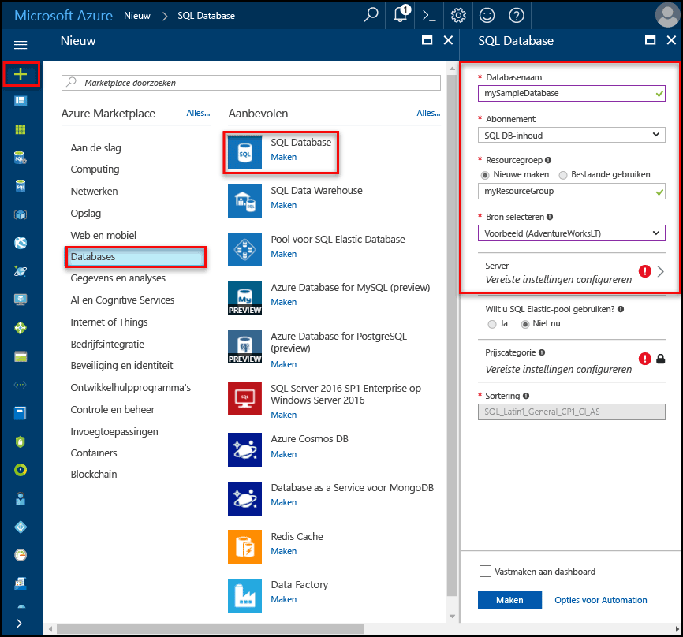
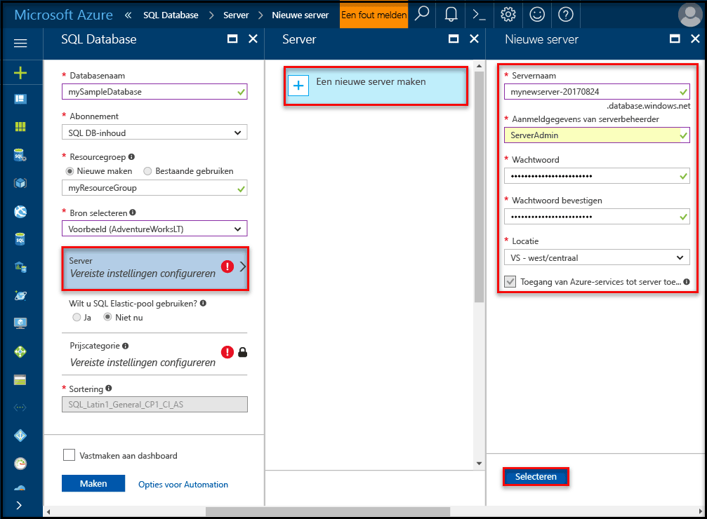
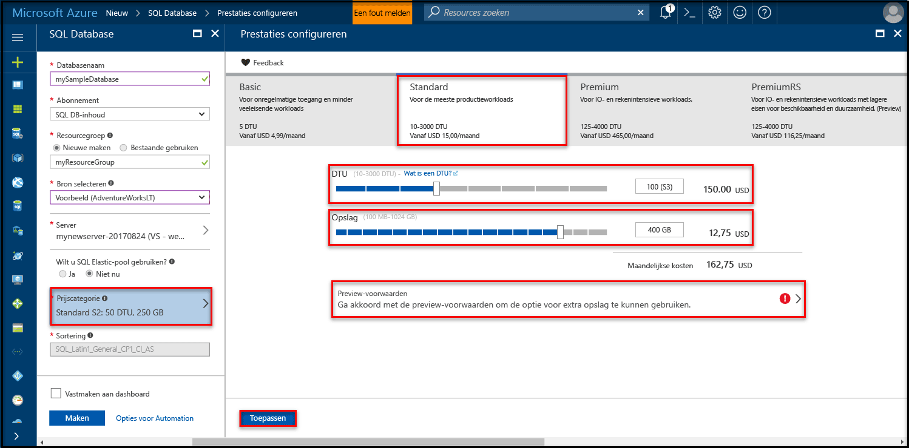
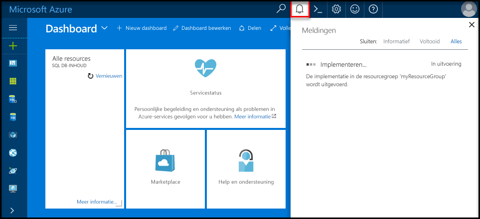
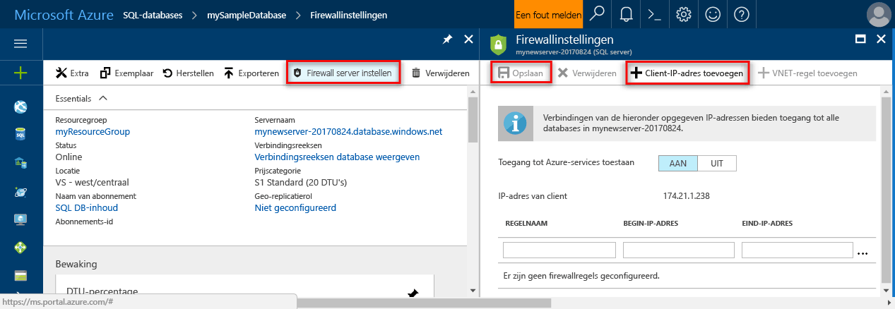

# <a name="create-an-azure-sql-database-in-the-azure-portal"></a><span data-ttu-id="ac1c7-105">Een Azure SQL-database maken in Azure Portal</span><span class="sxs-lookup"><span data-stu-id="ac1c7-105">Create an Azure SQL database in the Azure portal</span></span>

<span data-ttu-id="ac1c7-106">In deze Quick Start leert u hoe u een SQL-database maakt in Azure.</span><span class="sxs-lookup"><span data-stu-id="ac1c7-106">This quick start tutorial walks through how to create a SQL database in Azure.</span></span> <span data-ttu-id="ac1c7-107">Azure SQL Database is een Database-as-a-Service-oplossing waarmee u maximaal beschikbare SQL Server-databases kunt uitvoeren en schalen in de cloud.</span><span class="sxs-lookup"><span data-stu-id="ac1c7-107">Azure SQL Database is a “Database-as-a-Service” offering that enables you to run and scale highly available SQL Server databases in the cloud.</span></span> <span data-ttu-id="ac1c7-108">In deze Quick Start ziet u hoe u aan de slag gaat door een SQL-database te maken met behulp van Azure Portal.</span><span class="sxs-lookup"><span data-stu-id="ac1c7-108">This quick start shows you how to get started by creating a SQL database using the Azure portal.</span></span>

<span data-ttu-id="ac1c7-109">Als u nog geen Azure-abonnement hebt, maakt u een [gratis account](https://azure.microsoft.com/free/) voordat u begint.</span><span class="sxs-lookup"><span data-stu-id="ac1c7-109">If you don't have an Azure subscription, create a [free](https://azure.microsoft.com/free/) account before you begin.</span></span>

## <a name="log-in-to-the-azure-portal"></a><span data-ttu-id="ac1c7-110">Aanmelden bij Azure Portal</span><span class="sxs-lookup"><span data-stu-id="ac1c7-110">Log in to the Azure portal</span></span>

<span data-ttu-id="ac1c7-111">Meld u aan bij [Azure Portal](https://portal.azure.com/).</span><span class="sxs-lookup"><span data-stu-id="ac1c7-111">Log in to the [Azure portal](https://portal.azure.com/).</span></span>

## <a name="create-a-sql-database"></a><span data-ttu-id="ac1c7-112">Een SQL-database maken</span><span class="sxs-lookup"><span data-stu-id="ac1c7-112">Create a SQL database</span></span>

<span data-ttu-id="ac1c7-113">Een Azure SQL-database wordt gemaakt met een gedefinieerde set [reken- en opslagresources](sql-database-service-tiers.md).</span><span class="sxs-lookup"><span data-stu-id="ac1c7-113">An Azure SQL database is created with a defined set of [compute and storage resources](sql-database-service-tiers.md).</span></span> <span data-ttu-id="ac1c7-114">De database is gemaakt in een [Azure-resourcegroep](../azure-resource-manager/resource-group-overview.md) en in een [logische Azure SQL Database-server](sql-database-features.md).</span><span class="sxs-lookup"><span data-stu-id="ac1c7-114">The database is created within an [Azure resource group](../azure-resource-manager/resource-group-overview.md) and in an [Azure SQL Database logical server](sql-database-features.md).</span></span> 

<span data-ttu-id="ac1c7-115">Volg deze stappen voor het maken van een SQL-database met de voorbeeldgegevens van Adventure Works LT.</span><span class="sxs-lookup"><span data-stu-id="ac1c7-115">Follow these steps to create a SQL database containing the Adventure Works LT sample data.</span></span> 

1. <span data-ttu-id="ac1c7-116">Klik op de knop **Nieuw** in de linkerbovenhoek van Azure Portal.</span><span class="sxs-lookup"><span data-stu-id="ac1c7-116">Click the **New** button found on the upper left-hand corner of the Azure portal.</span></span>

2. <span data-ttu-id="ac1c7-117">Selecteer **Databases** op de pagina **Nieuw** en selecteer **SQL-database** op de pagina **Databases**.</span><span class="sxs-lookup"><span data-stu-id="ac1c7-117">Select **Databases** from the **New** page, and select **SQL Database** from the **Databases** page.</span></span>

   

3. <span data-ttu-id="ac1c7-119">Vul het formulier SQL Database in met de volgende informatie, zoals in de voorgaande afbeelding wordt weergegeven:</span><span class="sxs-lookup"><span data-stu-id="ac1c7-119">Fill out the SQL Database form with the following information, as shown on the preceding image:</span></span>   

   | <span data-ttu-id="ac1c7-120">Instelling</span><span class="sxs-lookup"><span data-stu-id="ac1c7-120">Setting</span></span>       | <span data-ttu-id="ac1c7-121">Voorgestelde waarde</span><span class="sxs-lookup"><span data-stu-id="ac1c7-121">Suggested value</span></span> | <span data-ttu-id="ac1c7-122">Beschrijving</span><span class="sxs-lookup"><span data-stu-id="ac1c7-122">Description</span></span> | 
   | ------------ | ------------------ | ------------------------------------------------- | 
   | <span data-ttu-id="ac1c7-123">**Databasenaam**</span><span class="sxs-lookup"><span data-stu-id="ac1c7-123">**Database name**</span></span> | <span data-ttu-id="ac1c7-124">mySampleDatabase</span><span class="sxs-lookup"><span data-stu-id="ac1c7-124">mySampleDatabase</span></span> | <span data-ttu-id="ac1c7-125">Zie [Database-id's](https://docs.microsoft.com/en-us/sql/relational-databases/databases/database-identifiers) voor geldige databasenamen.</span><span class="sxs-lookup"><span data-stu-id="ac1c7-125">For valid database names, see [Database Identifiers](https://docs.microsoft.com/en-us/sql/relational-databases/databases/database-identifiers).</span></span> | 
   | <span data-ttu-id="ac1c7-126">**Abonnement**</span><span class="sxs-lookup"><span data-stu-id="ac1c7-126">**Subscription**</span></span> | <span data-ttu-id="ac1c7-127">Uw abonnement</span><span class="sxs-lookup"><span data-stu-id="ac1c7-127">Your subscription</span></span>  | <span data-ttu-id="ac1c7-128">Zie [Abonnementen](https://account.windowsazure.com/Subscriptions) voor meer informatie over uw abonnementen.</span><span class="sxs-lookup"><span data-stu-id="ac1c7-128">For details about your subscriptions, see [Subscriptions](https://account.windowsazure.com/Subscriptions).</span></span> |
   | <span data-ttu-id="ac1c7-129">**Resourcegroep**</span><span class="sxs-lookup"><span data-stu-id="ac1c7-129">**Resource group**</span></span>  | <span data-ttu-id="ac1c7-130">myResourceGroup</span><span class="sxs-lookup"><span data-stu-id="ac1c7-130">myResourceGroup</span></span> | <span data-ttu-id="ac1c7-131">Zie [Naming conventions](https://docs.microsoft.com/azure/architecture/best-practices/naming-conventions) (Naamgevingsconventies) voor geldige resourcegroepnamen.</span><span class="sxs-lookup"><span data-stu-id="ac1c7-131">For valid resource group names, see [Naming rules and restrictions](https://docs.microsoft.com/azure/architecture/best-practices/naming-conventions).</span></span> |
   | <span data-ttu-id="ac1c7-132">**Bron selecteren**</span><span class="sxs-lookup"><span data-stu-id="ac1c7-132">**Source source**</span></span> | <span data-ttu-id="ac1c7-133">Sample (AdventureWorksLT)</span><span class="sxs-lookup"><span data-stu-id="ac1c7-133">Sample (AdventureWorksLT)</span></span> | <span data-ttu-id="ac1c7-134">Hiermee worden het schema en de gegevens van AdventureWorksLT in de nieuwe database geladen.</span><span class="sxs-lookup"><span data-stu-id="ac1c7-134">Loads the AdventureWorksLT schema and data into your new database</span></span> |

   > [!IMPORTANT]
   > <span data-ttu-id="ac1c7-135">U moet de voorbeelddatabase op dit formulier selecteren. Deze wordt namelijk in de rest van deze Quick Start gebruikt.</span><span class="sxs-lookup"><span data-stu-id="ac1c7-135">You must select the sample database on this form because it is used in the remainder of this quick start.</span></span>
   > 

4. <span data-ttu-id="ac1c7-136">Klik onder **Server** op **Vereiste instellingen configureren** en vul het formulier SQL-server (logische server) in met de volgende informatie, zoals in de volgende afbeelding wordt weergegeven:</span><span class="sxs-lookup"><span data-stu-id="ac1c7-136">Under **Server**, click **Configure required settings** and fill out the SQL server (logical server) form with the following information, as shown on the following image:</span></span>   

   | <span data-ttu-id="ac1c7-137">Instelling</span><span class="sxs-lookup"><span data-stu-id="ac1c7-137">Setting</span></span>       | <span data-ttu-id="ac1c7-138">Voorgestelde waarde</span><span class="sxs-lookup"><span data-stu-id="ac1c7-138">Suggested value</span></span> | <span data-ttu-id="ac1c7-139">Beschrijving</span><span class="sxs-lookup"><span data-stu-id="ac1c7-139">Description</span></span> | 
   | ------------ | ------------------ | ------------------------------------------------- | 
   | <span data-ttu-id="ac1c7-140">**Servernaam**</span><span class="sxs-lookup"><span data-stu-id="ac1c7-140">**Server name**</span></span> | <span data-ttu-id="ac1c7-141">Een wereldwijd unieke naam</span><span class="sxs-lookup"><span data-stu-id="ac1c7-141">Any globally unique name</span></span> | <span data-ttu-id="ac1c7-142">Zie [Naming conventions](https://docs.microsoft.com/azure/architecture/best-practices/naming-conventions) (Naamgevingsconventies) voor geldige servernamen.</span><span class="sxs-lookup"><span data-stu-id="ac1c7-142">For valid server names, see [Naming rules and restrictions](https://docs.microsoft.com/azure/architecture/best-practices/naming-conventions).</span></span> | 
   | <span data-ttu-id="ac1c7-143">**Aanmeldgegevens van serverbeheerder**</span><span class="sxs-lookup"><span data-stu-id="ac1c7-143">**Server admin login**</span></span> | <span data-ttu-id="ac1c7-144">Een geldige naam</span><span class="sxs-lookup"><span data-stu-id="ac1c7-144">Any valid name</span></span> | <span data-ttu-id="ac1c7-145">Zie [Database-id's](https://docs.microsoft.com/en-us/sql/relational-databases/databases/database-identifiers) voor geldige aanmeldingsnamen.</span><span class="sxs-lookup"><span data-stu-id="ac1c7-145">For valid login names, see [Database Identifiers](https://docs.microsoft.com/en-us/sql/relational-databases/databases/database-identifiers).</span></span> |
   | <span data-ttu-id="ac1c7-146">**Wachtwoord**</span><span class="sxs-lookup"><span data-stu-id="ac1c7-146">**Password**</span></span> | <span data-ttu-id="ac1c7-147">Een geldig wachtwoord</span><span class="sxs-lookup"><span data-stu-id="ac1c7-147">Any valid password</span></span> | <span data-ttu-id="ac1c7-148">Uw wachtwoord moet uit ten minste 8 tekens bestaan en moet tekens bevatten uit drie van de volgende categorieën: hoofdletters, kleine letters, cijfers en niet-alfanumerieke tekens.</span><span class="sxs-lookup"><span data-stu-id="ac1c7-148">Your password must have at least 8 characters and must contain characters from three of the following categories: upper case characters, lower case characters, numbers, and and non-alphanumeric characters.</span></span> |
   | <span data-ttu-id="ac1c7-149">**Abonnement**</span><span class="sxs-lookup"><span data-stu-id="ac1c7-149">**Subscription**</span></span> | <span data-ttu-id="ac1c7-150">Uw abonnement</span><span class="sxs-lookup"><span data-stu-id="ac1c7-150">Your subscription</span></span> | <span data-ttu-id="ac1c7-151">Zie [Abonnementen](https://account.windowsazure.com/Subscriptions) voor meer informatie over uw abonnementen.</span><span class="sxs-lookup"><span data-stu-id="ac1c7-151">For details about your subscriptions, see [Subscriptions](https://account.windowsazure.com/Subscriptions).</span></span> |
   | <span data-ttu-id="ac1c7-152">**Resourcegroep**</span><span class="sxs-lookup"><span data-stu-id="ac1c7-152">**Resource group**</span></span> | <span data-ttu-id="ac1c7-153">myResourceGroup</span><span class="sxs-lookup"><span data-stu-id="ac1c7-153">myResourceGroup</span></span> | <span data-ttu-id="ac1c7-154">Zie [Naming conventions](https://docs.microsoft.com/azure/architecture/best-practices/naming-conventions) (Naamgevingsconventies) voor geldige resourcegroepnamen.</span><span class="sxs-lookup"><span data-stu-id="ac1c7-154">For valid resource group names, see [Naming rules and restrictions](https://docs.microsoft.com/azure/architecture/best-practices/naming-conventions).</span></span> |
   | <span data-ttu-id="ac1c7-155">**Locatie**</span><span class="sxs-lookup"><span data-stu-id="ac1c7-155">**Location**</span></span> | <span data-ttu-id="ac1c7-156">Een geldige locatie</span><span class="sxs-lookup"><span data-stu-id="ac1c7-156">Any valid location</span></span> | <span data-ttu-id="ac1c7-157">Zie [Azure-regio's](https://azure.microsoft.com/regions/) voor informatie over regio's.</span><span class="sxs-lookup"><span data-stu-id="ac1c7-157">For information about regions, see [Azure Regions](https://azure.microsoft.com/regions/).</span></span> |

   > [!IMPORTANT]
   > <span data-ttu-id="ac1c7-158">De beheerdersaanmelding bij de server en het wachtwoord die u hier opgeeft, zijn vereist voor aanmelding bij de server en de bijbehorende databases verderop in deze Quick Start.</span><span class="sxs-lookup"><span data-stu-id="ac1c7-158">The server admin login and password that you specify here are required to log in to the server and its databases later in this quick start.</span></span> <span data-ttu-id="ac1c7-159">Onthoud of noteer deze informatie voor later gebruik.</span><span class="sxs-lookup"><span data-stu-id="ac1c7-159">Remember or record this information for later use.</span></span> 
   >  

   

5. <span data-ttu-id="ac1c7-161">Wanneer u het formulier hebt ingevuld, klikt u op **Selecteren**.</span><span class="sxs-lookup"><span data-stu-id="ac1c7-161">When you have completed the form, click **Select**.</span></span>

6. <span data-ttu-id="ac1c7-162">Klik op **Prijscategorie** om de servicelaag en het prestatieniveau voor de nieuwe database op te geven.</span><span class="sxs-lookup"><span data-stu-id="ac1c7-162">Click **Pricing tier** to specify the service tier and performance level for your new database.</span></span> <span data-ttu-id="ac1c7-163">Gebruik de schuifregelaar om **20 DTU's** en **250** GB aan opslagruimte te selecteren.</span><span class="sxs-lookup"><span data-stu-id="ac1c7-163">Use the slider to select **20 DTUs** and **250** GB of storage.</span></span> <span data-ttu-id="ac1c7-164">Zie [Wat is een DTU?](sql-database-what-is-a-dtu.md) voor meer informatie over DTU's.</span><span class="sxs-lookup"><span data-stu-id="ac1c7-164">For more information on DTUs, see [What is a DTU?](sql-database-what-is-a-dtu.md).</span></span>

   

7. <span data-ttu-id="ac1c7-166">Nadat u de hoeveelheid DTU's hebt geselecteerd, klikt u op **Toepassen**.</span><span class="sxs-lookup"><span data-stu-id="ac1c7-166">After selected the amount of DTUs, click **Apply**.</span></span>  

8. <span data-ttu-id="ac1c7-167">Nu u het SQL Database-formulier hebt ingevuld, klikt u op **Maken** om de database in te richten.</span><span class="sxs-lookup"><span data-stu-id="ac1c7-167">Now that you have completed the SQL Database form, click **Create** to provision the database.</span></span> <span data-ttu-id="ac1c7-168">De inrichting duurt een paar minuten.</span><span class="sxs-lookup"><span data-stu-id="ac1c7-168">Provisioning takes a few minutes.</span></span> 

9. <span data-ttu-id="ac1c7-169">Klik op de werkbalk op **Meldingen** om het implementatieproces te bewaken.</span><span class="sxs-lookup"><span data-stu-id="ac1c7-169">On the toolbar, click **Notifications** to monitor the deployment process.</span></span>

   

## <a name="create-a-server-level-firewall-rule"></a><span data-ttu-id="ac1c7-171">Een serverfirewallregel maken</span><span class="sxs-lookup"><span data-stu-id="ac1c7-171">Create a server-level firewall rule</span></span>

<span data-ttu-id="ac1c7-172">De service SQL Database maakt een firewall op serverniveau die voorkomt dat externe toepassingen en hulpmiddelen verbinding maken met de server of databases op de server, tenzij er een firewallregel is gemaakt om de firewall te openen voor specifieke IP-adressen.</span><span class="sxs-lookup"><span data-stu-id="ac1c7-172">The SQL Database service creates a firewall at the server-level that prevents external applications and tools from connecting to the server or any databases on the server unless a firewall rule is created to open the firewall for specific IP addresses.</span></span> <span data-ttu-id="ac1c7-173">Volg deze stappen om een [SQL Database-firewallregel op serverniveau](sql-database-firewall-configure.md) te maken voor het IP-adres van de client en connectiviteit via de SQL Database-firewall alleen voor uw IP-adres toe te staan.</span><span class="sxs-lookup"><span data-stu-id="ac1c7-173">Follow these steps to create a [SQL Database server-level firewall rule](sql-database-firewall-configure.md) for your client's IP address and enable external connectivity through the SQL Database firewall for your IP address only.</span></span> 

> [!NOTE]
> <span data-ttu-id="ac1c7-174">SQL Database communiceert via poort 1433.</span><span class="sxs-lookup"><span data-stu-id="ac1c7-174">SQL Database communicates over port 1433.</span></span> <span data-ttu-id="ac1c7-175">Als u verbinding probeert te maken vanuit een bedrijfsnetwerk, wordt uitgaand verkeer via poort 1433 mogelijk niet toegestaan door de firewall van uw netwerk.</span><span class="sxs-lookup"><span data-stu-id="ac1c7-175">If you are trying to connect from within a corporate network, outbound traffic over port 1433 may not be allowed by your network's firewall.</span></span> <span data-ttu-id="ac1c7-176">In dat geval kunt u geen verbinding maken met uw Azure SQL Database-server, tenzij de IT-afdeling poort 1433 openstelt.</span><span class="sxs-lookup"><span data-stu-id="ac1c7-176">If so, you cannot connect to your Azure SQL Database server unless your IT department opens port 1433.</span></span>
>

1. <span data-ttu-id="ac1c7-177">Wanneer de implementatie is voltooid, klikt u op **SQL Databases** in het menu aan de linkerkant. Klik vervolgens op de pagina **SQL Databases** op **mySampleDatabase**.</span><span class="sxs-lookup"><span data-stu-id="ac1c7-177">After the deployment completes, click **SQL databases** from the left-hand menu and then click **mySampleDatabase** on the **SQL databases** page.</span></span> <span data-ttu-id="ac1c7-178">De overzichtspagina voor uw database wordt geopend, met de volledig gekwalificeerde servernaam (zoals **mynewserver20170313.database.windows.net**) en opties voor verdere configuratie.</span><span class="sxs-lookup"><span data-stu-id="ac1c7-178">The overview page for your database opens, showing you the fully qualified server name (such as **mynewserver20170313.database.windows.net**) and provides options for further configuration.</span></span> <span data-ttu-id="ac1c7-179">Kopieer deze volledig gekwalificeerde servernaam voor later gebruik.</span><span class="sxs-lookup"><span data-stu-id="ac1c7-179">Copy this fully qualified server name for use later.</span></span>

   > [!IMPORTANT]
   > <span data-ttu-id="ac1c7-180">U hebt deze volledig gekwalificeerde servernaam nodig om in de volgende Quick Starts verbinding te maken met de server en de bijbehorende databases.</span><span class="sxs-lookup"><span data-stu-id="ac1c7-180">You need this fully qualified server name to connect to your server and its databases in subsequent quick starts.</span></span>
   > 

    

2. <span data-ttu-id="ac1c7-182">Klik op de werkbalk op **Serverfirewall instellen** zoals in de vorige afbeelding is weergegeven.</span><span class="sxs-lookup"><span data-stu-id="ac1c7-182">Click **Set server firewall** on the toolbar as shown in the previous image.</span></span> <span data-ttu-id="ac1c7-183">De pagina **Firewallinstellingen** voor de SQL Database-server wordt geopend.</span><span class="sxs-lookup"><span data-stu-id="ac1c7-183">The **Firewall settings** page for the SQL Database server opens.</span></span> 

    

3. <span data-ttu-id="ac1c7-185">Klik op **IP van client toevoegen** op de werkbalk om uw huidige IP-adres aan een nieuwe firewallregel toe te voegen.</span><span class="sxs-lookup"><span data-stu-id="ac1c7-185">Click **Add client IP** on the toolbar to add your current IP address to a new firewall rule.</span></span> <span data-ttu-id="ac1c7-186">Een firewallregel kan poort 1433 openen voor een afzonderlijk IP-adres of voor een aantal IP-adressen.</span><span class="sxs-lookup"><span data-stu-id="ac1c7-186">A firewall rule can open port 1433 for a single IP address or a range of IP addresses.</span></span>

4. <span data-ttu-id="ac1c7-187">Klik op **Opslaan**.</span><span class="sxs-lookup"><span data-stu-id="ac1c7-187">Click **Save**.</span></span> <span data-ttu-id="ac1c7-188">Er wordt een firewallregel op serverniveau gemaakt voor uw huidige IP-adres waarbij poort 1433 op de logische server wordt geopend.</span><span class="sxs-lookup"><span data-stu-id="ac1c7-188">A server-level firewall rule is created for your current IP address opening port 1433 on the logical server.</span></span>

    

4. <span data-ttu-id="ac1c7-190">Klik op **OK** en sluit de pagina **Firewallinstellingen**.</span><span class="sxs-lookup"><span data-stu-id="ac1c7-190">Click **OK** and then close the **Firewall settings** page.</span></span>

<span data-ttu-id="ac1c7-191">U kunt nu verbinding maken met de SQL Database-server en de bijbehorende databases met behulp van SQL Server Management Studio of een ander hulpprogramma naar keuze. Dit doet u vanaf dit IP-adres via het serverbeheerdersaccount dat eerder is gemaakt.</span><span class="sxs-lookup"><span data-stu-id="ac1c7-191">You can now connect to the SQL Database server and its databases using SQL Server Management Studio or another tool of your choice from this IP address using the server admin account created previously.</span></span>

> [!IMPORTANT]
> <span data-ttu-id="ac1c7-192">Voor alle Azure-services is toegang via de SQL Database-firewall standaard ingeschakeld.</span><span class="sxs-lookup"><span data-stu-id="ac1c7-192">By default, access through the SQL Database firewall is enabled for all Azure services.</span></span> <span data-ttu-id="ac1c7-193">Klik op **UIT** op deze pagina om dit voor alle Azure-services uit te schakelen.</span><span class="sxs-lookup"><span data-stu-id="ac1c7-193">Click **OFF** on this page to disable for all Azure services.</span></span>
>

## <a name="query-the-sql-database"></a><span data-ttu-id="ac1c7-194">Query's uitvoeren op de SQL-database</span><span class="sxs-lookup"><span data-stu-id="ac1c7-194">Query the SQL database</span></span>

<span data-ttu-id="ac1c7-195">Nu u een voorbeelddatabase in Azure hebt gemaakt, gebruiken we het ingebouwde hulpprogramma voor query's binnen Azure Portal om te bevestigen dat u verbinding kunt maken met de database en query's kunt uitvoeren voor de gegevens.</span><span class="sxs-lookup"><span data-stu-id="ac1c7-195">Now that you have created a sample database in Azure, let’s use the built-in query tool within the Azure portal to confirm that you can connect to the database and query the data.</span></span> 

1. <span data-ttu-id="ac1c7-196">Klik op de pagina SQL Database voor uw database op **Extra** op de werkbalk.</span><span class="sxs-lookup"><span data-stu-id="ac1c7-196">On the SQL Database page for your database, click **Tools** on the toolbar.</span></span> <span data-ttu-id="ac1c7-197">De pagina **Extra** wordt geopend.</span><span class="sxs-lookup"><span data-stu-id="ac1c7-197">The **Tools** page opens.</span></span>

    

2. <span data-ttu-id="ac1c7-199">Klik achtereenvolgens op **Query-editor (preview)**, op het selectievakje **Preview-voorwaarden** en op **OK**.</span><span class="sxs-lookup"><span data-stu-id="ac1c7-199">Click **Query editor (preview)**, click the **Preview terms** checkbox, and then click **OK**.</span></span> <span data-ttu-id="ac1c7-200">De pagina Query-editor wordt geopend.</span><span class="sxs-lookup"><span data-stu-id="ac1c7-200">The Query editor page opens.</span></span>

3. <span data-ttu-id="ac1c7-201">Klik op **Aanmelden** en selecteer wanneer hierom wordt gevraagd **SQL serververificatie**. Geef vervolgens de gebruikersnaam en het wachtwoord van de serverbeheerder op die u eerder hebt gemaakt.</span><span class="sxs-lookup"><span data-stu-id="ac1c7-201">Click **Login** and then, when prompted, select **SQL server authentication** and then provide the server admin login and password that you created earlier.</span></span>

    

4. <span data-ttu-id="ac1c7-203">Klik op **OK** om u aan te melden.</span><span class="sxs-lookup"><span data-stu-id="ac1c7-203">Click **OK** to log in.</span></span>

5. <span data-ttu-id="ac1c7-204">Wanneer u bent geverifieerd, typt u de volgende query in het deelvenster van de query-editor:</span><span class="sxs-lookup"><span data-stu-id="ac1c7-204">After you are authenticated, type the following query in the query editor pane.</span></span>

   ```sql
   SELECT TOP 20 pc.Name as CategoryName, p.name as ProductName
   FROM SalesLT.ProductCategory pc
   JOIN SalesLT.Product p
   ON pc.productcategoryid = p.productcategoryid;
   ```

6. <span data-ttu-id="ac1c7-205">Klik op **Uitvoeren** en bekijk de resultaten van de query in het deelvenster **Resultaten**.</span><span class="sxs-lookup"><span data-stu-id="ac1c7-205">Click **Run** and then review the query results in the **Results** pane.</span></span>

   

7. <span data-ttu-id="ac1c7-207">Sluit de pagina **Query-editor** en de pagina **Extra**.</span><span class="sxs-lookup"><span data-stu-id="ac1c7-207">Close the **Query editor** page and the **Tools** page.</span></span>

## <a name="clean-up-resources"></a><span data-ttu-id="ac1c7-208">Resources opschonen</span><span class="sxs-lookup"><span data-stu-id="ac1c7-208">Clean up resources</span></span>

<span data-ttu-id="ac1c7-209">Als u deze resources niet voor een andere Quick Start/zelfstudie nodig hebt (zie [Volgende stappen](#next-steps)), kunt u ze verwijderen door het volgende te doen:</span><span class="sxs-lookup"><span data-stu-id="ac1c7-209">If you don't need these resources for another quickstart/tutorial (see [Next steps](#next-steps)), you can delete them by doing the following:</span></span>


1. <span data-ttu-id="ac1c7-210">Klik in het menu links in Azure Portal op **Resourcegroepen** en klik vervolgens op **myResourceGroup**.</span><span class="sxs-lookup"><span data-stu-id="ac1c7-210">From the left-hand menu in the Azure portal, click **Resource groups** and then click **myResourceGroup**.</span></span> 
2. <span data-ttu-id="ac1c7-211">Klik op de pagina van uw resourcegroep op **Verwijderen**, typ **myResourceGroup** in het tekstvak en klik vervolgens op **Verwijderen**.</span><span class="sxs-lookup"><span data-stu-id="ac1c7-211">On your resource group page, click **Delete**, type **myResourceGroup** in the text box, and then click **Delete**.</span></span>

## <a name="next-steps"></a><span data-ttu-id="ac1c7-212">Volgende stappen</span><span class="sxs-lookup"><span data-stu-id="ac1c7-212">Next steps</span></span>

<span data-ttu-id="ac1c7-213">Nu u een database hebt, kunt u verbinding maken met een hulpprogramma naar keuze en hiermee query's uitvoeren.</span><span class="sxs-lookup"><span data-stu-id="ac1c7-213">Now that you have a database, you can connect and query using your favorite tools.</span></span> <span data-ttu-id="ac1c7-214">Klik op de onderstaande hulpprogramma's voor meer informatie:</span><span class="sxs-lookup"><span data-stu-id="ac1c7-214">Learn more by choosing your tool below:</span></span>

- [<span data-ttu-id="ac1c7-215">SQL Server Management Studio</span><span class="sxs-lookup"><span data-stu-id="ac1c7-215">SQL Server Management Studio</span></span>](sql-database-connect-query-ssms.md)
- [<span data-ttu-id="ac1c7-216">Visual Studio Code</span><span class="sxs-lookup"><span data-stu-id="ac1c7-216">Visual Studio Code</span></span>](sql-database-connect-query-vscode.md)
- [<span data-ttu-id="ac1c7-217">.NET</span><span class="sxs-lookup"><span data-stu-id="ac1c7-217">.NET</span></span>](sql-database-connect-query-dotnet.md)
- [<span data-ttu-id="ac1c7-218">PHP</span><span class="sxs-lookup"><span data-stu-id="ac1c7-218">PHP</span></span>](sql-database-connect-query-php.md)
- [<span data-ttu-id="ac1c7-219">Node.js</span><span class="sxs-lookup"><span data-stu-id="ac1c7-219">Node.js</span></span>](sql-database-connect-query-nodejs.md)
- [<span data-ttu-id="ac1c7-220">Java</span><span class="sxs-lookup"><span data-stu-id="ac1c7-220">Java</span></span>](sql-database-connect-query-java.md)
- [<span data-ttu-id="ac1c7-221">Python</span><span class="sxs-lookup"><span data-stu-id="ac1c7-221">Python</span></span>](sql-database-connect-query-python.md)
- [<span data-ttu-id="ac1c7-222">Ruby</span><span class="sxs-lookup"><span data-stu-id="ac1c7-222">Ruby</span></span>](sql-database-connect-query-ruby.md)
