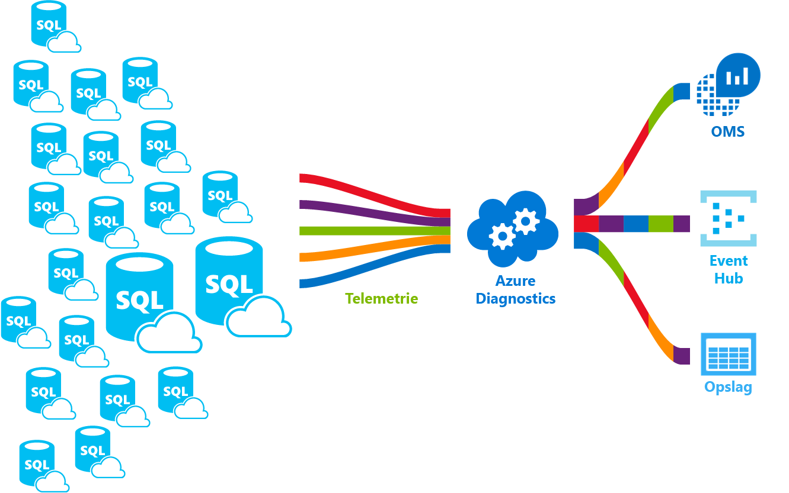

# <a name="azure-sql-database-metrics-and-diagnostics-logging"></a><span data-ttu-id="4a43f-103">Azure SQL Database metrische gegevens en logboekregistratie van diagnostische gegevens</span><span class="sxs-lookup"><span data-stu-id="4a43f-103">Azure SQL Database metrics and diagnostics logging</span></span> 
<span data-ttu-id="4a43f-104">Azure SQL Database kunt verzenden metrische gegevens en de logboeken met diagnostische gegevens voor het bewaken van eenvoudiger.</span><span class="sxs-lookup"><span data-stu-id="4a43f-104">Azure SQL Database can emit metrics and diagnostic logs for easier monitoring.</span></span> <span data-ttu-id="4a43f-105">U kunt Azure SQL Database toostore Resourcegebruik, werknemers en sessies en verbindingen in een van deze Azure-resources configureren:</span><span class="sxs-lookup"><span data-stu-id="4a43f-105">You can configure Azure SQL Database toostore resource usage, workers and sessions, and connectivity into one of these Azure resources:</span></span>
- <span data-ttu-id="4a43f-106">**Azure Storage**: voor het archiveren van grote hoeveelheden telemetriegegevens voor een lage prijs</span><span class="sxs-lookup"><span data-stu-id="4a43f-106">**Azure Storage**: For archiving vast amounts of telemetry for a small price</span></span>
- <span data-ttu-id="4a43f-107">**Azure Event Hub**: voor het integreren van telemetrie van Azure SQL Database met uw aangepaste bewakingsoplossing of hot pijplijnen</span><span class="sxs-lookup"><span data-stu-id="4a43f-107">**Azure Event Hub**: For integrating Azure SQL Database telemetry with your custom monitoring solution or hot pipelines</span></span>
- <span data-ttu-id="4a43f-108">**Azure Log Analytics**: voor out of box van Hallo bewakingsoplossing met rapportage, waarschuwingen en beperkende mogelijkheden</span><span class="sxs-lookup"><span data-stu-id="4a43f-108">**Azure Log Analytics**: For out of hello box monitoring solution with reporting, alerting, and mitigating capabilities</span></span> 

    

## <a name="enable-logging"></a><span data-ttu-id="4a43f-110">Logboekregistratie inschakelen</span><span class="sxs-lookup"><span data-stu-id="4a43f-110">Enable logging</span></span>

<span data-ttu-id="4a43f-111">Metrische gegevens en diagnostische logboekregistratie is standaard niet ingeschakeld.</span><span class="sxs-lookup"><span data-stu-id="4a43f-111">Metrics and diagnostics logging is not enabled by default.</span></span> <span data-ttu-id="4a43f-112">U kunt inschakelen en beheren van metrische gegevens en logboekregistratie van diagnostische gegevens met een van de volgende methoden Hallo:</span><span class="sxs-lookup"><span data-stu-id="4a43f-112">You can enable and manage metrics and diagnostics logging using one of hello following methods:</span></span>
- <span data-ttu-id="4a43f-113">Azure Portal</span><span class="sxs-lookup"><span data-stu-id="4a43f-113">Azure portal</span></span>
- <span data-ttu-id="4a43f-114">PowerShell</span><span class="sxs-lookup"><span data-stu-id="4a43f-114">PowerShell</span></span>
- <span data-ttu-id="4a43f-115">Azure CLI</span><span class="sxs-lookup"><span data-stu-id="4a43f-115">Azure CLI</span></span>
- <span data-ttu-id="4a43f-116">REST API</span><span class="sxs-lookup"><span data-stu-id="4a43f-116">REST API</span></span> 
- <span data-ttu-id="4a43f-117">Resource Manager-sjabloon</span><span class="sxs-lookup"><span data-stu-id="4a43f-117">Resource Manager template</span></span>

<span data-ttu-id="4a43f-118">Wanneer u metrische gegevens en logboekregistratie van diagnostische gegevens inschakelen, moet u toospecify hello Azure-resource waar de geselecteerde gegevens worden verzameld.</span><span class="sxs-lookup"><span data-stu-id="4a43f-118">When you enable metrics and diagnostics logging, you need toospecify hello Azure resource where selected data is collected.</span></span> <span data-ttu-id="4a43f-119">Beschikbare opties:</span><span class="sxs-lookup"><span data-stu-id="4a43f-119">Options available:</span></span>
- <span data-ttu-id="4a43f-120">Log Analytics</span><span class="sxs-lookup"><span data-stu-id="4a43f-120">Log analytics</span></span>
- <span data-ttu-id="4a43f-121">Event Hub</span><span class="sxs-lookup"><span data-stu-id="4a43f-121">Event Hub</span></span>
- <span data-ttu-id="4a43f-122">Azure Storage</span><span class="sxs-lookup"><span data-stu-id="4a43f-122">Azure Storage</span></span> 

<span data-ttu-id="4a43f-123">U kunt inrichten van een nieuwe Azure resource of Selecteer een bestaande resource.</span><span class="sxs-lookup"><span data-stu-id="4a43f-123">You can provision a new Azure resource or select an existing resource.</span></span> <span data-ttu-id="4a43f-124">Na het selecteren van opslagresource hello, moet u toospecify welke toocollect gegevens.</span><span class="sxs-lookup"><span data-stu-id="4a43f-124">After selecting hello storage resource, you need toospecify which data toocollect.</span></span> <span data-ttu-id="4a43f-125">Beschikbare opties zijn:</span><span class="sxs-lookup"><span data-stu-id="4a43f-125">Options available include:</span></span>

- <span data-ttu-id="4a43f-126">**[1 minuut metrieken](sql-database-metrics-diag-logging.md#1-minute-metrics)**  -DTU-percentage, DTU limiet, CPU-percentage, bevat gegevens van fysieke percentage lezen, schrijven logboek percentage, mislukt-geslaagd/geblokkeerd door de firewall-verbindingen, sessies percentage, werknemers percentage, opslag, opslagpercentage, XTP-opslagpercentage</span><span class="sxs-lookup"><span data-stu-id="4a43f-126">**[1-minute metrics](sql-database-metrics-diag-logging.md#1-minute-metrics)** - contains DTU percentage, DTU limit, CPU percentage, Physical data read percentage, Log write percentage, Successful/Failed/Blocked by firewall connections, sessions percentage, workers percentage, storage, storage percentage, XTP storage percentage</span></span>

<span data-ttu-id="4a43f-127">Als u Event Hub of een AzureStorage-account opgeeft, kunt u een beleid bewaren toospecify gegevens die ouder is dan een geselecteerde periode wordt verwijderd.</span><span class="sxs-lookup"><span data-stu-id="4a43f-127">If you specify Event Hub or an AzureStorage account, you can specify a retention policy toospecify that data that is older than a selected time period is deleted.</span></span> <span data-ttu-id="4a43f-128">Als u Log Analytics opgeeft, is Hallo bewaarbeleid voor afhankelijk van de geselecteerde prijscategorie Hallo.</span><span class="sxs-lookup"><span data-stu-id="4a43f-128">If you specify Log Analytics, hello retention policy depends on hello selected pricing tier.</span></span> <span data-ttu-id="4a43f-129">Lees meer over [logboekanalyse prijzen](https://azure.microsoft.com/pricing/details/log-analytics/).</span><span class="sxs-lookup"><span data-stu-id="4a43f-129">Read more about [Log Analytics pricing](https://azure.microsoft.com/pricing/details/log-analytics/).</span></span> 

<span data-ttu-id="4a43f-130">Het is raadzaam dat u beide Hallo leest [overzicht van metrische gegevens in Microsoft Azure](../monitoring-and-diagnostics/monitoring-overview-metrics.md) en [overzicht van Azure diagnostische logboeken](../monitoring-and-diagnostics/monitoring-overview-of-diagnostic-logs.md) toogain niet alleen hoe een goed begrip van artikelen tooenable logboekregistratie, maar Hallo metrische gegevens en logboekbestanden categorieën ondersteund door Hallo verschillende Azure-services.</span><span class="sxs-lookup"><span data-stu-id="4a43f-130">We recommend that you read both hello [Overview of metrics in Microsoft Azure](../monitoring-and-diagnostics/monitoring-overview-metrics.md) and [Overview of Azure Diagnostic Logs](../monitoring-and-diagnostics/monitoring-overview-of-diagnostic-logs.md) articles toogain an understanding of not only how tooenable logging, but hello metrics and log categories supported by hello various Azure services.</span></span>

### <a name="azure-portal"></a><span data-ttu-id="4a43f-131">Azure Portal</span><span class="sxs-lookup"><span data-stu-id="4a43f-131">Azure portal</span></span>

<span data-ttu-id="4a43f-132">tooenable metrische gegevens en logboeken met diagnostische gegevens verzamelen in hello Azure-portal navigeert tooyour Azure SQL database of de pagina van de elastische groep en klik vervolgens op **diagnostische instellingen**.</span><span class="sxs-lookup"><span data-stu-id="4a43f-132">tooenable metrics and diagnostic logs collection in hello Azure portal, navigate tooyour Azure SQL database or elastic pool page, and then click **Diagnostic settings**.</span></span>

   

### <a name="powershell"></a><span data-ttu-id="4a43f-134">PowerShell</span><span class="sxs-lookup"><span data-stu-id="4a43f-134">PowerShell</span></span>

<span data-ttu-id="4a43f-135">tooenable metrische gegevens en logboekregistratie van diagnostische gegevens met behulp van PowerShell, gebruikt u Hallo volgende opdrachten:</span><span class="sxs-lookup"><span data-stu-id="4a43f-135">tooenable metrics and diagnostics logging using PowerShell, use hello following commands:</span></span>

- <span data-ttu-id="4a43f-136">tooenable opslag van diagnostische logboeken in een Opslagaccount, gebruikt u deze opdracht:</span><span class="sxs-lookup"><span data-stu-id="4a43f-136">tooenable storage of Diagnostic Logs in a Storage Account, use this command:</span></span>

   ```powershell
   Set-AzureRmDiagnosticSetting -ResourceId [your resource id] -StorageAccountId [your storage account id] -Enabled $true
   ```

   <span data-ttu-id="4a43f-137">Hallo Storage Account-ID is Hallo resource-id voor Hallo storage account toowhich gewenste toosend Hallo registreert.</span><span class="sxs-lookup"><span data-stu-id="4a43f-137">hello Storage Account ID is hello resource id for hello storage account toowhich you want toosend hello logs.</span></span>

- <span data-ttu-id="4a43f-138">tooenable streaming van diagnostische logboeken tooan Event Hub, gebruikt u deze opdracht:</span><span class="sxs-lookup"><span data-stu-id="4a43f-138">tooenable streaming of Diagnostic Logs tooan Event Hub, use this command:</span></span>

   ```powershell
   Set-AzureRmDiagnosticSetting -ResourceId [your resource id] -ServiceBusRuleId [your service bus rule id] -Enabled $true
   ```

   <span data-ttu-id="4a43f-139">Hallo Service Bus regel-ID is een tekenreeks met deze indeling:</span><span class="sxs-lookup"><span data-stu-id="4a43f-139">hello Service Bus Rule ID is a string with this format:</span></span>

   ```powershell
   {service bus resource ID}/authorizationrules/{key name}
   ``` 

- <span data-ttu-id="4a43f-140">tooenable verzending van diagnostische logboeken tooa Log Analytics-werkruimte, gebruikt u deze opdracht:</span><span class="sxs-lookup"><span data-stu-id="4a43f-140">tooenable sending of Diagnostic Logs tooa Log Analytics workspace, use this command:</span></span>

   ```powershell
   Set-AzureRmDiagnosticSetting -ResourceId [your resource id] -WorkspaceId [resource id of hello log analytics workspace] -Enabled $true
   ```

- <span data-ttu-id="4a43f-141">U kunt Hallo bron-id van de werkruimte voor logboekanalyse met behulp van de volgende opdracht Hallo verkrijgen:</span><span class="sxs-lookup"><span data-stu-id="4a43f-141">You can obtain hello resource id of your Log Analytics workspace using hello following command:</span></span>

   ```powershell
   (Get-AzureRmOperationalInsightsWorkspace).ResourceId
   ```

<span data-ttu-id="4a43f-142">U kunt deze parameters tooenable meerdere uitvoeropties combineren.</span><span class="sxs-lookup"><span data-stu-id="4a43f-142">You can combine these parameters tooenable multiple output options.</span></span>

### <a name="cli"></a><span data-ttu-id="4a43f-143">CLI</span><span class="sxs-lookup"><span data-stu-id="4a43f-143">CLI</span></span>

<span data-ttu-id="4a43f-144">tooenable metrische gegevens en diagnostische gegevens met behulp van logboekregistratie hello Azure CLI, gebruik Hallo volgende opdrachten:</span><span class="sxs-lookup"><span data-stu-id="4a43f-144">tooenable metrics and diagnostics logging using hello Azure CLI, use hello following commands:</span></span>

- <span data-ttu-id="4a43f-145">tooenable opslag van diagnostische logboeken in een Opslagaccount, gebruikt u deze opdracht:</span><span class="sxs-lookup"><span data-stu-id="4a43f-145">tooenable storage of Diagnostic Logs in a Storage Account, use this command:</span></span>

   ```azurecli-interactive
   azure insights diagnostic set --resourceId <resourceId> --storageId <storageAccountId> --enabled true
   ```

   <span data-ttu-id="4a43f-146">Hallo Storage Account-ID is Hallo resource-id voor Hallo storage account toowhich gewenste toosend Hallo registreert.</span><span class="sxs-lookup"><span data-stu-id="4a43f-146">hello Storage Account ID is hello resource id for hello storage account toowhich you want toosend hello logs.</span></span>

- <span data-ttu-id="4a43f-147">tooenable streaming van diagnostische logboeken tooan Event Hub, gebruikt u deze opdracht:</span><span class="sxs-lookup"><span data-stu-id="4a43f-147">tooenable streaming of Diagnostic Logs tooan Event Hub, use this command:</span></span>

   ```azurecli-interactive
   azure insights diagnostic set --resourceId <resourceId> --serviceBusRuleId <serviceBusRuleId> --enabled true
   ```

   <span data-ttu-id="4a43f-148">Hallo Service Bus regel-ID is een tekenreeks met deze indeling:</span><span class="sxs-lookup"><span data-stu-id="4a43f-148">hello Service Bus Rule ID is a string with this format:</span></span>

   ```azurecli-interactive
   {service bus resource ID}/authorizationrules/{key name}
   ```

- <span data-ttu-id="4a43f-149">tooenable verzending van diagnostische logboeken tooa Log Analytics-werkruimte, gebruikt u deze opdracht:</span><span class="sxs-lookup"><span data-stu-id="4a43f-149">tooenable sending of Diagnostic Logs tooa Log Analytics workspace, use this command:</span></span>

   ```azurecli-interactive
   azure insights diagnostic set --resourceId <resourceId> --workspaceId <resource id of hello log analytics workspace> --enabled true
   ```

<span data-ttu-id="4a43f-150">U kunt deze parameters tooenable meerdere uitvoeropties combineren.</span><span class="sxs-lookup"><span data-stu-id="4a43f-150">You can combine these parameters tooenable multiple output options.</span></span>

### <a name="rest-api"></a><span data-ttu-id="4a43f-151">REST API</span><span class="sxs-lookup"><span data-stu-id="4a43f-151">REST API</span></span>

<span data-ttu-id="4a43f-152">Meer informatie over het te[diagnostische instellingen wijzigen met hello Azure Monitor REST-API](https://msdn.microsoft.com/library/azure/dn931931.aspx).</span><span class="sxs-lookup"><span data-stu-id="4a43f-152">Read about how too[change Diagnostic settings using hello Azure Monitor REST API](https://msdn.microsoft.com/library/azure/dn931931.aspx).</span></span> 

### <a name="resource-manager-template"></a><span data-ttu-id="4a43f-153">Resource Manager-sjabloon</span><span class="sxs-lookup"><span data-stu-id="4a43f-153">Resource Manager template</span></span>

<span data-ttu-id="4a43f-154">Meer informatie over het te[Schakel de diagnostische instellingen bij het maken van de resource met Resource Manager-sjabloon](../monitoring-and-diagnostics/monitoring-enable-diagnostic-logs-using-template.md).</span><span class="sxs-lookup"><span data-stu-id="4a43f-154">Read about how too[enable Diagnostic settings at resource creation using Resource Manager template](../monitoring-and-diagnostics/monitoring-enable-diagnostic-logs-using-template.md).</span></span> 

## <a name="stream-into-log-analytics"></a><span data-ttu-id="4a43f-155">Stream in Log Analytics</span><span class="sxs-lookup"><span data-stu-id="4a43f-155">Stream into Log Analytics</span></span> 
<span data-ttu-id="4a43f-156">Azure SQL Database metrische gegevens en logboeken met diagnostische gegevens kunnen worden gestreamd naar logboekanalyse met behulp van de optie ingebouwde 'verzenden tooLog Analytics' Hallo in Hallo portal of met logboekanalyse inschakelen in een diagnostische instelling via Azure PowerShell-cmdlets, Azure CLI of Azure Monitor REST API.</span><span class="sxs-lookup"><span data-stu-id="4a43f-156">Azure SQL Database metrics and diagnostic logs can be streamed into Log Analytics using hello built-in “Send tooLog Analytics” option in hello portal, or by enabling Log Analytics in a diagnostic setting via Azure PowerShell cmdlets, Azure CLI, or Azure Monitor REST API.</span></span>

### <a name="installation-overview"></a><span data-ttu-id="4a43f-157">Installatie-overzicht</span><span class="sxs-lookup"><span data-stu-id="4a43f-157">Installation overview</span></span>

<span data-ttu-id="4a43f-158">Azure SQL Database wagenpark bewaking is heel eenvoudig met logboekanalyse.</span><span class="sxs-lookup"><span data-stu-id="4a43f-158">Monitoring Azure SQL Database fleet is simple with Log Analytics.</span></span> <span data-ttu-id="4a43f-159">Er zijn drie stappen vereist:</span><span class="sxs-lookup"><span data-stu-id="4a43f-159">Three steps are required:</span></span>

1.  <span data-ttu-id="4a43f-160">Log Analytics-resource maken</span><span class="sxs-lookup"><span data-stu-id="4a43f-160">Create Log Analytics resource</span></span>
2.  <span data-ttu-id="4a43f-161">Configureer databases toorecord metrische gegevens en diagnostische logboeken in Hallo gemaakt Log Analytics</span><span class="sxs-lookup"><span data-stu-id="4a43f-161">Configure databases toorecord metrics and diagnostic logs into hello created Log Analytics</span></span>
3.  <span data-ttu-id="4a43f-162">Installeer **Azure SQL Analytics** oplossing van galerie in Log Analytics</span><span class="sxs-lookup"><span data-stu-id="4a43f-162">Install **Azure SQL Analytics** solution from gallery in Log Analytics</span></span>

### <a name="create-log-analytics-resource"></a><span data-ttu-id="4a43f-163">Log Analytics-resource maken</span><span class="sxs-lookup"><span data-stu-id="4a43f-163">Create Log Analytics resource</span></span>

1. <span data-ttu-id="4a43f-164">Klik op **nieuw** in het menu links van Hallo.</span><span class="sxs-lookup"><span data-stu-id="4a43f-164">Click **New** in hello left-hand menu.</span></span>
2. <span data-ttu-id="4a43f-165">Klik op **bewaking en beheer**</span><span class="sxs-lookup"><span data-stu-id="4a43f-165">Click **Monitoring + Management**</span></span>
3. <span data-ttu-id="4a43f-166">Klik op **Analytics melden**</span><span class="sxs-lookup"><span data-stu-id="4a43f-166">Click **Log Analytics**</span></span>
4. <span data-ttu-id="4a43f-167">Hallo logboekanalyse formulier invullen met Hallo vereiste aanvullende informatie: de Werkruimtenaam van de, abonnement, resourcegroep, locatie en prijscategorie.</span><span class="sxs-lookup"><span data-stu-id="4a43f-167">Fill in hello Log Analytics form with hello additional information required: workspace name, subscription, resource group, location, and pricing tier.</span></span>

   

### <a name="configure-databases-toorecord-metrics-and-diagnostic-logs"></a><span data-ttu-id="4a43f-169">Databases toorecord metrische gegevens en de logboeken met diagnostische gegevens configureren</span><span class="sxs-lookup"><span data-stu-id="4a43f-169">Configure databases toorecord metrics and diagnostic logs</span></span>

<span data-ttu-id="4a43f-170">Hallo gemakkelijkste manier tooconfigure waarin databases hun metrische gegevens registreren is via hello Azure-portal.</span><span class="sxs-lookup"><span data-stu-id="4a43f-170">hello easiest way tooconfigure where databases record their metrics is through hello Azure portal.</span></span> <span data-ttu-id="4a43f-171">In hello Azure-portal, gaat u tooyour Azure SQL Database resource en klikt u op **diagnostische instellingen**.</span><span class="sxs-lookup"><span data-stu-id="4a43f-171">In hello Azure portal, navigate tooyour Azure SQL Database resource and click **Diagnostics settings**.</span></span> 

### <a name="install-hello-azure-sql-analytics-solution-from-gallery"></a><span data-ttu-id="4a43f-172">Hello Azure SQL Analytics-oplossing installeren vanuit galerie</span><span class="sxs-lookup"><span data-stu-id="4a43f-172">Install hello Azure SQL Analytics solution from gallery</span></span>  

1. <span data-ttu-id="4a43f-173">Zodra Hallo Log Analytics-resource is gemaakt en uw gegevens die in deze binnenkomen is, installeer Azure SQL Analytics-oplossing.</span><span class="sxs-lookup"><span data-stu-id="4a43f-173">Once hello Log Analytics resource is created and your data is flowing into it, install Azure SQL Analytics solution.</span></span> <span data-ttu-id="4a43f-174">Dit kan worden gedaan via Hallo **galerie met oplossingen** die u kunt vinden op Hallo OMS-startpagina en in Hallo side menu.</span><span class="sxs-lookup"><span data-stu-id="4a43f-174">This can be done through hello **Solutions Gallery** that you can find on hello OMS homepage and in hello side menu.</span></span> <span data-ttu-id="4a43f-175">Zoek in de galerie hello, en klik op **Azure SQL Analytics** oplossing en op **toevoegen**.</span><span class="sxs-lookup"><span data-stu-id="4a43f-175">In hello gallery, find and click **Azure SQL Analytics** solution and click **Add**.</span></span>

   

2. <span data-ttu-id="4a43f-177">Uw startpagina OMS een nieuwe tegel opgeroepen **Azure SQL Analytics** wordt weergegeven.</span><span class="sxs-lookup"><span data-stu-id="4a43f-177">On your OMS homepage, a new tile called **Azure SQL Analytics** appears.</span></span> <span data-ttu-id="4a43f-178">Als u deze tegel wordt geopend hello Azure SQL Analytics dashboard.</span><span class="sxs-lookup"><span data-stu-id="4a43f-178">Selecting this tile opens hello Azure SQL Analytics dashboard.</span></span>

### <a name="using-azure-sql-analytics-solution"></a><span data-ttu-id="4a43f-179">Met behulp van Azure SQL Analytics-oplossing</span><span class="sxs-lookup"><span data-stu-id="4a43f-179">Using Azure SQL Analytics Solution</span></span>

<span data-ttu-id="4a43f-180">Azure SQL-Analytics is een hiërarchische dashboard waarmee u toonavigate via Hallo hiërarchie van Azure SQL Database-resources.</span><span class="sxs-lookup"><span data-stu-id="4a43f-180">Azure SQL Analytics is a hierarchical dashboard that allows you toonavigate through hello hierarchy of Azure SQL Database resources.</span></span> <span data-ttu-id="4a43f-181">Deze mogelijkheid kunt u toodo op hoog niveau bewaking maar ook kunt u tooscope uw bewaking toojust Hallo rechts set resources.</span><span class="sxs-lookup"><span data-stu-id="4a43f-181">This capability enables you toodo high-level monitoring but it also enables you tooscope your monitoring toojust hello right set of resources.</span></span>
<span data-ttu-id="4a43f-182">Dashboard bevat Hallo lijsten van verschillende bronnen onder Hallo geselecteerd resource.</span><span class="sxs-lookup"><span data-stu-id="4a43f-182">Dashboard contains hello lists of different resources under hello selected resource.</span></span> <span data-ttu-id="4a43f-183">Ziet u voor een geselecteerde abonnement Hallo servers, elastische pools en databases die deel uitmaken van toohello geselecteerde abonnement.</span><span class="sxs-lookup"><span data-stu-id="4a43f-183">For example, for a selected subscription you can see hello all servers, elastic pools and databases that belong toohello selected subscription.</span></span> <span data-ttu-id="4a43f-184">U kunt bovendien voor elastische Pools en databases Hallo resource meetgegevens voor softwaregebruik van de bron zien.</span><span class="sxs-lookup"><span data-stu-id="4a43f-184">Additionally, for Elastic Pools and databases, you can see hello resource usage metrics of that resource.</span></span> <span data-ttu-id="4a43f-185">Dit omvat grafieken voor DTU, CPU, IO, logboek, sessies, werknemers, verbindingen en opslag in GB.</span><span class="sxs-lookup"><span data-stu-id="4a43f-185">This includes charts for DTU, CPU, IO, LOG, sessions, workers, connections, and storage in GB.</span></span>

## <a name="stream-into-azure-event-hub"></a><span data-ttu-id="4a43f-186">Stream in Azure Event Hub</span><span class="sxs-lookup"><span data-stu-id="4a43f-186">Stream into Azure Event Hub</span></span>

<span data-ttu-id="4a43f-187">Azure SQL Database metrische gegevens en logboeken met diagnostische gegevens kunnen worden gestreamd naar Event Hub gebruiken Hallo ingebouwde 'Stream tooan event hub' in de portal hello, of doordat de Service Bus regel-Id in een diagnostische instelling via Azure PowerShell-Cmdlets, Azure CLI of Azure Monitor REST API.</span><span class="sxs-lookup"><span data-stu-id="4a43f-187">Azure SQL Database metrics and diagnostic logs can be streamed into Event Hub using hello built-in “Stream tooan event hub” option in hello portal, or by enabling Service Bus Rule Id in a diagnostic setting via Azure PowerShell Cmdlets, Azure CLI, or Azure Monitor REST API.</span></span> 

### <a name="what-toodo-with-metrics-and-diagnostic-logs-in-event-hub"></a><span data-ttu-id="4a43f-188">Welke toodo met metrische gegevens en de logboeken met diagnostische gegevens in de Event Hub?</span><span class="sxs-lookup"><span data-stu-id="4a43f-188">What toodo with metrics and diagnostic logs in Event Hub?</span></span>
<span data-ttu-id="4a43f-189">Zodra het Hallo geselecteerd gegevens gestreamd in Event Hub, bent u een stap dichter tooenabling geavanceerde bewakingsscenario's.</span><span class="sxs-lookup"><span data-stu-id="4a43f-189">Once hello selected data is streamed into Event Hub, you are one step closer tooenabling advanced monitoring scenarios.</span></span> <span data-ttu-id="4a43f-190">Event Hubs fungeert als Hallo 'voordeur' van een gebeurtenispijplijn en zodra gegevens zijn verzameld in een Event Hub, kunnen worden omgezet en opgeslagen met een realtime-analyseprovider of batchverwerking/opslagadapters.</span><span class="sxs-lookup"><span data-stu-id="4a43f-190">Event Hubs acts as hello "front door" for an event pipeline, and once data is collected into an Event Hub, it can be transformed and stored using any real-time analytics provider or batching/storage adapters.</span></span> <span data-ttu-id="4a43f-191">Event Hubs worden losgekoppeld Hallo productie van een stream van gebeurtenissen van Hallo gebruik van deze gebeurtenissen, zodat gebeurtenisconsumers Hallo gebeurtenissen op basis van hun eigen planning kunnen openen.</span><span class="sxs-lookup"><span data-stu-id="4a43f-191">Event Hubs decouples hello production of a stream of events from hello consumption of those events, so that event consumers can access hello events on their own schedule.</span></span> <span data-ttu-id="4a43f-192">Zie voor meer informatie over Event Hub:</span><span class="sxs-lookup"><span data-stu-id="4a43f-192">For more information on Event Hub, see:</span></span>

- <span data-ttu-id="4a43f-193">[Wat is Azure Event Hubs](../event-hubs/event-hubs-what-is-event-hubs.md)?</span><span class="sxs-lookup"><span data-stu-id="4a43f-193">[What are Azure Event Hubs](../event-hubs/event-hubs-what-is-event-hubs.md)?</span></span>
- [<span data-ttu-id="4a43f-194">Aan de slag met Event Hubs</span><span class="sxs-lookup"><span data-stu-id="4a43f-194">Get started with Event Hubs</span></span>](../event-hubs/event-hubs-csharp-ephcs-getstarted.md)


<span data-ttu-id="4a43f-195">Hier volgen slechts enkele manieren kunt u Hallo streaming mogelijkheid:</span><span class="sxs-lookup"><span data-stu-id="4a43f-195">Here are just a few ways you might use hello streaming capability:</span></span>

-   <span data-ttu-id="4a43f-196">Servicestatus weergeven door streaming 'hot pad' data tooPowerBI - met behulp van Event Hubs, Stream Analytics en Power BI, kunt u eenvoudig uw metrische gegevens en diagnostische gegevens in bijna realtime-inzichten transformeren op uw Azure-services.</span><span class="sxs-lookup"><span data-stu-id="4a43f-196">View service health by streaming “hot path” data tooPowerBI - Using Event Hubs, Stream Analytics, and PowerBI, you can easily transform your metrics and diagnostics data into near real-time insights on your Azure services.</span></span> <span data-ttu-id="4a43f-197">Zie voor een overzicht van hoe tooset van een Event Hubs verwerken van gegevens met Stream Analytics en Power BI te gebruiken als uitvoer, [Stream Analytics en Power BI](../stream-analytics/stream-analytics-power-bi-dashboard.md).</span><span class="sxs-lookup"><span data-stu-id="4a43f-197">For an overview of how tooset up an Event Hubs, process data with Stream Analytics, and use PowerBI as an output, see [Stream Analytics and Power BI](../stream-analytics/stream-analytics-power-bi-dashboard.md).</span></span>
-   <span data-ttu-id="4a43f-198">Stroom logboeken toothird derden logboekregistratie en telemetrie streams – Event Hubs met behulp van streaming-u kunnen krijgen de metrische gegevens en de logboeken met diagnostische gegevens in toodifferent van derden bewaking en log analytics-oplossingen.</span><span class="sxs-lookup"><span data-stu-id="4a43f-198">Stream logs toothird-party logging and telemetry streams – Using Event Hubs streaming you can get your metrics and diagnostic logs in toodifferent third-party monitoring and log analytics solutions.</span></span> 
-   <span data-ttu-id="4a43f-199">Maak een aangepaste Telemetrie en de logboekregistratie-platform als er al een op maat gemaakte telemetrie-platform of diagnostische logboeken zijn alleen rekening houdt met een uiterst schaalbare Hallo voor publiceren / abonneren gebouw aard van Event Hubs kunt u tooflexibly opnemen.</span><span class="sxs-lookup"><span data-stu-id="4a43f-199">Build a custom telemetry and logging platform – If you already have a custom-built telemetry platform or are just thinking about building one, hello highly scalable publish-subscribe nature of Event Hubs allows you tooflexibly ingest diagnostic logs.</span></span> <span data-ttu-id="4a43f-200">Zie [Dan Rosanova van handleiding toousing Event Hubs in een wereldwijde schaal telemetrie platform](https://azure.microsoft.com/documentation/videos/build-2015-designing-and-sizing-a-global-scale-telemetry-platform-on-azure-event-Hubs/).</span><span class="sxs-lookup"><span data-stu-id="4a43f-200">See [Dan Rosanova’s guide toousing Event Hubs in a global scale telemetry platform](https://azure.microsoft.com/documentation/videos/build-2015-designing-and-sizing-a-global-scale-telemetry-platform-on-azure-event-Hubs/).</span></span>

## <a name="stream-into-azure-storage"></a><span data-ttu-id="4a43f-201">Stream in Azure Storage</span><span class="sxs-lookup"><span data-stu-id="4a43f-201">Stream into Azure Storage</span></span>

<span data-ttu-id="4a43f-202">Azure SQL Database metrische gegevens en logboeken met diagnostische gegevens kunnen worden opgeslagen in Azure Storage met optie voor ingebouwde 'Archiveren tooa storage-account' hello in hello Azure-portal, of door het inschakelen van Azure Storage in een diagnostische instelling via Azure PowerShell-Cmdlets, Azure CLI of Azure Monitor voor REST-API.</span><span class="sxs-lookup"><span data-stu-id="4a43f-202">Azure SQL Database metrics and diagnostic logs can be stored into Azure Storage using hello built-in "Archive tooa storage account” option in hello Azure portal, or by enabling Azure Storage in a diagnostic setting via Azure PowerShell Cmdlets, Azure CLI, or Azure Monitor REST API.</span></span>

### <a name="schema-of-metrics-and-diagnostic-logs-in-hello-storage-account"></a><span data-ttu-id="4a43f-203">Schema van de metrische gegevens en diagnostische logboeken in Hallo storage-account</span><span class="sxs-lookup"><span data-stu-id="4a43f-203">Schema of metrics and diagnostic logs in hello storage account</span></span>

<span data-ttu-id="4a43f-204">Nadat u metrische gegevens en diagnostische logboeken verzameling hebt ingesteld, wordt een storage-container gemaakt in Hallo storage-account die u hebt geselecteerd tijdens de eerste rijen Hallo van gegevens beschikbaar zijn.</span><span class="sxs-lookup"><span data-stu-id="4a43f-204">Once you have set up metrics and diagnostic logs collection, a storage container is created in hello storage account you selected when hello first rows of data are available.</span></span> <span data-ttu-id="4a43f-205">Hallo-structuur van deze BLOB's is:</span><span class="sxs-lookup"><span data-stu-id="4a43f-205">hello structure of these blobs is:</span></span>

```powershell
insights-{metrics|logs}-{category name}/resourceId=/SUBSCRIPTIONS/{subscription ID}/ RESOURCEGROUPS/{resource group name}/PROVIDERS/Microsoft.SQL/servers/{resource_server}/ databases/{database_name}/y={four-digit numeric year}/m={two-digit numeric month}/d={two-digit numeric day}/h={two-digit 24-hour clock hour}/m=00/PT1H.json
```
    
<span data-ttu-id="4a43f-206">Of gewoon meer:</span><span class="sxs-lookup"><span data-stu-id="4a43f-206">Or, more simply:</span></span>

```powershell
insights-{metrics|logs}-{category name}/resourceId=/{resource Id}/y={four-digit numeric year}/m={two-digit numeric month}/d={two-digit numeric day}/h={two-digit 24-hour clock hour}/m=00/PT1H.json
```

<span data-ttu-id="4a43f-207">Zo mogelijk een blob-naam voor 1 minuut metrieken:</span><span class="sxs-lookup"><span data-stu-id="4a43f-207">For example, a blob name for 1-minute metrics might be:</span></span>

```powershell
insights-metrics-minute/resourceId=/SUBSCRIPTIONS/s1id1234-5679-0123-4567-890123456789/RESOURCEGROUPS/TESTRESOURCEGROUP/PROVIDERS/MICROSOFT.SQL/ servers/Server1/databases/database1/y=2016/m=08/d=22/h=18/m=00/PT1H.json
```

<span data-ttu-id="4a43f-208">Als u wilt dat toorecord Hallo gegevens uit de elastische groep hello, verschilt blob-naam enigszins:</span><span class="sxs-lookup"><span data-stu-id="4a43f-208">In case you want toorecord hello data from hello Elastic Pool, blob name is a bit different:</span></span>

```powershell
insights-{metrics|logs}-{category name}/resourceId=/SUBSCRIPTIONS/{subscription ID}/ RESOURCEGROUPS/{resource group name}/PROVIDERS/Microsoft.SQL/servers/{resource_server}/ elasticPools/{elastic_pool_name}/y={four-digit numeric year}/m={two-digit numeric month}/d={two-digit numeric day}/h={two-digit 24-hour clock hour}/m=00/PT1H.json
```

### <a name="download-metrics-and-logs-from-azure-storage"></a><span data-ttu-id="4a43f-209">Metrische gegevens en logboeken downloaden vanaf de Azure-opslag</span><span class="sxs-lookup"><span data-stu-id="4a43f-209">Download metrics and logs from Azure storage</span></span>

<span data-ttu-id="4a43f-210">Zie [metrische gegevens en diagnostische logboeken downloaden vanaf Azure Storage](../storage/blobs/storage-dotnet-how-to-use-blobs.md#download-blobs)</span><span class="sxs-lookup"><span data-stu-id="4a43f-210">See [Download metrics and diagnostic logs from Azure Storage](../storage/blobs/storage-dotnet-how-to-use-blobs.md#download-blobs)</span></span>

## <a name="1-minute-metrics"></a><span data-ttu-id="4a43f-211">1 minuut metrische gegevens</span><span class="sxs-lookup"><span data-stu-id="4a43f-211">1-minute metrics</span></span>

| |  |
|---|---|
|<span data-ttu-id="4a43f-212">**Resource**</span><span class="sxs-lookup"><span data-stu-id="4a43f-212">**Resource**</span></span>|<span data-ttu-id="4a43f-213">**Metrische gegevens**</span><span class="sxs-lookup"><span data-stu-id="4a43f-213">**Metrics**</span></span>|
|<span data-ttu-id="4a43f-214">Database</span><span class="sxs-lookup"><span data-stu-id="4a43f-214">Database</span></span>|<span data-ttu-id="4a43f-215">DTU-percentage DTU gebruikt, DTU limiet, CPU-percentage, fysieke gegevens gelezen percentage, logboek schrijven percentage, mislukt-geslaagd/geblokkeerd door de firewall-verbindingen, sessies percentage, werknemers percentage, opslag, opslagpercentage, XTP-opslagpercentage, impassen</span><span class="sxs-lookup"><span data-stu-id="4a43f-215">DTU percentage, DTU used, DTU limit, CPU percentage, Physical data read percentage, Log write percentage, Successful/Failed/Blocked by firewall connections, sessions percentage, workers percentage, storage, storage percentage, XTP storage percentage, deadlocks</span></span> |
|<span data-ttu-id="4a43f-216">Elastische pool</span><span class="sxs-lookup"><span data-stu-id="4a43f-216">Elastic pool</span></span>|<span data-ttu-id="4a43f-217">percentage van de eDTU, eDTU gebruikt, eDTU limiet, CPU-percentage, fysieke gegevens gelezen percentage, logboek schrijven percentage, sessies percentage, werknemers percentage, opslag, opslagpercentage, opslaglimiet bereikt, XTP-opslagpercentage</span><span class="sxs-lookup"><span data-stu-id="4a43f-217">eDTU percentage, eDTU used, eDTU limit, CPU percentage, Physical data read percentage, Log write percentage, sessions percentage, workers percentage, storage, storage percentage, storage limit, XTP storage percentage</span></span> |
|||

## <a name="next-steps"></a><span data-ttu-id="4a43f-218">Volgende stappen</span><span class="sxs-lookup"><span data-stu-id="4a43f-218">Next steps</span></span>

- <span data-ttu-id="4a43f-219">Lezen van beide Hallo [overzicht van metrische gegevens in Microsoft Azure](../monitoring-and-diagnostics/monitoring-overview-metrics.md) en [overzicht van Azure diagnostische logboeken](../monitoring-and-diagnostics/monitoring-overview-of-diagnostic-logs.md) toogain een goed begrip van het niet alleen hoe tooenable aan te melden, maar Hallo metrische gegevens en meld u categorieën artikelen ondersteund door Hallo verschillende Azure-services.</span><span class="sxs-lookup"><span data-stu-id="4a43f-219">Read both hello [Overview of metrics in Microsoft Azure](../monitoring-and-diagnostics/monitoring-overview-metrics.md) and [Overview of Azure Diagnostic Logs](../monitoring-and-diagnostics/monitoring-overview-of-diagnostic-logs.md) articles toogain an understanding of not only how tooenable logging, but hello metrics and log categories supported by hello various Azure services.</span></span>
- <span data-ttu-id="4a43f-220">Lees deze toolearn artikelen over event hubs:</span><span class="sxs-lookup"><span data-stu-id="4a43f-220">Read these articles toolearn about event hubs:</span></span>
   - <span data-ttu-id="4a43f-221">[Wat is Azure Event Hubs](../event-hubs/event-hubs-what-is-event-hubs.md)?</span><span class="sxs-lookup"><span data-stu-id="4a43f-221">[What are Azure Event Hubs](../event-hubs/event-hubs-what-is-event-hubs.md)?</span></span>
   - [<span data-ttu-id="4a43f-222">Aan de slag met Event Hubs</span><span class="sxs-lookup"><span data-stu-id="4a43f-222">Get started with Event Hubs</span></span>](../event-hubs/event-hubs-csharp-ephcs-getstarted.md)
- <span data-ttu-id="4a43f-223">Zie [metrische gegevens en diagnostische logboeken downloaden vanaf Azure Storage](../storage/blobs/storage-dotnet-how-to-use-blobs.md#download-blobs)</span><span class="sxs-lookup"><span data-stu-id="4a43f-223">See [Download metrics and diagnostic logs from Azure Storage](../storage/blobs/storage-dotnet-how-to-use-blobs.md#download-blobs)</span></span>
