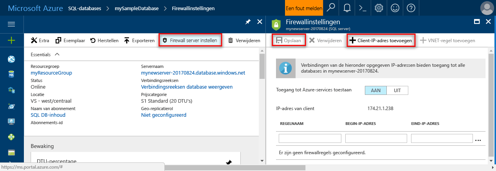

# Azure SQL Database-servers en databases maken en beherenCreate and manage Azure SQL Database servers and databases

Een Azure SQL database is een beheerde database in Microsoft Azure die is gemaakt binnen een [Azure-resourcegroep](../azure-resource-manager/resource-group-overview.md) met een gedefinieerde set [berekenings- en bronnen voor verschillende werkbelastingen](sql-database-service-tiers.md).An Azure SQL database is a managed database in Microsoft Azure that is created within an [Azure resource group](../azure-resource-manager/resource-group-overview.md) with a defined set of [compute and storage resources for different workloads](sql-database-service-tiers.md). Een Azure SQL database is gekoppeld aan een logische Azure SQL Database-server op, die wordt gemaakt binnen een specifieke Azure-regio.An Azure SQL database is associated with an Azure SQL Database logical server, which is created within a specific Azure region. 

## Een Azure SQL database kan zowel een enkele, gegroepeerde of gepartitioneerde databaseAn Azure SQL database can be a single, pooled, or partitioned database

Een Azure SQL database kan zijn:An Azure SQL database can be:

- Een individuele database met een [eigen set resources](sql-database-what-is-a-dtu.md#what-are-database-transaction-units-dtus) (DTU's)A single database with its [own set of resources](sql-database-what-is-a-dtu.md#what-are-database-transaction-units-dtus) (DTUs)
- Onderdeel van een [elastische SQL-groep](sql-database-elastic-pool.md) die [deelt van een set resources](sql-database-what-is-a-dtu.md#what-are-elastic-database-transaction-units-edtus) (edtu's)Part of a [SQL elastic pool](sql-database-elastic-pool.md) that [shares a set of resources](sql-database-what-is-a-dtu.md#what-are-elastic-database-transaction-units-edtus) (eDTUs)
- Een onderdeel van een set [uitgeschaalde Shard-databases](sql-database-elastic-scale-introduction.md#horizontal-and-vertical-scaling), welke individuele databases of databases in een groep kunnen zijnPart of a [scaled-out set of sharded databases](sql-database-elastic-scale-introduction.md#horizontal-and-vertical-scaling), which can be either single or pooled databases
- Een onderdeel van een set databases die deel uitmaken van een [SaaS-ontwerppatroon met meerdere tenants](sql-database-design-patterns-multi-tenancy-saas-applications.md), waarvan de databases individuele databases of een databases in een groep (of beide) kunnen zijnPart of a set of databases participating in a [multitenant SaaS design pattern](sql-database-design-patterns-multi-tenancy-saas-applications.md), and whose databases can either be single or pooled databases (or both) 

> [!TIP]
> Zie [Database-id's](https://docs.microsoft.com/en-us/sql/relational-databases/databases/database-identifiers) voor geldige databasenamen.For valid database names, see [Database Identifiers](https://docs.microsoft.com/en-us/sql/relational-databases/databases/database-identifiers). 
>
 
- Hallo standaarddatabasesortering die wordt gebruikt door Microsoft Azure SQL Database is **SQL_LATIN1_GENERAL_CP1_CI_AS**, waarbij **LATIN1_GENERAL** Engels (Verenigde Staten), **CP1** codetabel 1252, is **CI** is niet hoofdlettergevoelig, en **AS** accentgevoelig is.hello default database collation used by Microsoft Azure SQL Database is **SQL_LATIN1_GENERAL_CP1_CI_AS**, where **LATIN1_GENERAL** is English (United States), **CP1** is code page 1252, **CI** is case-insensitive, and **AS** is accent-sensitive. Zie voor meer informatie over hoe tooset sortering Hallo [COLLATE (Transact-SQL)](https://msdn.microsoft.com/library/ms184391.aspx).For more information about how tooset hello collation, see [COLLATE (Transact-SQL)](https://msdn.microsoft.com/library/ms184391.aspx).
- Microsoft Azure SQL Database ondersteunt tabular data stream (TDS)-protocol clientversie 7.3 of hoger.Microsoft Azure SQL Database supports tabular data stream (TDS) protocol client version 7.3 or later.
- Alleen TCP/IP-verbindingen zijn toegestaan.Only TCP/IP connections are allowed.

## Wat is een logische Azure SQL-server?What is an Azure SQL logical server?

Een logische server fungeert als een administratieve middelpunt voor meerdere databases, met inbegrip van [SQL elastische pools](sql-database-elastic-pool.md) [aanmeldingen](sql-database-manage-logins.md), [firewall-regels](sql-database-firewall-configure.md), [controle regels](sql-database-auditing.md), [dreiging beleidsregels](sql-database-threat-detection.md), en [failover groepen](sql-database-geo-replication-overview.md).A logical server acts as a central administrative point for multiple databases, including [SQL elastic pools](sql-database-elastic-pool.md) [logins](sql-database-manage-logins.md), [firewall rules](sql-database-firewall-configure.md), [auditing rules](sql-database-auditing.md), [threat detection policies](sql-database-threat-detection.md), and [failover groups](sql-database-geo-replication-overview.md). Een logische server kan zich in een andere regio dan de resourcegroep.A logical server can be in a different region than its resource group. Hallo logische server moet bestaan voordat u kunt hello Azure SQL database maken.hello logical server must exist before you can create hello Azure SQL database. Alle databases op een server worden gemaakt binnen Hallo dezelfde regio bevinden als Hallo logische server.All databases on a server are created within hello same region as hello logical server. 

> [!IMPORTANT]
> In SQL-Database is een server een logische constructie die verschilt van een SQL Server-exemplaar dat u mogelijk kent met in Hallo lokale wereld.In SQL Database, a server is a logical construct that is distinct from a SQL Server instance that you may be familiar with in hello on-premises world. In het bijzonder Hallo SQL Database-service maakt geen garanties met betrekking tot de locatie van het Hallo-databases in de relatie tootheir logische servers en beschrijft geen instantieniveau toegang of functies.Specifically, hello SQL Database service makes no guarantees regarding location of hello databases in relation tootheir logical servers, and exposes no instance-level access or features.
> 

Wanneer u een logische server maakt, Geef een beheerserver aanmeldingsaccount en het wachtwoord heeft beheerdersrechten toohello master-database op die server en alle databases die zijn gemaakt op die server.When you create a logical server, you provide a server login account and password that has administrative rights toohello master database on that server and all databases created on that server. Dit eerste account is een SQL-aanmeldings-account.This initial account is a SQL login account. Azure SQL Database ondersteunt SQL-verificatie en Azure Active Directory-verificatie voor verificatie.Azure SQL Database supports SQL authentication and Azure Active Directory Authentication for authentication. Zie voor informatie over aanmeldingen en verificatie, [het beheren van Databases en aanmeldingen in Azure SQL Database](sql-database-manage-logins.md).For information about logins and authentication, see [Managing Databases and Logins in Azure SQL Database](sql-database-manage-logins.md). Windows-verificatie wordt niet ondersteund.Windows Authentication is not supported. 

> [!TIP]
> Zie voor een geldige groep en server Resourcenamen [naamgeving van regels en beperkingen](https://docs.microsoft.com/azure/architecture/best-practices/naming-conventions).For valid resource group and server names, see [Naming rules and restrictions](https://docs.microsoft.com/azure/architecture/best-practices/naming-conventions).
>

Een logische server met Azure Database:An Azure Database logical server:

- Binnen een Azure-abonnement is gemaakt, maar kan worden verplaatst met het abonnement van de tooanother ingesloten bronnenIs created within an Azure subscription, but can be moved with its contained resources tooanother subscription
- Hallo resource bovenliggende voor de databases en elastische pools datawarehousesIs hello parent resource for databases, elastic pools, and data warehouses
- Biedt een naamruimte voor de databases en elastische pools datawarehousesProvides a namespace for databases, elastic pools, and data warehouses
- Een logische container met sterke levensduur semantiek - verwijderen wordt verwijderd van een server en het is Hallo ingesloten databases en elastische pools datawarehousesIs a logical container with strong lifetime semantics - delete a server and it deletes hello contained databases, elastic pools, and data warehouses
- Maakt deel uit van [Azure op rollen gebaseerde toegangsbeheer (RBAC)](/active-directory/role-based-access-control-what-is) -databases en elastische pools datawarehouses binnen een server toegangsrechten van Hallo server overnemenParticipates in [Azure role-based access control (RBAC)](/active-directory/role-based-access-control-what-is) - databases, elastic pools, and data warehouses within a server inherit access rights from hello server
- Is een hogere-element van Hallo identiteit van de databases en elastische pools datawarehouses voor Azure resource management-toepassing (Zie Hallo URL-schema voor de databases en pools)Is a high-order element of hello identity of databases, elastic pools, and data warehouses for Azure resource management purposes (see hello URL scheme for databases and pools)
- Groepeert resources in een regioCollocates resources in a region
- Biedt een verbindingseindpunt voor databasetoegang (<serverName>.database.windows.net)Provides a connection endpoint for database access (<serverName>.database.windows.net)
- Biedt toegang tot toometadata met betrekking tot ingesloten bronnen via DMV's door de verbindende tooa hoofddatabaseProvides access toometadata regarding contained resources via DMVs by connecting tooa master database 
- Biedt Hallo bereik voor management-beleidsregels die toepassing tooits databases - aanmeldingen, firewall-, controleren, dreiging detectie, enz.Provides hello scope for management policies that apply tooits databases - logins, firewall, audit, threat detection, etc. 
- Wordt beperkt door een quotum binnen Hallo bovenliggende abonnement (zes servers per abonnement standaard - [Zie abonnement hier beperkt](../azure-subscription-service-limits.md))Is restricted by a quota within hello parent subscription (six servers per subscription by default - [see Subscription limits here](../azure-subscription-service-limits.md))
- Hallo-bereik voor databasequotum en DTU-quotum biedt voor Hallo resources (zoals 45.000 DTU bevat)Provides hello scope for database quota and DTU quota for hello resources it contains (such as 45,000 DTU)
- Hallo bereik versioning voor mogelijkheden ingeschakeld op ingesloten bronnenIs hello versioning scope for capabilities enabled on contained resources 
- Hoofdaanmeldingen op serverniveau kunnen alle databases op een server beherenServer-level principal logins can manage all databases on a server
- Kan aanmeldingen bevatten vergelijkbaar toothose in exemplaren van SQL Server on-premises dat krijgen toegang tooone of meer databases op Hallo-server en kunnen worden verleend beperkte beheerdersrechten.Can contain logins similar toothose in instances of SQL Server on your premises that are granted access tooone or more databases on hello server, and can be granted limited administrative rights. Zie [Aanmeldingen](sql-database-manage-logins.md) voor meer informatie.For more information, see [Logins](sql-database-manage-logins.md).

## Azure SQL databases hebt beveiligd met SQL Database-firewallAzure SQL databases protected by SQL Database firewall

toohelp beschermt uw gegevens een [SQL Database-firewall](sql-database-firewall-configure.md) voorkomt u dat alle toegang tooyour database-server of een van de databases van buiten uw server verbinding toohello rechtstreeks via de verbinding van uw Azure-abonnement.toohelp protect your data, a [SQL Database firewall](sql-database-firewall-configure.md) prevents all access tooyour database server or any of its databases from outside of your connection toohello server directly through your Azure subscription connection. tooenable aanvullende connectiviteit, moet u [maken van een of meer firewallregels](sql-database-firewall-configure.md#creating-and-managing-firewall-rules).tooenable additional connectivity, you must [create one or more firewall rules](sql-database-firewall-configure.md#creating-and-managing-firewall-rules). Zie voor het maken en beheren van de elastische pools SQL, [elastische pools](sql-database-elastic-pool.md).For creating and managing SQL elastic pools, see [Elastic pools](sql-database-elastic-pool.md).

## Azure SQL-servers, databases en firewalls met hello Azure-portal beherenManage Azure SQL servers, databases, and firewalls using hello Azure portal

U kunt hello Azure SQL database resourcegroep tevoren of tijdens het maken van Hallo-server zelf maken.You can create hello Azure SQL database's resource group ahead of time or while creating hello server itself. Er zijn meerdere methoden voor het ophalen van tooa nieuw SQL serverformulier door het maken van een nieuwe SQL-server of als onderdeel van het maken van een nieuwe database.There are multiple methods for getting tooa new SQL server form, either by creating a new SQL server or as part of creating a new database. 

### Maak een lege SQL-server (logische server)Create a blank SQL server (logical server)

een Azure SQL Database-server (zonder een database) met toocreate Hallo [Azure-portal](https://portal.azure.com), navigeer tooa leeg SQL server (logische server) formulier.toocreate an Azure SQL Database server (without a database) using hello [Azure portal](https://portal.azure.com), navigate tooa blank SQL server (logical server) form. Hallo volgende schermafbeelding ziet u een methode voor het openen van een formulier toocreate een lege logische SQL-server.hello following screenshot shows one method for opening a form toocreate a blank logical SQL server. 

   

Als u toothis formulier met een andere methode krijgt, is informatie op Hallo formulier Hallo identiek.If you get toothis form using another method, hello information on hello form is identical.

### Maak een lege of voorbeeld SQL-databaseCreate a blank or sample SQL database

een Azure SQL database met toocreate Hallo [Azure-portal](https://portal.azure.com), gaat u tooa leeg SQL Database-formulier en bieden Hallo aangevraagde informatie.toocreate an Azure SQL database using hello [Azure portal](https://portal.azure.com), navigate tooa blank SQL Database form and provide hello requested information. U kunt de resourcegroep en de logische server tevoren of tijdens het Hallo-database zelf maken hello Azure SQL database maken.You can create hello Azure SQL database's resource group and logical server ahead of time or while creating hello database itself. U kunt een lege database maken of maken van een voorbeelddatabase van Adventure Works LT. gebaseerdYou can create a blank database or create a sample database based on Adventure Works LT. 

  

> [BELANGRIJK] Zie voor meer informatie over het selecteren van Hallo prijscategorie voor uw database [Servicelagen](sql-database-service-tiers.md).[IMPORTANT] For information on selecting hello pricing tier for your database, see [Service tiers](sql-database-service-tiers.md).
>

### Een bestaande SQL server beherenManage an existing SQL server

toomanage een bestaande server, gaat u toohello server met behulp van een aantal methoden - pagina voor specifieke SQL-database, zoals hello **SQL-servers** pagina of Hallo **alle resources** pagina.toomanage an existing server, navigate toohello server using a number of methods - such as from specific SQL database page, hello **SQL servers** page, or hello **All resources** page. Hallo volgende schermafbeelding ziet hoe toobegin instellen van een firewall van het niveau van de server uit Hallo **overzicht** pagina voor een server.hello following screenshot shows how toobegin setting a server-level firewall from hello **Overview** page for a server. 

   

een bestaande database toomanage navigeren toohello **SQL-databases** pagina en klik op de gewenste toomanage Hallo-database.toomanage an existing database, navigate toohello **SQL databases** page and click hello database you wish toomanage. Hallo volgende schermafbeelding ziet hoe toobegin instellen van een firewall van het niveau van de server voor een database uit Hallo **overzicht** pagina voor een database.hello following screenshot shows how toobegin setting a server-level firewall for a database from hello **Overview** page for a database. 

    

> [!IMPORTANT]
> tooconfigure prestaties eigenschappen voor een database, Zie [Servicelagen](sql-database-service-tiers.md).tooconfigure performance properties for a database, see [Service tiers](sql-database-service-tiers.md).
>

> [!TIP]
> Zie voor een Azure-portal snel starten-zelfstudie [maken van een Azure SQL database in Azure-portal Hallo](sql-database-get-started-portal.md).For an Azure portal quick start tutorial, see [Create an Azure SQL database in hello Azure portal](sql-database-get-started-portal.md).
>

## Azure SQL-servers, databases, en firewalls beheren met behulp van PowerShellManage Azure SQL servers, databases, and firewalls using PowerShell

toocreate en beheren van Azure SQL-server, databases en firewalls met Azure PowerShell, gebruikt u Hallo volgende PowerShell-cmdlets.toocreate and manage Azure SQL server, databases, and firewalls with Azure PowerShell, use hello following PowerShell cmdlets. Als u tooinstall moet of een upgrade van PowerShell, raadpleegt u [Installeer Azure PowerShell-module](/powershell/azure/install-azurerm-ps).If you need tooinstall or upgrade PowerShell, see [Install Azure PowerShell module](/powershell/azure/install-azurerm-ps). Zie voor het maken en beheren van de elastische pools SQL, [elastische pools](sql-database-elastic-pool.md).For creating and managing SQL elastic pools, see [Elastic pools](sql-database-elastic-pool.md).

| CmdletCmdlet | BeschrijvingDescription |
| --- | --- |
|[New-AzureRmSqlDatabaseNew-AzureRmSqlDatabase](/powershell/module/azurerm.sql/new-azurermsqldatabase)|Maakt een databaseCreates a database |
|[Get-AzureRmSqlDatabaseGet-AzureRmSqlDatabase](/powershell/module/azurerm.sql/get-azurermsqldatabase)|Een of meer databases opgehaaldGets one or more databases|
|[Set-AzureRmSqlDatabaseSet-AzureRmSqlDatabase](/powershell/module/azurerm.sql/set-azurermsqldatabase)|Stelt eigenschappen van een database of een bestaande database is verplaatst naar een elastische poolSets properties for a database, or moves an existing database into an elastic pool|
|[Verwijder AzureRmSqlDatabaseRemove-AzureRmSqlDatabase](/powershell/module/azurerm.sql/remove-azurermsqldatabase)|Hiermee verwijdert u een databaseRemoves a database|
|[Nieuwe AzureRmResourceGroupNew-AzureRmResourceGroup](/powershell/module/azurerm.resources/new-azurermresourcegroup)|Maakt een resourcegroep]Creates a resource group]
|[Nieuwe AzureRmSqlServerNew-AzureRmSqlServer](/powershell/module/azurerm.sql/new-azurermsqlserver)|Hiermee maakt u een serverCreates a  server|
|[Get-AzureRmSqlServerGet-AzureRmSqlServer](/powershell/module/azurerm.sql/get-azurermsqlserver)|Retourneert informatie over serversReturns information about servers|
|[Set-AzureRmSqlServerSet-AzureRmSqlServer](https://docs.microsoft.com/en-us/powershell/module/azurerm.sql/set-azurermsqlserver)|Hiermee wijzigt u de eigenschappen van een serverModifies properties of a server|
|[Remove-AzureRmSqlServerRemove-AzureRmSqlServer](/powershell/module/azurerm.sql/remove-azurermsqlserver)|Hiermee verwijdert u een serverRemoves a server|
|[New-AzureRmSqlServerFirewallRuleNew-AzureRmSqlServerFirewallRule](/powershell/module/azurerm.sql/new-azurermsqlserverfirewallrule)|Hiermee maakt u een firewallregel op serverniveauCreates a server-level firewall rule |
|[Get-AzureRmSqlServerFirewallRuleGet-AzureRmSqlServerFirewallRule](/powershell/module/azurerm.sql/get-azurermsqlserverfirewallrule)|Firewallregels voor server opgehaaldGets firewall rules for a server|
|[Set-AzureRmSqlServerFirewallRuleSet-AzureRmSqlServerFirewallRule](/powershell/module/azurerm.sql/set-azurermsqlserverfirewallrule)|Hiermee wijzigt u een firewallregel in een serverModifies a firewall rule in a server|
|[Remove-AzureRmSqlServerFirewallRuleRemove-AzureRmSqlServerFirewallRule](/powershell/module/azurerm.sql/remove-azurermsqlserverfirewallrule)|Hiermee verwijdert u een firewallregel van een server.Deletes a firewall rule from a server.|

> [!TIP]
> Zie voor een PowerShell snel starten-zelfstudie [maken van één Azure SQL database met behulp van PowerShell](sql-database-get-started-portal.md).For a PowerShell quick start tutorial, see [Create a single Azure SQL database using PowerShell](sql-database-get-started-portal.md). Zie voor PowerShell-voorbeeldscripts, [Gebruik PowerShell toocreate één Azure SQL database en een firewallregel configureren](scripts/sql-database-create-and-configure-database-powershell.md) en [bewaken en schalen van een enkele SQL-database met behulp van PowerShell](scripts/sql-database-monitor-and-scale-database-powershell.md).For PowerShell example scripts, see [Use PowerShell toocreate a single Azure SQL database and configure a firewall rule](scripts/sql-database-create-and-configure-database-powershell.md) and [Monitor and scale a single SQL database using PowerShell](scripts/sql-database-monitor-and-scale-database-powershell.md).
>

## Azure SQL-servers, databases, en firewalls beheren met behulp van hello Azure CLIManage Azure SQL servers, databases, and firewalls using hello Azure CLI

toocreate en beheren van Azure SQL-server, databases en firewalls Hello [Azure CLI](/cli/azure/overview), gebruikt u de volgende Hallo [Azure CLI SQL Database](/cli/azure/sql/db) opdrachten.toocreate and manage Azure SQL server, databases, and firewalls with hello [Azure CLI](/cli/azure/overview), use hello following [Azure CLI SQL Database](/cli/azure/sql/db) commands. Gebruik Hallo [Cloud Shell](/azure/cloud-shell/overview) toorun Hallo CLI in uw browser of [installeren](/cli/azure/install-azure-cli) op Mac OS-, Linux- of Windows.Use hello [Cloud Shell](/azure/cloud-shell/overview) toorun hello CLI in your browser, or [install](/cli/azure/install-azure-cli) it on macOS, Linux, or Windows. Zie voor het maken en beheren van de elastische pools SQL, [elastische pools](sql-database-elastic-pool.md).For creating and managing SQL elastic pools, see [Elastic pools](sql-database-elastic-pool.md).

| CmdletCmdlet | BeschrijvingDescription |
| --- | --- |
|[AZ sql-database makenaz sql db create](/cli/azure/sql/db#create) |Maakt een databaseCreates a database|
|[AZ sql db-lijstaz sql db list](/cli/azure/sql/db#list)|Geeft een lijst van alle databases en datawarehouses in een server of alle databases in een elastische poolLists all databases and data warehouses in a server, or all databases in an elastic pool|
|[AZ sql db-editiesaz sql db list-editions](/cli/azure/sql/db#list-editions)|Een lijst met beschikbare service doelstellingen en opslaglimietenLists available service objectives and storage limits|
|[AZ sql db lijst-gebruikaz sql db list-usages](/cli/azure/sql/db#list-usages)|Retourneert het gebruik van de databaseReturns database usages|
|[AZ sql db weergevenaz sql db show](/cli/azure/sql/db#show)|Een database of de data warehouse opgehaaldGets a database or data warehouse|
|[AZ sql database-updateaz sql db update](/cli/azure/sql/db#update)|Een database bijwerktUpdates a database|
|[AZ sql db verwijderenaz sql db delete](/cli/azure/sql/db#delete)|Hiermee verwijdert u een databaseRemoves a database|
|[AZ groep makenaz group create](/cli/azure/group#create)|Maakt een resourcegroepCreates a resource group|
|[AZ sql server makenaz sql server create](/cli/azure/sql/server#create)|Hiermee maakt u een serverCreates a server|
|[lijst met AZ sql serveraz sql server list](/cli/azure/sql/server#list)|Een lijst met serversLists servers|
|[AZ sql server lijst-gebruikaz sql server list-usages](/cli/azure/sql/server#list-usages)|Retourneert het gebruik van serverReturns  server usages|
|[AZ sql server weergevenaz sql server show](/cli/azure/sql/server#show)|Een server opgehaaldGets a server|
|[update van sql server AZaz sql server update](/cli/azure/sql/server#update)|Een server worden bijgewerktUpdates a server|
|[AZ sql server verwijderenaz sql server delete](/cli/azure/sql/server#delete)|Een server verwijderenDeletes a server|
|[AZ sql server-firewallregel makenaz sql server firewall-rule create](/cli/azure/sql/server/firewall-rule#create)|Hiermee maakt u een firewallregel op serverCreates a server firewall rule|
|[lijst van AZ sql server-firewallregelaz sql server firewall-rule list](/cli/azure/sql/server/firewall-rule#list)|Geeft een lijst van de firewallregels Hallo op een serverLists hello firewall rules on a server|
|[AZ sql server-firewallregel weergevenaz sql server firewall-rule show](/cli/azure/sql/server/firewall-rule#show)|Hallo-details van een firewallregelShows hello detail of a firewall rule|
|[update van AZ sql server-firewallregelaz sql server firewall-rule update](/cli/azure/sql/server/firewall-rule#update)|Een firewallregel bijgewerktUpdates a firewall rule|
|[AZ sql server-firewallregel verwijderenaz sql server firewall-rule delete](/cli/azure/sql/server/firewall-rule#delete)|Hiermee verwijdert u een firewallregelDeletes a firewall rule|

> [!TIP]
> Zie voor een zelfstudie snel starten met Azure CLI, [maken van één Azure SQL database met behulp van Azure CLI Hallo](sql-database-get-started-cli.md).For an Azure CLI quick start tutorial, see [Create a single Azure SQL database using hello Azure CLI](sql-database-get-started-cli.md). Zie voor Azure CLI-voorbeeldscripts, [gebruik CLI toocreate één Azure SQL database en een firewallregel configureren](scripts/sql-database-create-and-configure-database-cli.md) en [gebruik CLI toomonitor en schaal één SQL-database](scripts/sql-database-monitor-and-scale-database-cli.md).For Azure CLI example scripts, see [Use CLI toocreate a single Azure SQL database and configure a firewall rule](scripts/sql-database-create-and-configure-database-cli.md) and [Use CLI toomonitor and scale a single SQL database](scripts/sql-database-monitor-and-scale-database-cli.md).
>

## Azure SQL-servers, databases, en firewalls beheren met behulp van Transact-SQLManage Azure SQL servers, databases, and firewalls using Transact-SQL

toocreate en beheren van Azure SQL-server, databases en firewalls met Transact-SQL, Hallo volgende T-SQL-opdrachten gebruiken.toocreate and manage Azure SQL server, databases, and firewalls with Transact-SQL, use hello following T-SQL commands. U kunt deze opdrachten hello Azure-portal met de opdracht [SQL Server Management Studio](/sql/ssms/use-sql-server-management-studio), [Visual Studio Code](https://code.visualstudio.com/docs), of een ander programma dat kan verbinding maken met tooan Azure SQL Database-server en doorgeven Transact-SQL de opdrachten.You can issue these commands using hello Azure portal, [SQL Server Management Studio](/sql/ssms/use-sql-server-management-studio), [Visual Studio Code](https://code.visualstudio.com/docs), or any other program that can connect tooan Azure SQL Database server and pass Transact-SQL commands. Zie voor het beheren van de elastische pools SQL [elastische pools](sql-database-elastic-pool.md).For managing SQL elastic pools, see [Elastic pools](sql-database-elastic-pool.md).

> [!IMPORTANT]
> U kunt maken of verwijderen van een server met behulp van Transact-SQL.You cannot create or delete a server using Transact-SQL.
>

| OpdrachtCommand | BeschrijvingDescription |
| --- | --- |
|[DATABASE (Azure SQL Database) makenCREATE DATABASE (Azure SQL Database)](/sql/t-sql/statements/create-database-azure-sql-database)|Maakt een nieuwe database.Creates a new database. U moet verbonden toohello hoofddatabase toocreate een nieuwe database.You must be connected toohello master database toocreate a new database.|
| [ALTER DATABASE (Azure SQL Database)ALTER DATABASE (Azure SQL Database)](/sql/t-sql/statements/alter-database-azure-sql-database) |Hiermee wijzigt u een Azure SQL database.Modifies an Azure SQL database. |
|[ALTER DATABASE (Azure SQL datawarehouse)ALTER DATABASE (Azure SQL Data Warehouse)](/sql/t-sql/statements/alter-database-azure-sql-data-warehouse)|Hiermee wijzigt u een Azure SQL datawarehouse.Modifies an Azure SQL Data Warehouse.|
|[DATABASE (Transact-SQL) verwijderenDROP DATABASE (Transact-SQL)](/sql/t-sql/statements/drop-database-transact-sql)|Hiermee verwijdert u een database.Deletes a database.|
|[sys.database_service_objectives (Azure SQL Database)sys.database_service_objectives (Azure SQL Database)](/sql/relational-databases/system-catalog-views/sys-database-service-objectives-azure-sql-database)|Retourneert Hallo edition (servicelaag), servicedoelstelling (prijscategorie) en de naam van de elastische groep, indien aanwezig, voor een Azure SQL database of een Azure SQL Data Warehouse.Returns hello edition (service tier), service objective (pricing tier), and elastic pool name, if any, for an Azure SQL database or an Azure SQL Data Warehouse. Als u aangemeld bent op de hoofddatabase toohello in een Azure SQL Database-server, retourneert de informatie voor alle databases.If logged on toohello master database in an Azure SQL Database server, returns information on all databases. Voor Azure SQL Data Warehouse moet u verbonden toohello hoofddatabase.For Azure SQL Data Warehouse, you must be connected toohello master database.|
|[sys.dm_db_resource_stats (Azure SQL Database)sys.dm_db_resource_stats (Azure SQL Database)](/sql/relational-databases/system-dynamic-management-views/sys-dm-db-resource-stats-azure-sql-database)| Retourneert de CPU, i/o- en geheugen verbruik voor een Azure SQL Database-database.Returns CPU, I/O, and memory consumption for an Azure SQL Database database. Één rij bestaat voor elke 15 seconden, zelfs als er geen activiteit in Hallo-database.One row exists for every 15 seconds, even if there is no activity in hello database.|
|[sys.resource_stats (Azure SQL Database)sys.resource_stats (Azure SQL Database)](/sql/relational-databases/system-catalog-views/sys-resource-stats-azure-sql-database)|Retourneert de gegevens in CPU-gebruik en opslag voor een Azure SQL Database.Returns CPU usage and storage data for an Azure SQL Database. Hallo-gegevens worden verzameld en geaggregeerd binnen vijf minuten.hello data is collected and aggregated within five-minute intervals.|
|[sys.database_connection_stats (Azure SQL Database)sys.database_connection_stats (Azure SQL Database)](/sql/relational-databases/system-catalog-views/sys-database-connection-stats-azure-sql-database)|Statistieken voor SQL-Database database connectiviteitsgebeurtenissen, met een overzicht van de database verbinding successen en mislukkingen bevat.Contains statistics for SQL Database database connectivity events, providing an overview of database connection successes and failures. |
|[sys.event_log (Azure SQL Database)sys.event_log (Azure SQL Database)](/sql/relational-databases/system-catalog-views/sys-event-log-azure-sql-database)|Geslaagde Azure SQL Database-databaseverbindingen verbindingsfouten en impassen retourneert.Returns successful Azure SQL Database database connections, connection failures, and deadlocks. U kunt deze informatie tootrack gebruiken of de activiteit van uw database met SQL Database oplossen.You can use this information tootrack or troubleshoot your database activity with SQL Database.|
|[sp_set_firewall_rule (Azure SQL Database)sp_set_firewall_rule (Azure SQL Database)](/sql/relational-databases/system-stored-procedures/sp-set-firewall-rule-azure-sql-database)|Maken of bijwerken van Hallo serverniveau firewall-instellingen voor uw SQL Database-server.Creates or updates hello server-level firewall settings for your SQL Database server. Deze opgeslagen procedure is alleen beschikbaar in Hallo hoofddatabase toohello niveau van de server principal-aanmelding op.This stored procedure is only available in hello master database toohello server-level principal login. Een firewallregel op serverniveau kan alleen worden gemaakt met behulp van Transact-SQL nadat Hallo eerste niveau van de server firewall-regel is gemaakt door een gebruiker met machtigingen op Azure-niveauA server-level firewall rule can only be created using Transact-SQL after hello first server-level firewall rule has been created by a user with Azure-level permissions|
|[sys.firewall_rules (Azure SQL Database)sys.firewall_rules (Azure SQL Database)](/sql/relational-databases/system-catalog-views/sys-firewall-rules-azure-sql-database)|Retourneert informatie over Hallo serverniveau firewall-instellingen die zijn gekoppeld aan uw Microsoft Azure SQL Database.Returns information about hello server-level firewall settings associated with your Microsoft Azure SQL Database.|
|[sp_delete_firewall_rule (Azure SQL Database)sp_delete_firewall_rule (Azure SQL Database)](/sql/relational-databases/system-stored-procedures/sp-delete-firewall-rule-azure-sql-database)|Hiermee verwijdert u serverniveau firewall-instellingen van uw SQL-Database-server.Removes server-level firewall settings from your SQL Database server. Deze opgeslagen procedure is alleen beschikbaar in Hallo hoofddatabase toohello niveau van de server principal-aanmelding op.This stored procedure is only available in hello master database toohello server-level principal login.|
|[sp_set_database_firewall_rule (Azure SQL Database)sp_set_database_firewall_rule (Azure SQL Database)](/sql/relational-databases/system-stored-procedures/sp-set-database-firewall-rule-azure-sql-database)|Maken of bijwerken van Hallo databaseniveau firewallregels voor uw Azure SQL Database of SQL Data Warehouse.Creates or updates hello database-level firewall rules for your Azure SQL Database or SQL Data Warehouse. Database-firewall-regels kunnen worden geconfigureerd voor de hoofddatabase Hallo en gebruikersdatabases op SQL-Database.Database firewall rules can be configured for hello master database, and for user databases on SQL Database. Database-firewallregels zijn nuttig wanneer databasegebruikers met behulp van opgenomen.Database firewall rules are useful when using contained database users. |
|[sys.database_firewall_rules (Azure SQL Database)sys.database_firewall_rules (Azure SQL Database)](/sql/relational-databases/system-catalog-views/sys-database-firewall-rules-azure-sql-database)|Retourneert informatie over Hallo databaseniveau firewall-instellingen die zijn gekoppeld aan uw Microsoft Azure SQL Database.Returns information about hello database-level firewall settings associated with your Microsoft Azure SQL Database. |
|[sp_delete_database_firewall_rule (Azure SQL Database)sp_delete_database_firewall_rule (Azure SQL Database)](/sql/relational-databases/system-stored-procedures/sp-delete-database-firewall-rule-azure-sql-database)|Hiermee verwijdert u de instelling van de firewallregel op databaseniveau van uw Azure SQL Database of SQL Data Warehouse.Removes database-level firewall setting from your Azure SQL Database or SQL Data Warehouse. |

> [!TIP]
> Zie voor een zelfstudie voor snel starten met behulp van SQL Server Management Studio op Microsoft Windows, [Azure SQL Database: gebruikt SQL Server Management Studio tooconnect en query gegevens](sql-database-connect-query-ssms.md).For quick start tutorial using SQL Server Management Studio on Microsoft Windows, see [Azure SQL Database: Use SQL Server Management Studio tooconnect and query data](sql-database-connect-query-ssms.md). Zie voor een zelfstudie voor snel starten met behulp van Visual Studio Code op Hallo Mac OS-, Linux- of Windows, [Azure SQL Database: Gebruik Visual Studio Code tooconnect en query gegevens](sql-database-connect-query-vscode.md).For a quick start tutorial using Visual Studio Code on hello macOS, Linux, or Windows, see [Azure SQL Database: Use Visual Studio Code tooconnect and query data](sql-database-connect-query-vscode.md).

## Azure SQL-servers, databases, en firewalls beheren met behulp van Hallo REST-APIManage Azure SQL servers, databases, and firewalls using hello REST API

toocreate en Azure SQL-server, databases en Hallo REST-API met firewalls beheren, Zie [REST-API van Azure SQL Database](/rest/api/sql/).toocreate and manage Azure SQL server, databases, and firewalls using hello REST API, see [Azure SQL Database REST API](/rest/api/sql/).

## Volgende stappenNext steps

- toolearn over het groeperen van databases met SQL elastische pools, Zie [elastische pools](sql-database-elastic-pool.md).toolearn about pooling databases using SQL elastic pools, see [Elastic pools](sql-database-elastic-pool.md).
- Zie voor meer informatie over Azure SQL Database-service Hallo [wat is er SQL-Database?](sql-database-technical-overview.md).For information about hello Azure SQL Database service, see [What is SQL Database?](sql-database-technical-overview.md).
- Zie toolearn over het migreren van een SQL Server database-tooAzure [tooAzure SQL-Database migreren](sql-database-cloud-migrate.md).toolearn about migrating a SQL Server database tooAzure, see [Migrate tooAzure SQL Database](sql-database-cloud-migrate.md).
- Zie [Functies](sql-database-features.md) voor meer informatie over ondersteunde functies.For information about supported features, see [Features](sql-database-features.md).
