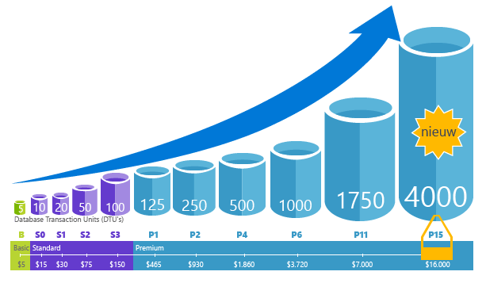
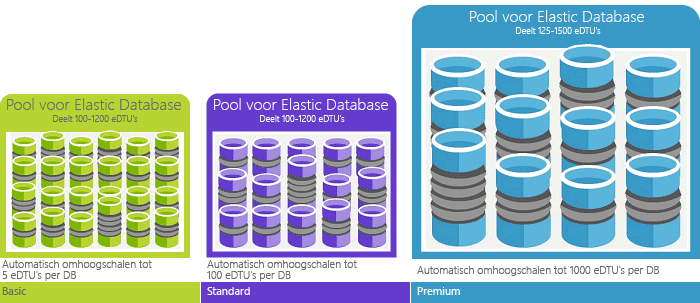

# Wat is Azure SQL Database-service Hallo? 

SQL Database is een algemene relationele databaseservice in Microsoft Azure die ondersteuning biedt voor structuren zoals relationele gegevens, JSON, ruimtelijke gegevens en XML. De service biedt [dynamisch schaalbare prestaties](sql-database-service-tiers.md) en opties zoals [columnstore-indexen](https://docs.microsoft.com/sql/relational-databases/indexes/columnstore-indexes-overview) voor krachtige analyses en rapportages, en [in-memory OLTP](sql-database-in-memory.md) voor veeleisende transactieverwerking. Microsoft verwerkt alle patches en bijwerken van Hallo SQL codebasis naadloos en isoleert afwezig alle management Hallo onderliggende infrastructuur. 

SQL-Database deelt de codebasis met Hallo [Microsoft SQL Server database-engine](https://docs.microsoft.com/sql/sql-server/sql-server-technical-documentation). Met de strategie van Microsoft cloud eerste zijn Hallo nieuwste mogelijkheden van SQL Server vrijgegeven eerste tooSQL Database en tooSQL Server zelf. Deze aanpak geeft u met Hallo nieuwste mogelijkheden voor SQL Server met geen overhead voor patch-doeleinden of upgrade- en met deze nieuwe functies die zijn getest in miljoenen databases. Ga voor informatie over aangekondigde nieuwe mogelijkheden naar:

- **[Azure Roadmap voor SQL-Database](https://azure.microsoft.com/roadmap/?category=databases)**: een plaats toofind wat is er nieuw en binnenkort volgende. 
- **[Azure SQL Database-blog](https://azure.microsoft.com/blog/topics/database)**: hier plaatsen de leden van het SQL Server-productteam berichten met het laatste nieuws over SQL Database en informatie over nieuwe functies. 

SQL Database levert voorspelbare prestaties op meerdere serviceniveaus met dynamische schaalbaarheid zonder uitvaltijd, ingebouwde intelligente optimalisatie, schaalbaarheid en beschikbaarheid op wereldwijde schaal en geavanceerde beveiligingsmogelijkheden. Bovendien hoeft u vrijwel geen tijd te besteden aan beheer. Deze mogelijkheden kunnen u toofocus op sneller ontwikkelen en uw toomarket tijd versnellen, plaats u kostbare tijd en bronnen toomanaging virtuele machines en infrastructuur. Hallo SQL Database-service momenteel in 38 gegevens is draait om Hallo wereld met meer datacenters regelmatig online binnenkort waarmee u toorun uw database in een datacentrum in de buurt.

> [!NOTE]
> Ga naar het [Vertrouwenscentrum van Azure](https://azure.microsoft.com/support/trust-center/security/) voor informatie over de beveiliging van het Azure-platform.
>

## Schaalbare prestaties en pools

Met SQL Database zijn alle databases volledig geïsoleerd en draagbaar, met elk een eigen [servicelaag](sql-database-service-tiers.md) en een gegarandeerd prestatieniveau. SQL-Database biedt verschillende prestatieniveaus voor verschillende behoeften en databases toobe gegroepeerde toomaximize Hallo gebruik van bronnen en geld besparen maakt.

### Prestaties en schaal aanpassen zonder uitvaltijd

SQL-Database biedt vier Servicelagen toosupport lightweight tooheavyweight database werkbelastingen: Basic, Standard, Premium en Premium RS. U kunt uw eerste app ontwikkelen op een klein, één database tegen lage kosten per maand en wijzig vervolgens de servicelaag handmatig of programmatisch op elk moment toomeet Hallo behoeften van uw oplossing. U kunt de prestaties zonder uitvaltijd tooyour app of tooyour klanten aanpassen. Dynamische schaalbaarheid Hiermee kunt u uw database tootransparently reageren toorapidly resourcevereisten en schakelt u tooonly betalen voor Hallo resources dat u nodig hebt wanneer u deze nodig wijzigen.

   

### Elastische pools toomaximize Resourcegebruik

Voor veel bedrijven en toepassingen kunnen toocreate wordt individuele databases en kies prestaties omhoog of omlaag op aanvraag al voldoende, vooral als de gebruikspatronen redelijk voorspelbaar zijn. Maar als er onvoorspelbare gebruikspatronen, het, kunt u harde toomanage kosten en uw bedrijfsmodel. [Elastische pools](sql-database-elastic-pool.md) ontworpen toosolve dit probleem zijn. Hallo concept is eenvoudig. U prestaties resources tooa groep in plaats van een individuele database toewijzen en hiervoor te betalen voor Hallo collectieve prestaties resources van het Hallo-groep in plaats van de prestaties van één database. 

   

Met elastische pools hoeft u geen toofocus op de prestaties van de database omhoog en omlaag kiezen zoals fluctueert met de aanvraag voor resources. Hallo verbruiken gegroepeerde databases Hallo prestaties resources van elastische pool Hallo indien nodig. Gegroepeerde databases gebruiken, maar niet overschrijden Hallo van Hallo-toepassingen zo uw kosten voorspelbaar blijven zelfs als afzonderlijke Databasegebruik dat niet. Wat is er meer, kunt u [toevoegen en verwijderen van databases toohello groep](sql-database-elastic-pool-manage-portal.md), schalen van uw app van een handjevol databases toothousands, allemaal binnen het budget dat u beheert. U kunt ook besturingselement Hallo minimum en maximum aantal bronnen beschikbaar toodatabases in Hallo groep tooensure geen database in de groep Hallo gebruikt alle Hallo groep resources en dat elke gegroepeerde database een minimale gegarandeerde hoeveelheid resources heeft. Zie toolearn meer informatie over ontwerppatronen voor SaaS-toepassingen met elastische pools [ontwerppatronen voor multitenant SaaS-toepassingen met SQL Database](sql-database-design-patterns-multi-tenancy-saas-applications.md).

### Individuele databases combineren met gepoolde databases

Waarvoor u ook kiest - individuele databases of elastische pools - u zit er niet aan vast. U kunt individuele databases combineren met elastische pools en Hallo-Servicelagen van individuele databases en elastische pools wijzigen snel en eenvoudig tooadapt tooyour situatie. Met de Hallo kracht en het bereik van Azure kunt u mix-and-match andere Azure services met SQL-Database toomeet uw app in unieke behoeften, station kosten en efficiëntie van de resource ontwerpen en nieuwe zakelijke verkoopkansen.

### Uitgebreide mogelijkheden voor bewaking en waarschuwingen

Maar hoe kunt u de relatieve prestaties Hallo van individuele databases en elastische pools vergelijken? Hoe weet u Hallo stoppen wanneer u omhoog en omlaag? Gebruik van Hallo [ingebouwde prestatiebewaking](sql-database-performance.md) en [waarschuwingen](sql-database-insights-alerts-portal.md) hulpprogramma's, gecombineerd met Hallo prestatieclassificaties op basis van [Database Transaction Units (dtu's) voor individuele databases en elastische dtu's (edtu's) voor elastische pools](sql-database-what-is-a-dtu.md). Deze hulpprogramma's gebruikt, kunt u snel beoordelen Hallo gevolgen van de schaal omhoog of omlaag op basis van uw huidige of project prestatievereisten past. Zie [SQL Database-opties en prestaties: wat is er beschikbaar in elke servicelaag](sql-database-service-tiers.md) voor meer informatie.

Daarnaast kan SQL Database [metrische gegevens en diagnostische logboeken verzenden](sql-database-metrics-diag-logging.md) die de bewaking vergemakkelijken. U kunt SQL-Database toostore Resourcegebruik, werknemers en sessies en verbindingen in een van deze Azure-resources configureren:

- **Azure Storage**: voor het archiveren van grote hoeveelheden telemetriegegevens voor een lage prijs
- **Azure Event Hub**: voor het integreren van SQL Database-telemetrie in uw eigen bewakingsoplossing of actieve pijplijnen
- **Azure Log Analytics**: voor een ingebouwde bewakingsoplossing met functionaliteit voor rapportages, waarschuwingen en risicobeperking

    

## Beschikbaarheid

De toonaangevende serviceovereenkomst [(SLA)](http://azure.microsoft.com/support/legal/sla/) van Azure met 99,99% beschikbaarheid dankzij een wereldwijd netwerk van door Microsoft beheerde datacenters, zorgt u ervoor dat uw app continu (24 uur per dag, 7 dagen per week) in de lucht blijft. Daarnaast biedt SQL Database ingebouwde functies voor [bedrijfscontinuïteit en wereldwijde schaalbaarheid](sql-database-business-continuity.md), zoals:

- **[Automatische back-ups](sql-database-automated-backups.md)**: SQL Database maakt automatische volledige en differentiële back-ups en back-ups van transactielogboeken.
- **[Punt in tijd herstelacties](sql-database-recovery-using-backups.md)**: SQL Database ondersteunt tooany herstelpunt in de tijd binnen Hallo automatische back-up bewaarperiode.
- **[Actieve geo-replicatie](sql-database-geo-replication-overview.md)**: SQL-Database kan tooconfigure up toofour leesbare secundaire database databases in beide Hallo dezelfde of globaal gedistribueerd Azure-datacenters.  Bijvoorbeeld, als er een SaaS-toepassing met een catalogusdatabase die een groot aantal gelijktijdige transacties voor alleen-lezen is, gebruik actieve geo-replicatie tooenable globale scale lezen en verwijder knelpunten op Hallo primaire die voltooid moeten tooread werkbelastingen zijn. 
- **[Failover-groepen](sql-database-geo-replication-overview.md)**: SQL-Database kunt u tooenable hoge beschikbaarheid en taakverdeling op globale schaal, met inbegrip van transparante geo-replicatie en failover van grote sets van databases en elastische pools. Failover-groepen en actieve geo-replicatie kunt maken van globaal gedistribueerde SaaS-toepassingen met minimale beheer overhead verlaten alle Hallo complexe bewaking, Routering en failover orchestration tooSQL Database.

## Ingebouwde intelligentie

Met SQL-Database beschikt u over ingebouwde intelligentie die helpt u aanzienlijk kosten te verlagen Hallo van uitvoeren en het beheren van databases en maximaliseert de prestaties en beveiliging van uw toepassing. SQL-Database miljoenen klanten werkbelastingen ononderbroken uitgevoerd, verzamelt en een enorme hoeveelheid telemetrische gegevens inachtneming van ook volledig privacy van klanten achter de schermen Hallo verwerkt. Verschillende algoritmen beoordeelt Hallo telemetrische gegevens continu zodat Hallo-service kan informatie over en met uw toepassing aanpassen. Op basis van deze analyse, voordoet Hallo service wanneer de prestaties verbeteren van de aanbevelingen op maat gemaakte tooyour specifieke werkbelasting. 

### Automatische afstemming van prestaties

SQL-Database biedt meer inzicht in de Hallo query's moet u toomonitor. SQL-Database leert over uw patronen database en maakt u tooadapt tooyour werkbelasting van uw database-schema. SQL Database geeft aanbevelingen voor het afstemmen van de prestaties met [SQL Database Advisor](sql-database-advisor.md), waarmee u de aanbevolen acties kunt weergegeven en uitvoeren. Maar doorlopende databasebewaking is een moeilijke, tijdrovende taak, zeker wanneer het om vele databases gaat. Het beheren van een zeer groot aantal databases mogelijk onmogelijk toodo efficiënt zelfs met alle beschikbare hulpprogramma's en rapporten waarmee SQL-Database en de Azure-portal. In plaats van controleren en de database handmatig afstemmen, kunt u overwegen delegeren aantal Hallo controleren en afstemmen acties tooSQL Database met de functie voor automatisch afstemmen. SQL-Database wordt automatisch toepassen van aanbevelingen, tests en controleert of elk van de prestaties afstemmen acties tooensure-Hallo houdt verbeteren. Op deze manier SQL-Database automatisch aangepast tooyour werkbelasting op beheerde en veilige wijze. Automatische afstemming betekent dat Hallo prestaties van uw database is zorgvuldig bewaakt en vergeleken voor en na elke actie afstemmen, en als Hallo prestaties niet verbeteren, Hallo actie afstemming is teruggedraaid.

Vandaag, veel van onze partners uitgevoerd [SaaS-apps voor meerdere tenants](sql-database-design-patterns-multi-tenancy-saas-applications.md) bovenop SQL-Database zijn vertrouwen op automatische toomake of hun toepassingen hebt altijd stabiel en voorspelbaar prestaties afstemmen van de prestaties. Voor deze vermindert deze functie kostte Hallo risico dat een incident prestaties in het midden van de Hallo van Hallo 's nachts. Bovendien, omdat het deel van hun klanten gebruikt ook SQL Server, ze gebruiken Hallo dezelfde indexering aanbevelingen die worden geleverd door de SQL-Database toohelp hun SQL Server-klanten.

Er zijn twee automatisch afstemmingsmethoden in SQL Database:

- **[Automatisch indexbeheer](sql-database-automatic-tuning.md#automatic-index-management)**: hiermee worden indexen geïdentificeerd die moeten worden toegevoegd aan of verwijderd uit uw database.
- **[Automatische abonnementcorrectie](sql-database-automatic-tuning.md#automatic-plan-choice-correction)**: hiermee worden abonnementen met problemen geïdentificeerd en prestatieproblemen met SQL-abonnementen opgelost (binnenkort beschikbaar, nu al beschikbaar in SQL Server 2017).

### Verwerking van adaptieve query’s

We ook Hallo toevoegen [adaptieve queryverwerking](/sql/relational-databases/performance/adaptive-query-processing) reeks functies tooSQL Database, inclusief interleaved worden uitgevoerd voor meerdere instructies tabelwaarden functies, batch-modus geheugen grant feedback en batch-modus adaptieve joins . Elk van deze functies adaptieve queryverwerking geldt vergelijkbare 'meer informatie over en aanpassen' technieken, waardoor verdere adres problemen gerelateerde toohistorically intractable query optimalisatie prestatieproblemen.

### Intelligente detectie van bedreigingen

 [Detectie van dreigingen SQL](sql-database-threat-detection.md) maakt gebruik van [SQL Database auditing](sql-database-auditing.md) toocontinuously monitor Azure SQL-databases voor schadelijke aanvallen tooaccess gevoelige gegevens. Detectie van dreigingen SQL biedt een nieuwe laag van beveiliging, waarbij kan klanten toodetect en hierop reageren toopotential bedreigingen wanneer deze zich voordoen doordat beveiligingswaarschuwingen op vreemde activiteiten worden gedetecteerd. Gebruikers ontvangen waarschuwingen bij verdachte databaseactiviteiten, potentiële kwetsbaarheden, SQL-injectieaanvallen en afwijkende patronen voor databasetoegang. SQL-bedreiging detectiewaarschuwingen Geef details op van de verdachte activiteit en de aanbevolen actie voor het tooinvestigate en Hallo bedreigingen te verhelpen. Gebruikers kunnen Hallo verdachte gebeurtenissen toodetermine verkennen als Hallo gebeurtenis resultaten van een tooaccess poging schenden of misbruik van gegevens in Hallo-database. Detectie van dreigingen maakt het eenvoudig tooaddress potentiële bedreigingen toohello database zonder Hallo nodig toobe een expert beveiliging of systemen bewaking van de geavanceerde beveiliging te beheren.

## Geavanceerde beveiliging en naleving van voorschriften

SQL-Database biedt een reeks [ingebouwde functies voor beveiliging en naleving](sql-database-security-overview.md) toohelp uw toepassing voldoen aan verschillende vereisten voor beveiliging en naleving. 

### Controles voor naleving en beveiliging

[SQL Database Auditing](sql-database-auditing.md) houdt databasegebeurtenissen en schrijft deze tooan controlelogboek in uw Azure storage-account. Dankzij controles kunt u zorgen voor naleving van wet- en regelgeving, krijgt u inzicht in de activiteit in uw database en in de afwijkingen en discrepanties die kunnen wijzen op problemen voor het bedrijf of vermoedelijke schendingen van de beveiliging.

### Versleuteling van inactieve gegevens

SQL-Database [transparante gegevensversleuteling](https://docs.microsoft.com/sql/relational-databases/security/encryption/transparent-data-encryption-with-azure-sql-database) beschermt tegen Hallo dreiging van schadelijke activiteiten door te voeren realtime versleuteling en ontsleuteling van Hallo-database, gekoppelde back-ups en transactielogbestanden in rust zonder wijzigingen toohello toepassing. Met ingang van mei 2017 worden alle nieuw gemaakte Azure-database automatisch beschermd met transparante gegevensversleuteling (TDE). TDE is van de SQL beproefde versleuteling in rust-technologie die is door veel naleving standaarden tooprotect tegen diefstal van opslagmedia vereist. Klanten kunnen Hallo TDE versleutelingssleutels en andere geheimen zodanig beveiligd en compatibel zijn met Azure Key Vault beheren.

### Versleuteling van gegevens in beweging

SQL-Database is Hallo alleen database toooffer systeembeveiliging van gevoelige gegevens in rust en tijdens de verwerking met query vlucht [altijd versleuteld](https://docs.microsoft.com/sql/relational-databases/security/encryption/always-encrypted-database-engine). Altijd versleutelde is een industrie-de eerste die ongeëvenaarde gegevens biedt beveiliging tegen diefstal Hallo van kritieke gegevens met betrekking tot schendingen. Bijvoorbeeld, bij de altijd versleuteld, creditcardnummers klanten opgeslagen Altijd, zelfs tijdens de verwerking van query's op Hallo database versleuteld zodat ontsleuteling op Hallo punt van gebruik door geautoriseerde personeel of toepassingen die tooprocess moeten die gegevens.

### Dynamische gegevensmaskering

[SQL-Database dynamische-gegevensmaskering](sql-database-dynamic-data-masking-get-started.md) blootstelling van gevoelige gegevens beperkt door het toonon beheerdersmogelijkheden maskeren. Dynamische gegevensmaskering helpt voorkomen dat onbevoegde toegang toosensitive gegevens doordat klanten toodesignate hoeveel Hallo gevoelige gegevens tooreveal met minimale gevolgen voor de toepassingslaag Hallo. Het is een beveiligingsfunctie op basis van beleid dat gevoelige gegevens in de resultatenset Hallo van een query Hallo via aangewezen databasevelden, verbergt tijdens het Hallo-gegevens in Hallo-database wordt niet gewijzigd.

### Beveiliging op rijniveau

[Beveiliging op gebruikersniveau rij](https://docs.microsoft.com/sql/relational-databases/security/row-level-security) kunnen klanten toocontrol toegang toorows in een databasetabel op basis van Hallo kenmerken van een query uit te voeren Hallo-gebruiker (zoals door de groep lidmaatschap of -uitvoering de context). (RLS) beveiliging vereenvoudigt Hallo ontwerp en het coderen van beveiliging in uw toepassing. RLS kunt u tooimplement beperkingen voor gegevenstoegang rij. Bijvoorbeeld ervoor te zorgen dat werknemers toegang krijgen tot alleen die rijen met gegevens die relevante tootheir afdeling zijn of een bedrijf van de klant gegevens toegang tooonly Hallo gegevens relevante tootheir beperken.

### Azure Active Directory-integratie en meervoudige verificatie

SQL-Database kunt u toocentrally beheren van identiteiten van databasegebruiker en andere Microsoft-services met [Azure Active Directory-integratie](sql-database-aad-authentication.md). Deze mogelijkheid vereenvoudigt het beheer van machtigingen en verbetert de beveiliging. Azure Active Directory ondersteunt [multi-factorauthenticatie](sql-database-ssms-mfa-authentication.md) (MFA) tooincrease gegevens en toepassingen beveiliging bij het ondersteunen van een enkel Kana-proces.

### Nalevingscertificering

SQL Database wordt regelmatig gecontroleerd en is gecertificeerd volgens diverse nalevingsstandaarden. Zie voor meer informatie, Hallo [Microsoft Azure Trust Center](https://azure.microsoft.com/support/trust-center/), waarbij u de meest recente lijst Hallo van vindt [SQL-Database naleving certificeringen](https://azure.microsoft.com/support/trust-center/services/).

## Gebruiksvriendelijke hulpprogramma’s

SQL Database maakt het bouwen en onderhouden van toepassingen makkelijker en productiever. SQL-Database kunt u toofocus doen beste: geweldige apps bouwen. In SQL Database kunt u beheren en ontwikkelen met de hulpprogramma’s en vaardigheden die u al hebt.

- **[Azure-portal Hallo](https://portal.azure.com/)**: een webtoepassing voor het beheren van alle Azure-services 
- **[SQL Server Management Studio](https://docs.microsoft.com/sql/ssms/download-sql-server-management-studio-ssms)**: een gratis, downloadbare toepassing voor het beheren van elke SQL-infrastructuur van SQL Server-tooSQL Database
- **[SQL Server Data Tools in Visual Studio](https://docs.microsoft.com/sql/ssdt/download-sql-server-data-tools-ssdt)**: een gratis te downloaden clienttoepassing voor het ontwikkelen van relationele SQL Server-databases, Azure SQL-databases, Integration Services-pakketten, Analysis Services-gegevensmodellen en Reporting Services-rapporten.
- **[Visual Studio Code](https://code.visualstudio.com/docs)**: een gratis, downloadbare, open-source, code-editor voor Windows, Mac OS- en Linux die ondersteuning biedt voor extensies, met inbegrip van Hallo [mssql-extensie](https://aka.ms/mssql-marketplace) voor query's in Microsoft SQL Server Azure SQL Database en SQL datawarehouse.

SQL Database ondersteunt toepassingen maken met Python, Java, Node.js, PHP, Ruby, en .NET op Hallo Mac OS, Linux en Windows. SQL Database ondersteunt dezelfde Hallo [verbindingsbibliotheken](sql-database-libraries.md) als SQL Server.

## Hallo SQL Server-engineeringteam benaderen

- [DBA Stack Exchange](https://dba.stackexchange.com/questions/tagged/sql-server): stel hier uw vragen over databasebeheer
- [Stack Overflow](http://stackoverflow.com/questions/tagged/sql-server): stel hier uw vragen over ontwikkeling
- [MSDN-forums](https://social.msdn.microsoft.com/Forums/en-US/home?category=sqlserver): stel hier uw technische vragen
- [Microsoft Connect](https://connect.microsoft.com/SQLServer/Feedback): hier kunt u bugs doorgeven en functies aanvragen
- [Reddit](https://www.reddit.com/r/SQLServer/): vragen en antwoorden voor SQL Server

## Volgende stappen

- Zie Hallo [pagina met prijzen](https://azure.microsoft.com/pricing/details/sql-database/) voor één database en elastische pools kosten vergelijkingen en rekenmachines.

- Zie dat deze quick start tooget die u gestart:

  - [Maak een SQL-database in hello Azure-portal](sql-database-get-started-portal.md)  
  - [Een SQL-database maken met hello Azure CLI](sql-database-get-started-cli.md)
  - [Een SQL-database maken met PowerShell](sql-database-get-started-powershell.md)

- Zie de volgende artikelen voor een reeks Azure CLI- en PowerShell-voorbeelden:
  - [Azure CLI-voorbeelden voor SQL Database](sql-database-cli-samples.md)
  - [Azure PowerShell-voorbeelden voor SQL Database](sql-database-powershell-samples.md)
