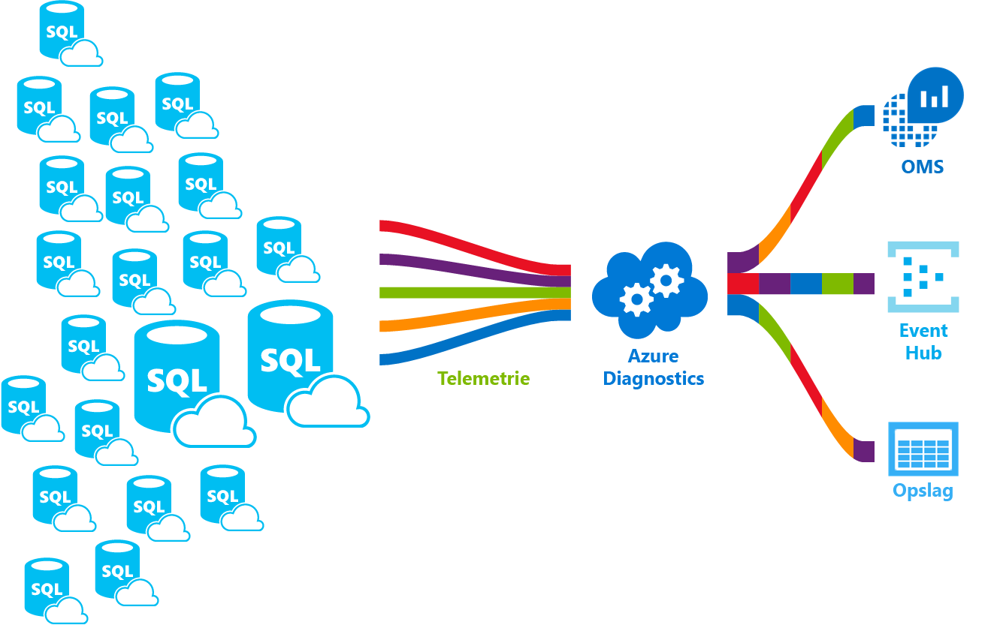

# Wat is Azure SQL Database-service Hallo?What is hello Azure SQL Database service? 

SQL Database is een algemene relationele databaseservice in Microsoft Azure die ondersteuning biedt voor structuren zoals relationele gegevens, JSON, ruimtelijke gegevens en XML.SQL Database is a general-purpose relational database service in Microsoft Azure that supports structures such as relational data, JSON, spatial, and XML. De service biedt [dynamisch schaalbare prestaties](sql-database-service-tiers.md) en opties zoals [columnstore-indexen](https://docs.microsoft.com/sql/relational-databases/indexes/columnstore-indexes-overview) voor krachtige analyses en rapportages, en [in-memory OLTP](sql-database-in-memory.md) voor veeleisende transactieverwerking.It delivers [dynamically scalable performance](sql-database-service-tiers.md) and provides options such as [columnstore indexes](https://docs.microsoft.com/sql/relational-databases/indexes/columnstore-indexes-overview) for extreme analytic analysis and reporting, and [in-memory OLTP](sql-database-in-memory.md) for extreme transactional processing. Microsoft verwerkt alle patches en bijwerken van Hallo SQL codebasis naadloos en isoleert afwezig alle management Hallo onderliggende infrastructuur.Microsoft handles all patching and updating of hello SQL code base seamlessly and abstracts away all management of hello underlying infrastructure. 

SQL-Database deelt de codebasis met Hallo [Microsoft SQL Server database-engine](https://docs.microsoft.com/sql/sql-server/sql-server-technical-documentation).SQL Database shares its code base with hello [Microsoft SQL Server database engine](https://docs.microsoft.com/sql/sql-server/sql-server-technical-documentation). Met de strategie van Microsoft cloud eerste zijn Hallo nieuwste mogelijkheden van SQL Server vrijgegeven eerste tooSQL Database en tooSQL Server zelf.With Microsoft's cloud-first strategy, hello newest capabilities of SQL Server are released first tooSQL Database, and then tooSQL Server itself. Deze aanpak geeft u met Hallo nieuwste mogelijkheden voor SQL Server met geen overhead voor patch-doeleinden of upgrade- en met deze nieuwe functies die zijn getest in miljoenen databases.This approach provides you with hello newest SQL Server capabilities with no overhead for patching or upgrading - and with these new features tested across millions of databases. Ga voor informatie over aangekondigde nieuwe mogelijkheden naar:For information about new capabilities as they are announced, see:

- **[Azure Roadmap voor SQL-Database](https://azure.microsoft.com/roadmap/?category=databases)**: een plaats toofind wat is er nieuw en binnenkort volgende.**[Azure Roadmap for SQL Database](https://azure.microsoft.com/roadmap/?category=databases)**: A place toofind out what’s new and what’s coming next. 
- **[Azure SQL Database-blog](https://azure.microsoft.com/blog/topics/database)**: hier plaatsen de leden van het SQL Server-productteam berichten met het laatste nieuws over SQL Database en informatie over nieuwe functies.**[Azure SQL Database blog](https://azure.microsoft.com/blog/topics/database)**: A place where SQL Server product team members blog about SQL Database news and features. 

SQL Database levert voorspelbare prestaties op meerdere serviceniveaus met dynamische schaalbaarheid zonder uitvaltijd, ingebouwde intelligente optimalisatie, schaalbaarheid en beschikbaarheid op wereldwijde schaal en geavanceerde beveiligingsmogelijkheden. Bovendien hoeft u vrijwel geen tijd te besteden aan beheer.SQL Database delivers predictable performance at multiple service levels that provides dynamic scalability with no downtime, built-in intelligent optimization, global scalability and availability, and advanced security options — all with near-zero administration. Deze mogelijkheden kunnen u toofocus op sneller ontwikkelen en uw toomarket tijd versnellen, plaats u kostbare tijd en bronnen toomanaging virtuele machines en infrastructuur.These capabilities allow you toofocus on rapid app development and accelerating your time toomarket, rather than allocating precious time and resources toomanaging virtual machines and infrastructure. Hallo SQL Database-service momenteel in 38 gegevens is draait om Hallo wereld met meer datacenters regelmatig online binnenkort waarmee u toorun uw database in een datacentrum in de buurt.hello SQL Database service is currently in 38 data centers around hello world, with more data centers coming online regularly, which enables you toorun your database in a data center near you.

> [!NOTE]
> Ga naar het [Vertrouwenscentrum van Azure](https://azure.microsoft.com/support/trust-center/security/) voor informatie over de beveiliging van het Azure-platform.See [Azure Trust Center](https://azure.microsoft.com/support/trust-center/security/) for information about Azure's platform security.
>

## Schaalbare prestaties en poolsScalable performance and pools

Met SQL Database zijn alle databases volledig geïsoleerd en draagbaar, met elk een eigen [servicelaag](sql-database-service-tiers.md) en een gegarandeerd prestatieniveau.With SQL Database, each database is isolated from each other and portable, each with its own [service tier](sql-database-service-tiers.md) with a guaranteed performance level. SQL-Database biedt verschillende prestatieniveaus voor verschillende behoeften en databases toobe gegroepeerde toomaximize Hallo gebruik van bronnen en geld besparen maakt.SQL Database provides different performance levels for different needs, and enables databases toobe pooled toomaximize hello use of resources and save money.

### Prestaties en schaal aanpassen zonder uitvaltijdAdjust performance and scale without downtime

SQL-Database biedt vier Servicelagen toosupport lightweight tooheavyweight database werkbelastingen: Basic, Standard, Premium en Premium RS.SQL Database offers four service tiers toosupport lightweight tooheavyweight database workloads: Basic, Standard, Premium, and Premium RS. U kunt uw eerste app ontwikkelen op een klein, één database tegen lage kosten per maand en wijzig vervolgens de servicelaag handmatig of programmatisch op elk moment toomeet Hallo behoeften van uw oplossing.You can build your first app on a small, single database at a low cost per month and then change its service tier manually or programmatically at any time toomeet hello needs of your solution. U kunt de prestaties zonder uitvaltijd tooyour app of tooyour klanten aanpassen.You can adjust performance without downtime tooyour app or tooyour customers. Dynamische schaalbaarheid Hiermee kunt u uw database tootransparently reageren toorapidly resourcevereisten en schakelt u tooonly betalen voor Hallo resources dat u nodig hebt wanneer u deze nodig wijzigen.Dynamic scalability enables your database tootransparently respond toorapidly changing resource requirements and enables you tooonly pay for hello resources that you need when you need them.

   

### Elastische pools toomaximize ResourcegebruikElastic pools toomaximize resource utilization

Voor veel bedrijven en toepassingen kunnen toocreate wordt individuele databases en kies prestaties omhoog of omlaag op aanvraag al voldoende, vooral als de gebruikspatronen redelijk voorspelbaar zijn.For many businesses and applications, being able toocreate single databases and dial performance up or down on demand is enough, especially if usage patterns are relatively predictable. Maar als er onvoorspelbare gebruikspatronen, het, kunt u harde toomanage kosten en uw bedrijfsmodel.But if you have unpredictable usage patterns, it can make it hard toomanage costs and your business model. [Elastische pools](sql-database-elastic-pool.md) ontworpen toosolve dit probleem zijn.[Elastic pools](sql-database-elastic-pool.md) are designed toosolve this problem. Hallo concept is eenvoudig.hello concept is simple. U prestaties resources tooa groep in plaats van een individuele database toewijzen en hiervoor te betalen voor Hallo collectieve prestaties resources van het Hallo-groep in plaats van de prestaties van één database.You allocate performance resources tooa pool rather than an individual database, and pay for hello collective performance resources of hello pool rather than for single database performance. 

   

Met elastische pools hoeft u geen toofocus op de prestaties van de database omhoog en omlaag kiezen zoals fluctueert met de aanvraag voor resources.With elastic pools, you don’t need toofocus on dialing database performance up and down as demand for resources fluctuates. Hallo verbruiken gegroepeerde databases Hallo prestaties resources van elastische pool Hallo indien nodig.hello pooled databases consume hello performance resources of hello elastic pool as needed. Gegroepeerde databases gebruiken, maar niet overschrijden Hallo van Hallo-toepassingen zo uw kosten voorspelbaar blijven zelfs als afzonderlijke Databasegebruik dat niet.Pooled databases consume but don’t exceed hello limits of hello pool, so your cost remains predictable even if individual database usage doesn’t. Wat is er meer, kunt u [toevoegen en verwijderen van databases toohello groep](sql-database-elastic-pool-manage-portal.md), schalen van uw app van een handjevol databases toothousands, allemaal binnen het budget dat u beheert.What’s more, you can [add and remove databases toohello pool](sql-database-elastic-pool-manage-portal.md), scaling your app from a handful of databases toothousands, all within a budget that you control. U kunt ook besturingselement Hallo minimum en maximum aantal bronnen beschikbaar toodatabases in Hallo groep tooensure geen database in de groep Hallo gebruikt alle Hallo groep resources en dat elke gegroepeerde database een minimale gegarandeerde hoeveelheid resources heeft.You can also control hello minimum and maximum resources available toodatabases in hello pool tooensure that no database in hello pool uses all hello pool resources and that every pooled database has a guaranteed minimum amount of resources. Zie toolearn meer informatie over ontwerppatronen voor SaaS-toepassingen met elastische pools [ontwerppatronen voor multitenant SaaS-toepassingen met SQL Database](sql-database-design-patterns-multi-tenancy-saas-applications.md).toolearn more about design patterns for SaaS applications using elastic pools, see [Design Patterns for Multi-tenant SaaS Applications with SQL Database](sql-database-design-patterns-multi-tenancy-saas-applications.md).

### Individuele databases combineren met gepoolde databasesBlend single databases with pooled databases

Waarvoor u ook kiest - individuele databases of elastische pools - u zit er niet aan vast.Either way you go — single databases or elastic pools — you are not locked in. U kunt individuele databases combineren met elastische pools en Hallo-Servicelagen van individuele databases en elastische pools wijzigen snel en eenvoudig tooadapt tooyour situatie.You can blend single databases with elastic pools, and change hello service tiers of single databases and elastic pools quickly and easily tooadapt tooyour situation. Met de Hallo kracht en het bereik van Azure kunt u mix-and-match andere Azure services met SQL-Database toomeet uw app in unieke behoeften, station kosten en efficiëntie van de resource ontwerpen en nieuwe zakelijke verkoopkansen.With hello power and reach of Azure, you can mix-and-match other Azure services with SQL Database toomeet your unique app design needs, drive cost and resource efficiencies, and unlock new business opportunities.

### Uitgebreide mogelijkheden voor bewaking en waarschuwingenExtensive monitoring and alerting capabilities

Maar hoe kunt u de relatieve prestaties Hallo van individuele databases en elastische pools vergelijken?But how can you compare hello relative performance of single databases and elastic pools? Hoe weet u Hallo stoppen wanneer u omhoog en omlaag?How do you know hello right click-stop when you dial up and down? Gebruik van Hallo [ingebouwde prestatiebewaking](sql-database-performance.md) en [waarschuwingen](sql-database-insights-alerts-portal.md) hulpprogramma's, gecombineerd met Hallo prestatieclassificaties op basis van [Database Transaction Units (dtu's) voor individuele databases en elastische dtu's (edtu's) voor elastische pools](sql-database-what-is-a-dtu.md).You use hello [built-in performance monitoring](sql-database-performance.md) and [alerting](sql-database-insights-alerts-portal.md) tools, combined with hello performance ratings based on [Database Transaction Units (DTUs) for single databases and elastic DTUs (eDTUs) for elastic pools](sql-database-what-is-a-dtu.md). Deze hulpprogramma's gebruikt, kunt u snel beoordelen Hallo gevolgen van de schaal omhoog of omlaag op basis van uw huidige of project prestatievereisten past.Using these tools, you can quickly assess hello impact of scaling up or down based on your current or project performance needs. Zie [SQL Database-opties en prestaties: wat is er beschikbaar in elke servicelaag](sql-database-service-tiers.md) voor meer informatie.See [SQL Database options and performance: Understand what's available in each service tier](sql-database-service-tiers.md) for details.

Daarnaast kan SQL Database [metrische gegevens en diagnostische logboeken verzenden](sql-database-metrics-diag-logging.md) die de bewaking vergemakkelijken.Additionally, SQL Database can [emit metrics and diagnostic logs](sql-database-metrics-diag-logging.md) for easier monitoring. U kunt SQL-Database toostore Resourcegebruik, werknemers en sessies en verbindingen in een van deze Azure-resources configureren:You can configure SQL Database toostore resource usage, workers and sessions, and connectivity into one of these Azure resources:

- **Azure Storage**: voor het archiveren van grote hoeveelheden telemetriegegevens voor een lage prijs**Azure Storage**: For archiving vast amounts of telemetry for a small price
- **Azure Event Hub**: voor het integreren van SQL Database-telemetrie in uw eigen bewakingsoplossing of actieve pijplijnen**Azure Event Hub**: For integrating SQL Database telemetry with your custom monitoring solution or hot pipelines
- **Azure Log Analytics**: voor een ingebouwde bewakingsoplossing met functionaliteit voor rapportages, waarschuwingen en risicobeperking**Azure Log Analytics**: For built-in monitoring solution with reporting, alerting, and mitigating capabilities

    

## BeschikbaarheidAvailability capabilities

De toonaangevende serviceovereenkomst [(SLA)](http://azure.microsoft.com/support/legal/sla/) van Azure met 99,99% beschikbaarheid dankzij een wereldwijd netwerk van door Microsoft beheerde datacenters, zorgt u ervoor dat uw app continu (24 uur per dag, 7 dagen per week) in de lucht blijft.Azure's industry leading 99.99% availability service level agreement [(SLA)](http://azure.microsoft.com/support/legal/sla/), powered by a global network of Microsoft-managed datacenters, helps keep your app running 24/7. Daarnaast biedt SQL Database ingebouwde functies voor [bedrijfscontinuïteit en wereldwijde schaalbaarheid](sql-database-business-continuity.md), zoals:In addition, SQL Database provides built-in [business continuity and global scalability](sql-database-business-continuity.md) features, including:

- **[Automatische back-ups](sql-database-automated-backups.md)**: SQL Database maakt automatische volledige en differentiële back-ups en back-ups van transactielogboeken.**[Automatic backups](sql-database-automated-backups.md)**: SQL Database automatically performs full, differential, and transaction log backups.
- **[Punt in tijd herstelacties](sql-database-recovery-using-backups.md)**: SQL Database ondersteunt tooany herstelpunt in de tijd binnen Hallo automatische back-up bewaarperiode.**[Point-in-time restores](sql-database-recovery-using-backups.md)**: SQL Database supports recovery tooany point in time within hello automatic backup retention period.
- **[Actieve geo-replicatie](sql-database-geo-replication-overview.md)**: SQL-Database kan tooconfigure up toofour leesbare secundaire database databases in beide Hallo dezelfde of globaal gedistribueerd Azure-datacenters.**[Active geo-replication](sql-database-geo-replication-overview.md)**: SQL Database allows you tooconfigure up toofour readable secondary databases in either hello same or globally distributed Azure data centers.  Bijvoorbeeld, als er een SaaS-toepassing met een catalogusdatabase die een groot aantal gelijktijdige transacties voor alleen-lezen is, gebruik actieve geo-replicatie tooenable globale scale lezen en verwijder knelpunten op Hallo primaire die voltooid moeten tooread werkbelastingen zijn.For example, if you have a SaaS application with a catalog database that has a high volume of concurrent read-only transactions, use active geo-replication tooenable global read scale and remove bottlenecks on hello primary that are due tooread workloads. 
- **[Failover-groepen](sql-database-geo-replication-overview.md)**: SQL-Database kunt u tooenable hoge beschikbaarheid en taakverdeling op globale schaal, met inbegrip van transparante geo-replicatie en failover van grote sets van databases en elastische pools.**[Failover groups](sql-database-geo-replication-overview.md)**: SQL Database allows you tooenable high availability and load balancing at global scale, including transparent geo-replication and failover of large sets of databases and elastic pools. Failover-groepen en actieve geo-replicatie kunt maken van globaal gedistribueerde SaaS-toepassingen met minimale beheer overhead verlaten alle Hallo complexe bewaking, Routering en failover orchestration tooSQL Database.Failover groups and active geo-replication enables creation of globally distributed SaaS applications with minimal administration overhead leaving all hello complex monitoring, routing, and failover orchestration tooSQL Database.

## Ingebouwde intelligentieBuilt-in intelligence

Met SQL-Database beschikt u over ingebouwde intelligentie die helpt u aanzienlijk kosten te verlagen Hallo van uitvoeren en het beheren van databases en maximaliseert de prestaties en beveiliging van uw toepassing.With SQL Database, you get built-in intelligence that helps you dramatically reduce hello costs of running and managing databases and maximizes both performance and security of your application. SQL-Database miljoenen klanten werkbelastingen ononderbroken uitgevoerd, verzamelt en een enorme hoeveelheid telemetrische gegevens inachtneming van ook volledig privacy van klanten achter de schermen Hallo verwerkt.Running millions of customer workloads around-the-clock, SQL Database collects and processes a massive amount of telemetry data, while also fully respecting customer privacy behind hello scenes. Verschillende algoritmen beoordeelt Hallo telemetrische gegevens continu zodat Hallo-service kan informatie over en met uw toepassing aanpassen.Various algorithms are continuously evaluating hello telemetry data so that hello service can learn and adapt with your application. Op basis van deze analyse, voordoet Hallo service wanneer de prestaties verbeteren van de aanbevelingen op maat gemaakte tooyour specifieke werkbelasting.Based on this analysis, hello service comes up with performance improving recommendations tailored tooyour specific workload. 

### Automatische afstemming van prestatiesAutomatic performance tuning

SQL-Database biedt meer inzicht in de Hallo query's moet u toomonitor.SQL Database provides detailed insight into hello queries that you need toomonitor. SQL-Database leert over uw patronen database en maakt u tooadapt tooyour werkbelasting van uw database-schema.SQL Database's learns about your database patterns and enables you tooadapt your database schema tooyour workload. SQL Database geeft aanbevelingen voor het afstemmen van de prestaties met [SQL Database Advisor](sql-database-advisor.md), waarmee u de aanbevolen acties kunt weergegeven en uitvoeren.SQL Database provides performance tuning recommendations using  [SQL Database Advisor](sql-database-advisor.md), where you can review tuning actions and apply them. Maar doorlopende databasebewaking is een moeilijke, tijdrovende taak, zeker wanneer het om vele databases gaat.However, constantly monitoring database is a hard and tedious task, especially when dealing with many databases. Het beheren van een zeer groot aantal databases mogelijk onmogelijk toodo efficiënt zelfs met alle beschikbare hulpprogramma's en rapporten waarmee SQL-Database en de Azure-portal.Managing a huge number of databases might be impossible toodo efficiently even with all available tools and reports that SQL Database and Azure portal provide. In plaats van controleren en de database handmatig afstemmen, kunt u overwegen delegeren aantal Hallo controleren en afstemmen acties tooSQL Database met de functie voor automatisch afstemmen.Instead of monitoring and tuning your database manually, you might consider delegating some of hello monitoring and tuning actions tooSQL Database using automatic tuning feature. SQL-Database wordt automatisch toepassen van aanbevelingen, tests en controleert of elk van de prestaties afstemmen acties tooensure-Hallo houdt verbeteren.SQL Database automatically apply recommendations, tests, and verifies each of its tuning actions tooensure hello performance keeps improving. Op deze manier SQL-Database automatisch aangepast tooyour werkbelasting op beheerde en veilige wijze.This way, SQL Database automatically adapts tooyour workload in controlled and safe way. Automatische afstemming betekent dat Hallo prestaties van uw database is zorgvuldig bewaakt en vergeleken voor en na elke actie afstemmen, en als Hallo prestaties niet verbeteren, Hallo actie afstemming is teruggedraaid.Automatic tuning means that hello performance of your database is carefully monitored and compared before and after every tuning action, and if hello performance doesn’t improve, hello tuning action is reverted.

Vandaag, veel van onze partners uitgevoerd [SaaS-apps voor meerdere tenants](sql-database-design-patterns-multi-tenancy-saas-applications.md) bovenop SQL-Database zijn vertrouwen op automatische toomake of hun toepassingen hebt altijd stabiel en voorspelbaar prestaties afstemmen van de prestaties.Today, many of our partners running [SaaS multi-tenant apps](sql-database-design-patterns-multi-tenancy-saas-applications.md) on top of SQL Database are relying on automatic performance tuning toomake sure their applications always have stable and predictable performance. Voor deze vermindert deze functie kostte Hallo risico dat een incident prestaties in het midden van de Hallo van Hallo 's nachts.For them, this feature tremendously reduces hello risk of having a performance incident in hello middle of hello night. Bovendien, omdat het deel van hun klanten gebruikt ook SQL Server, ze gebruiken Hallo dezelfde indexering aanbevelingen die worden geleverd door de SQL-Database toohelp hun SQL Server-klanten.In addition, since part of their customer base also uses SQL Server, they are using hello same indexing recommendations provided by SQL Database toohelp their SQL Server customers.

Er zijn twee automatisch afstemmingsmethoden in SQL Database:There are two automatic tuning aspects that are available in SQL Database:

- **[Automatisch indexbeheer](sql-database-automatic-tuning.md#automatic-index-management)**: hiermee worden indexen geïdentificeerd die moeten worden toegevoegd aan of verwijderd uit uw database.**[Automatic index management](sql-database-automatic-tuning.md#automatic-index-management)**: Identifies indexes that should be added in your database, and indexes that should be removed.
- **[Automatische abonnementcorrectie](sql-database-automatic-tuning.md#automatic-plan-choice-correction)**: hiermee worden abonnementen met problemen geïdentificeerd en prestatieproblemen met SQL-abonnementen opgelost (binnenkort beschikbaar, nu al beschikbaar in SQL Server 2017).**[Automatic plan correction](sql-database-automatic-tuning.md#automatic-plan-choice-correction)**: Identifies problematic plans and fixes SQL plan performance problems (coming soon, already available in SQL Server 2017).

### Verwerking van adaptieve query’sAdaptive query processing

We ook Hallo toevoegen [adaptieve queryverwerking](/sql/relational-databases/performance/adaptive-query-processing) reeks functies tooSQL Database, inclusief interleaved worden uitgevoerd voor meerdere instructies tabelwaarden functies, batch-modus geheugen grant feedback en batch-modus adaptieve joins .We are also adding hello [adaptive query processing](/sql/relational-databases/performance/adaptive-query-processing) family of features tooSQL Database, including interleaved execution for multi-statement table-valued functions, batch mode memory grant feedback, and batch mode adaptive joins. Elk van deze functies adaptieve queryverwerking geldt vergelijkbare 'meer informatie over en aanpassen' technieken, waardoor verdere adres problemen gerelateerde toohistorically intractable query optimalisatie prestatieproblemen.Each of these adaptive query processing features applies similar “learn and adapt” techniques, helping further address performance issues related toohistorically intractable query optimization problems.

### Intelligente detectie van bedreigingenIntelligent threat detection

 [Detectie van dreigingen SQL](sql-database-threat-detection.md) maakt gebruik van [SQL Database auditing](sql-database-auditing.md) toocontinuously monitor Azure SQL-databases voor schadelijke aanvallen tooaccess gevoelige gegevens.[SQL Threat Detection](sql-database-threat-detection.md) leverages [SQL Database auditing](sql-database-auditing.md) toocontinuously monitor Azure SQL databases for potentially harmful attempts tooaccess sensitive data. Detectie van dreigingen SQL biedt een nieuwe laag van beveiliging, waarbij kan klanten toodetect en hierop reageren toopotential bedreigingen wanneer deze zich voordoen doordat beveiligingswaarschuwingen op vreemde activiteiten worden gedetecteerd.SQL threat detection provides a new layer of security, which enables customers toodetect and respond toopotential threats as they occur by providing security alerts on anomalous activities. Gebruikers ontvangen waarschuwingen bij verdachte databaseactiviteiten, potentiële kwetsbaarheden, SQL-injectieaanvallen en afwijkende patronen voor databasetoegang.Users receive alerts upon suspicious database activities, potential vulnerabilities, and SQL injection attacks, and anomalous database access patterns. SQL-bedreiging detectiewaarschuwingen Geef details op van de verdachte activiteit en de aanbevolen actie voor het tooinvestigate en Hallo bedreigingen te verhelpen.SQL threat detection alerts provide details of suspicious activity and recommend action on how tooinvestigate and mitigate hello threat. Gebruikers kunnen Hallo verdachte gebeurtenissen toodetermine verkennen als Hallo gebeurtenis resultaten van een tooaccess poging schenden of misbruik van gegevens in Hallo-database.Users can explore hello suspicious events toodetermine if hello event results from an attempt tooaccess, breach, or exploit data in hello database. Detectie van dreigingen maakt het eenvoudig tooaddress potentiële bedreigingen toohello database zonder Hallo nodig toobe een expert beveiliging of systemen bewaking van de geavanceerde beveiliging te beheren.Threat detection makes it simple tooaddress potential threats toohello database without hello need toobe a security expert or manage advanced security monitoring systems.

## Geavanceerde beveiliging en naleving van voorschriftenAdvanced security and compliance

SQL-Database biedt een reeks [ingebouwde functies voor beveiliging en naleving](sql-database-security-overview.md) toohelp uw toepassing voldoen aan verschillende vereisten voor beveiliging en naleving.SQL Database provides a range of [built-in security and compliance features](sql-database-security-overview.md) toohelp your application meet various security and compliance requirements. 

### Controles voor naleving en beveiligingAuditing for compliance and security

[SQL Database Auditing](sql-database-auditing.md) houdt databasegebeurtenissen en schrijft deze tooan controlelogboek in uw Azure storage-account.[SQL Database Auditing](sql-database-auditing.md) tracks database events and writes them tooan audit log in your Azure storage account. Dankzij controles kunt u zorgen voor naleving van wet- en regelgeving, krijgt u inzicht in de activiteit in uw database en in de afwijkingen en discrepanties die kunnen wijzen op problemen voor het bedrijf of vermoedelijke schendingen van de beveiliging.Auditing can help you maintain regulatory compliance, understand database activity, and gain insight into discrepancies and anomalies that could indicate business concerns or suspected security violations.

### Versleuteling van inactieve gegevensData encryption at rest

SQL-Database [transparante gegevensversleuteling](https://docs.microsoft.com/sql/relational-databases/security/encryption/transparent-data-encryption-with-azure-sql-database) beschermt tegen Hallo dreiging van schadelijke activiteiten door te voeren realtime versleuteling en ontsleuteling van Hallo-database, gekoppelde back-ups en transactielogbestanden in rust zonder wijzigingen toohello toepassing.SQL Database [transparent data encryption](https://docs.microsoft.com/sql/relational-databases/security/encryption/transparent-data-encryption-with-azure-sql-database) helps protect against hello threat of malicious activity by performing real-time encryption and decryption of hello database, associated backups, and transaction log files at rest without requiring changes toohello application. Met ingang van mei 2017 worden alle nieuw gemaakte Azure-database automatisch beschermd met transparante gegevensversleuteling (TDE).Starting in May 2017, all newly created Azure SQL databases are automatically protected with transparent data encryption (TDE). TDE is van de SQL beproefde versleuteling in rust-technologie die is door veel naleving standaarden tooprotect tegen diefstal van opslagmedia vereist.TDE is SQL’s proven encryption-at-rest technology that is required by many compliance standards tooprotect against theft of storage media. Klanten kunnen Hallo TDE versleutelingssleutels en andere geheimen zodanig beveiligd en compatibel zijn met Azure Key Vault beheren.Customers can manage hello TDE encryption keys and other secrets in a secure and compliant manner using Azure Key Vault.

### Versleuteling van gegevens in bewegingData encryption in motion

SQL-Database is Hallo alleen database toooffer systeembeveiliging van gevoelige gegevens in rust en tijdens de verwerking met query vlucht [altijd versleuteld](https://docs.microsoft.com/sql/relational-databases/security/encryption/always-encrypted-database-engine).SQL Database is hello only database system toooffer protection of sensitive data in flight, at rest and during query processing with [Always Encrypted](https://docs.microsoft.com/sql/relational-databases/security/encryption/always-encrypted-database-engine). Altijd versleutelde is een industrie-de eerste die ongeëvenaarde gegevens biedt beveiliging tegen diefstal Hallo van kritieke gegevens met betrekking tot schendingen.Always Encrypted is an industry-first that offers unparalleled data security against breaches involving hello theft of critical data. Bijvoorbeeld, bij de altijd versleuteld, creditcardnummers klanten opgeslagen Altijd, zelfs tijdens de verwerking van query's op Hallo database versleuteld zodat ontsleuteling op Hallo punt van gebruik door geautoriseerde personeel of toepassingen die tooprocess moeten die gegevens.For example, with Always Encrypted, customers’ credit card numbers are stored encrypted in hello database always, even during query processing, allowing decryption at hello point of use by authorized staff or applications that need tooprocess that data.

### Dynamische gegevensmaskeringDynamic data masking

[SQL-Database dynamische-gegevensmaskering](sql-database-dynamic-data-masking-get-started.md) blootstelling van gevoelige gegevens beperkt door het toonon beheerdersmogelijkheden maskeren.[SQL Database dynamic data masking](sql-database-dynamic-data-masking-get-started.md) limits sensitive data exposure by masking it toonon-privileged users. Dynamische gegevensmaskering helpt voorkomen dat onbevoegde toegang toosensitive gegevens doordat klanten toodesignate hoeveel Hallo gevoelige gegevens tooreveal met minimale gevolgen voor de toepassingslaag Hallo.Dynamic data masking helps prevent unauthorized access toosensitive data by enabling customers toodesignate how much of hello sensitive data tooreveal with minimal impact on hello application layer. Het is een beveiligingsfunctie op basis van beleid dat gevoelige gegevens in de resultatenset Hallo van een query Hallo via aangewezen databasevelden, verbergt tijdens het Hallo-gegevens in Hallo-database wordt niet gewijzigd.It’s a policy-based security feature that hides hello sensitive data in hello result set of a query over designated database fields, while hello data in hello database is not changed.

### Beveiliging op rijniveauRow-level security

[Beveiliging op gebruikersniveau rij](https://docs.microsoft.com/sql/relational-databases/security/row-level-security) kunnen klanten toocontrol toegang toorows in een databasetabel op basis van Hallo kenmerken van een query uit te voeren Hallo-gebruiker (zoals door de groep lidmaatschap of -uitvoering de context).[Row-level security](https://docs.microsoft.com/sql/relational-databases/security/row-level-security) enables customers toocontrol access toorows in a database table based on hello characteristics of hello user executing a query (such as by group membership or execution context). (RLS) beveiliging vereenvoudigt Hallo ontwerp en het coderen van beveiliging in uw toepassing.Row-level security (RLS) simplifies hello design and coding of security in your application. RLS kunt u tooimplement beperkingen voor gegevenstoegang rij.RLS enables you tooimplement restrictions on data row access. Bijvoorbeeld ervoor te zorgen dat werknemers toegang krijgen tot alleen die rijen met gegevens die relevante tootheir afdeling zijn of een bedrijf van de klant gegevens toegang tooonly Hallo gegevens relevante tootheir beperken.For example ensuring that workers can access only those data rows that are pertinent tootheir department, or restricting a customer's data access tooonly hello data relevant tootheir company.

### Azure Active Directory-integratie en meervoudige verificatieAzure Active Directory integration and multi-factor authentication

SQL-Database kunt u toocentrally beheren van identiteiten van databasegebruiker en andere Microsoft-services met [Azure Active Directory-integratie](sql-database-aad-authentication.md).SQL Database enables you toocentrally manage identities of database user and other Microsoft services with [Azure Active Directory integration](sql-database-aad-authentication.md). Deze mogelijkheid vereenvoudigt het beheer van machtigingen en verbetert de beveiliging.This capability simplified permission management and enhances security. Azure Active Directory ondersteunt [multi-factorauthenticatie](sql-database-ssms-mfa-authentication.md) (MFA) tooincrease gegevens en toepassingen beveiliging bij het ondersteunen van een enkel Kana-proces.Azure Active Directory supports [multi-factor authentication](sql-database-ssms-mfa-authentication.md) (MFA) tooincrease data and application security while supporting a single sing-in process.

### NalevingscertificeringCompliance certification

SQL Database wordt regelmatig gecontroleerd en is gecertificeerd volgens diverse nalevingsstandaarden.SQL Database participates in regular audits and has been certified against several compliance standards. Zie voor meer informatie, Hallo [Microsoft Azure Trust Center](https://azure.microsoft.com/support/trust-center/), waarbij u de meest recente lijst Hallo van vindt [SQL-Database naleving certificeringen](https://azure.microsoft.com/support/trust-center/services/).For more information, see hello [Microsoft Azure Trust Center](https://azure.microsoft.com/support/trust-center/), where you can find hello most current list of [SQL Database compliance certifications](https://azure.microsoft.com/support/trust-center/services/).

## Gebruiksvriendelijke hulpprogramma’sEasy-to-use tools

SQL Database maakt het bouwen en onderhouden van toepassingen makkelijker en productiever.SQL Database makes building and maintaining applications easier and more productive. SQL-Database kunt u toofocus doen beste: geweldige apps bouwen.SQL Database allows you toofocus on what you do best: building great apps. In SQL Database kunt u beheren en ontwikkelen met de hulpprogramma’s en vaardigheden die u al hebt.You can manage and develop in SQL Database using tools and skills you already have.

- **[Azure-portal Hallo](https://portal.azure.com/)**: een webtoepassing voor het beheren van alle Azure-services**[hello Azure portal](https://portal.azure.com/)**: A web-based application for managing all Azure services 
- **[SQL Server Management Studio](https://docs.microsoft.com/sql/ssms/download-sql-server-management-studio-ssms)**: een gratis, downloadbare toepassing voor het beheren van elke SQL-infrastructuur van SQL Server-tooSQL Database**[SQL Server Management Studio](https://docs.microsoft.com/sql/ssms/download-sql-server-management-studio-ssms)**: A free, downloadable client application for managing any SQL infrastructure, from SQL Server tooSQL Database
- **[SQL Server Data Tools in Visual Studio](https://docs.microsoft.com/sql/ssdt/download-sql-server-data-tools-ssdt)**: een gratis te downloaden clienttoepassing voor het ontwikkelen van relationele SQL Server-databases, Azure SQL-databases, Integration Services-pakketten, Analysis Services-gegevensmodellen en Reporting Services-rapporten.**[SQL Server Data Tools in Visual Studio](https://docs.microsoft.com/sql/ssdt/download-sql-server-data-tools-ssdt)**: A free, downloadable client application for developing SQL Server relational databases, Azure SQL databases, Integration Services packages, Analysis Services data models, and Reporting Services reports.
- **[Visual Studio Code](https://code.visualstudio.com/docs)**: een gratis, downloadbare, open-source, code-editor voor Windows, Mac OS- en Linux die ondersteuning biedt voor extensies, met inbegrip van Hallo [mssql-extensie](https://aka.ms/mssql-marketplace) voor query's in Microsoft SQL Server Azure SQL Database en SQL datawarehouse.**[Visual Studio Code](https://code.visualstudio.com/docs)**: a free, downloadable, open source, code editor for Windows, macOS, and Linux that supports extensions, including hello [mssql extension](https://aka.ms/mssql-marketplace) for querying Microsoft SQL Server, Azure SQL Database, and SQL Data Warehouse.

SQL Database ondersteunt toepassingen maken met Python, Java, Node.js, PHP, Ruby, en .NET op Hallo Mac OS, Linux en Windows.SQL Database supports building applications with Python, Java, Node.js, PHP, Ruby, and .NET on hello MacOS, Linux, and Windows. SQL Database ondersteunt dezelfde Hallo [verbindingsbibliotheken](sql-database-libraries.md) als SQL Server.SQL Database supports hello same [connection libraries](sql-database-libraries.md) as SQL Server.

## Hallo SQL Server-engineeringteam benaderenEngage with hello SQL Server engineering team

- [DBA Stack Exchange](https://dba.stackexchange.com/questions/tagged/sql-server): stel hier uw vragen over databasebeheer[DBA Stack Exchange](https://dba.stackexchange.com/questions/tagged/sql-server): Ask database administration questions
- [Stack Overflow](http://stackoverflow.com/questions/tagged/sql-server): stel hier uw vragen over ontwikkeling[Stack Overflow](http://stackoverflow.com/questions/tagged/sql-server): Ask development questions
- [MSDN-forums](https://social.msdn.microsoft.com/Forums/en-US/home?category=sqlserver): stel hier uw technische vragen[MSDN Forums](https://social.msdn.microsoft.com/Forums/en-US/home?category=sqlserver): Ask technical questions
- [Microsoft Connect](https://connect.microsoft.com/SQLServer/Feedback): hier kunt u bugs doorgeven en functies aanvragen[Microsoft Connect](https://connect.microsoft.com/SQLServer/Feedback): Report bugs and request feature
- [Reddit](https://www.reddit.com/r/SQLServer/): vragen en antwoorden voor SQL Server[Reddit](https://www.reddit.com/r/SQLServer/): Discuss SQL Server

## Volgende stappenNext steps

- Zie Hallo [pagina met prijzen](https://azure.microsoft.com/pricing/details/sql-database/) voor één database en elastische pools kosten vergelijkingen en rekenmachines.See hello [pricing page](https://azure.microsoft.com/pricing/details/sql-database/) for single database and elastic pools cost comparisons and calculators.

- Zie dat deze quick start tooget die u gestart:See these quick starts tooget you started:

  - [Maak een SQL-database in hello Azure-portalCreate a SQL database in hello Azure portal](sql-database-get-started-portal.md)  
  - [Een SQL-database maken met hello Azure CLICreate a SQL database with hello Azure CLI](sql-database-get-started-cli.md)
  - [Een SQL-database maken met PowerShellCreate a SQL database using PowerShell](sql-database-get-started-powershell.md)

- Zie de volgende artikelen voor een reeks Azure CLI- en PowerShell-voorbeelden:For a set of Azure CLI and PowerShell samples, see:
  - [Azure CLI-voorbeelden voor SQL DatabaseAzure CLI samples for SQL Database](sql-database-cli-samples.md)
  - [Azure PowerShell-voorbeelden voor SQL DatabaseAzure PowerShell samples for SQL Database](sql-database-powershell-samples.md)
