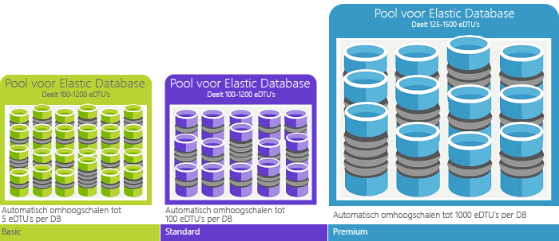

# Over DTU's (Database Transaction Units) en eDTU's (elastische Database Transaction Units)Explaining Database Transaction Units (DTUs) and elastic Database Transaction Units (eDTUs)
In dit artikel wordt uitgelegd wat DTU's (Database Transaction Units) en eDTU's (elastische Database Transaction Units) zijn en wat er gebeurt als u het maximale aantal DTU's of eDTU's hebt bereikt.This article explains Database Transaction Units (DTUs) and elastic Database Transaction Units (eDTUs) and what happens when you hit the maximum DTUs or eDTUs.  

## Wat zijn DTU's (Database Transaction Units)?What are Database Transaction Units (DTUs)
Voor één Azure SQL database op een specifiek prestatieniveau binnen een [servicelaag](sql-database-service-tiers.md#single-database-service-tiers-and-performance-levels), garandeert een bepaalde mate van resources voor die database (onafhankelijk van een andere database in de Azure-cloud) en het geven van een voorspelbare niveau van de prestaties van Microsoft.For a single Azure SQL database at a specific performance level within a [service tier](sql-database-service-tiers.md#single-database-service-tiers-and-performance-levels), Microsoft guarantees a certain level of resources for that database (independent of any other database in the Azure cloud) and providing a predictable level of performance. Deze hoeveelheid resources wordt berekend als een aantal Database Transaction Units of dtu's en is een gecombineerde meting van CPU, geheugen, i/o (gegevens en transactie logboekregistratie i/o).This amount of resources is calculated as a number of Database Transaction Units or DTUs, and is a blended measure of CPU, memory, I/O (data and transaction log I/O). De verhouding tussen deze resources oorspronkelijk is bepaald door een [benchmark-OLTP-werkbelasting](sql-database-benchmark-overview.md) ontworpen om typische van echte OLTP-werkbelastingen.The ratio amongst these resources was originally determined by an [OLTP benchmark workload](sql-database-benchmark-overview.md) designed to be typical of real-world OLTP workloads. Wanneer uw werkbelasting het bedrag van elk van deze resources overschrijdt, is uw doorvoer beperkte - resulterende in tragere prestaties en time-outs.When your workload exceeds the amount of any of these resources, your throughput is throttled - resulting in slower performance and timeouts. De beschikbare bronnen voor andere SQL-databases in de Azure-cloud hebben geen invloed op de bronnen die worden gebruikt door de werkbelasting en de resource die wordt gebruikt door andere werkbelastingen hebben geen invloed op de beschikbare bronnen voor de SQL-database.The resources used by your workload do not impact the resources available to other SQL databases in the Azure cloud, and the resource used by other workloads do not impact the resources available to your SQL database.

Dtu's zijn vooral handig zijn om de relatieve hoeveelheid resources tussen Azure SQL-Databases op verschillende prestatieniveaus en Servicelagen te begrijpen.DTUs are most useful for understanding the relative amount of resources between Azure SQL Databases at different performance levels and service tiers. Bijvoorbeeld, verdubbeling van het aantal dtu's door het verhogen van het prestatieniveau van een database is gelijk aan de set van de resource beschikbaar is voor die database verdubbeld.For example, doubling the DTUs by increasing the performance level of a database equates to doubling the set of resource available to that database. Zo biedt een Premium P11-database met 1750 DTU's 350 keer meer DTU aan rekenvermogen dan een Basic-database met 5 DTU's.For example, a Premium P11 database with 1750 DTUs provides 350x more DTU compute power than a Basic database with 5 DTUs.  

Gebruik voor het verkrijgen van meer inzicht in het brongebruik (DTU) van uw werkbelasting [Azure SQL Database Query Performance Insight](sql-database-query-performance.md) naar:To gain deeper insight into the resource (DTU) consumption of your workload, use [Azure SQL Database Query Performance Insight](sql-database-query-performance.md) to:

- De top-query's op het aantal CPU/duur/uitvoering die mogelijk kan worden afgestemd voor verbeterde prestaties identificeren.Identify the top queries by CPU/Duration/Execution count that can potentially be tuned for improved performance. Bijvoorbeeld, een i/o-intensieve query kan profiteren van het gebruik van [in het geheugen optimalisatietechnieken](sql-database-in-memory.md) beter gebruikmaken van het beschikbare geheugen op een bepaalde prijscategorie en prestatieniveau serviceniveau.For example, an I/O intensive query might benefit from the use of [in-memory optimization techniques](sql-database-in-memory.md) to make better use of the available memory at a certain service tier and performance level.
- Inzoomen op de details van een query, geven de tekst en de geschiedenis van bronnen beter worden benut.Drill down into the details of a query, view its text and history of resource utilization.
- Access-prestaties afstemmen van de aanbevelingen die acties uitgevoerd door weergeven [SQL Database Advisor](sql-database-advisor.md).Access performance tuning recommendations that show actions performed by [SQL Database Advisor](sql-database-advisor.md).

U kunt steeds de [servicelagen wijzigen](sql-database-service-tiers.md) met een minimale downtime voor uw toepassing (doorgaans minder dan vier seconden).You can [change service tiers](sql-database-service-tiers.md) at any time with minimal downtime to your application (generally averaging under four seconds). Voor veel bedrijven en apps is het kunnen maken van databases en het naar wens omhoog of omlaag schalen van de prestaties al voldoende, vooral als de gebruikspatronen redelijk voorspelbaar zijn.For many businesses and apps, being able to create databases and dial performance up or down on demand is enough, especially if usage patterns are relatively predictable. Bij onvoorspelbare gebruikspatronen kan het echter lastig zijn uw kosten en bedrijfsmodel effectief te beheren.But if you have unpredictable usage patterns, it can make it hard to manage costs and your business model. In dit scenario gebruikt u een elastische pool met een bepaald aantal edtu's die worden gedeeld door meerdere database in de groep.For this scenario, you use an elastic pool with a certain number of eDTUs that are shared among multiple database in the pool.

## Wat zijn eDTU's (elastische Database Transaction Units)?What are elastic Database Transaction Units (eDTUs)
In plaats daarvan dan bieden een specifieke set resources (dtu's) met een SQL-Database die altijd beschikbaar ongeacht of die niet nodig zijn, u kunt plaatsen databases in een [elastische pool](sql-database-elastic-pool.md) op een SQL-Database-server die een pool van resources tussen deze database deelt.Rather than provide a dedicated set of resources (DTUs) to a SQL Database that is always available regardless of whether needed not, you can place databases into an [elastic pool](sql-database-elastic-pool.md) on a SQL Database server that shares a pool of resources among those database. De gedeelde bronnen in een elastische pool gemeten door elastische Database Transaction Units of edtu's.The shared resources in an elastic pool measured by elastic Database Transaction Units or eDTUs. Elastische pools zijn een eenvoudige en voordelige oplossing om prestatiedoelen te beheren voor databases met breed uiteenlopende en onvoorspelbare gebruikspatronen.Elastic pools provide a simple cost effective solution to manage the performance goals for multiple databases that have widely varying and unpredictable usage patterns. U kunt in een elastische pool garanderen dat er geen één database gebruikmaakt van alle resources in de groep en ook of de minimale hoeveelheid resources is altijd beschikbaar zijn voor een database in een elastische pool.In an elastic pool, you can guarantee that no one database uses all of the resources in the pool and also that a minimum amount of resources is always available to a database in an elastic pool. Zie [elastische pools](sql-database-elastic-pool.md) voor meer informatie.See  [elastic pools](sql-database-elastic-pool.md) for more information.

Een pool krijgt een bepaald aantal eDTU's voor een vaste prijs.A pool is given a set number of eDTUs, for a set price. Binnen de elastische pool hebben afzonderlijke databases de flexibiliteit om de schaal automatisch aan te passen binnen de geconfigureerde grenzen.Within the elastic pool, individual databases are given the flexibility to auto-scale within the configured boundaries. Bij een zware belasting kan een database meer eDTU's verbruiken om te voldoen aan de vraag terwijl databases met een lichte belasting minder verbruiken, tot het punt waar databases zonder enige belasting geen eDTU's verbruiken.Under heavy load, a database can consume more eDTUs to meet demand while databases under light loads consume less, up to the point that databases under no load consume no eDTUs. Door resources in te richten voor de gehele pool en niet per database, worden beheertaken eenvoudiger en beschikt u over een voorspelbaar budget voor de pool.By provisioning resources for the entire pool, rather than per database, management tasks are simplified and you have a predictable budget for the pool.

Er kunnen extra eDTU's aan een bestaande pool worden toegevoegd zonder uitvaltijd van de database en zonder gevolgen voor de databases in de pool.Additional eDTUs can be added to an existing pool with no database downtime and with no impact on the databases in the pool. En als de extra eDTU's niet meer nodig zijn, kunnen ze op elk moment uit een bestaande pool worden verwijderd.Similarly, if extra eDTUs are no longer needed, they can be removed from an existing pool at any point in time. U kunt toevoegen aan of verwijderen uit de pool of de hoeveelheid eDTU's beperken die door een database met zware belasting mag worden gebruikt om zo eDTU's te reserveren voor andere databases.You can add or subtract databases to the pool, or limit the amount of eDTUs a database can use under heavy load to reserve eDTUs for other databases. Als een database zoals verwacht minder gebruikmaakt van resources, kunt u deze uit de pool verplaatsen en als een individuele database configureren met de voorspelbare hoeveelheid resources die deze database nodig heeft.If a database is predictably under-utilizing resources, you can move it out of the pool and configure it as a single database with predictable amount of resources it requires.

## Hoe bepaal ik hoeveel DTU's ik met mijn workload nodig heb?How can I determine the number of DTUs needed by my workload?
Als u een bestaande workload voor virtuele on-premises of SQL Server-machines wilt migreren naar Azure SQL Database, kunt u de [DTU-rekenmachine](http://dtucalculator.azurewebsites.net/) gebruiken om een schatting te maken van het aantal benodigde DTU's.If you are looking to migrate an existing on-premises or SQL Server virtual machine workload to Azure SQL Database, you can use the [DTU Calculator](http://dtucalculator.azurewebsites.net/) to approximate the number of DTUs needed. Voor een bestaande Azure SQL Database-workload raadpleegt u [SQL Database Query Performance Insight](sql-database-query-performance.md) voor meer informatie over het verbruik van databaseresources (DTU's) om inzicht te krijgen in hoe u uw workload kunt optimaliseren.For an existing Azure SQL Database workload, you can use [SQL Database Query Performance Insight](sql-database-query-performance.md) to understand your database resource consumption (DTUs) to get deeper insight into how to optimize your workload. U kunt ook de DMV [sys.dm_db_ resource_stats](https://msdn.microsoft.com/library/dn800981.aspx) gebruiken om de gegevens over het resourceverbruik van het afgelopen uur te verkrijgen.You can also use the [sys.dm_db_ resource_stats](https://msdn.microsoft.com/library/dn800981.aspx) DMV to get the resource consumption information for the last one hour. En in de catalogusweergave [sys.resource_stats](http://msdn.microsoft.com/library/dn269979.aspx) kunt u dezelfde gegevens opvragen voor de afgelopen veertien dagen, al hebben deze een iets lagere betrouwbaarheid van gemiddeld vijf minuten.Alternatively, the catalog view [sys.resource_stats](http://msdn.microsoft.com/library/dn269979.aspx) can also be queried to get the same data for the last 14 days, although at a lower fidelity of five-minute averages.

## Hoe weet ik of een elastische pool met resources voor mij voordeliger is?How do I know if I could benefit from an elastic pool of resources?
Pools zijn geschikt voor een groot aantal databases met specifieke gebruikspatronen.Pools are suited for a large number of databases with specific utilization patterns. Voor een bepaalde database wordt dit patroon gekenmerkt door een laag gemiddeld gebruik met relatief incidentele gebruikspieken.For a given database, this pattern is characterized by low average utilization with relatively infrequent utilization spikes. SQL Database evalueert automatisch het historisch resourcegebruik van databases in een bestaande SQL Database-server en op basis daarvan wordt de juiste poolconfiguratie in de Azure-portal aanbevolen.SQL Database automatically evaluates the historical resource usage of databases in an existing SQL Database server and recommends the appropriate pool configuration in the Azure portal. Zie [Wanneer moet een elastische pool worden gebruikt?](sql-database-elastic-pool.md) voor meer informatie.For more information, see [when should an elastic pool be used?](sql-database-elastic-pool.md)

## Wat gebeurt er wanneer ik het maximumaantal DTU's heb bereiktWhat happens when I hit my maximum DTUs
Prestatieniveaus worden gekalibreerd en worden bestuurd om de resources te verstrekken die nodig zijn om de databaseworkload uit te voeren tot de maximumlimiet die is toegestaan voor uw geselecteerde servicelaag of het geselecteerde prestatieniveau.Performance levels are calibrated and governed to provide the needed resources to run your database workload up to the max limits allowed for your selected service tier/performance level. Als uw workload de limiet bereikt op het gebied van CPU/gegevens-I/O/logboekI/O, blijft u resources ontvangen op het maximaal toegestane niveau, maar u zult dan waarschijnlijk merken dat uw query's langer duren.If your workload is hitting the limits in one of CPU/Data IO/Log IO limits, you continue to receive the resources at the maximum allowed level, but you are likely to see increased latencies for your queries. Deze limieten resulteren niet in fouten, maar wel in een vertraging van de workload, tenzij de vertraging zo ernstig wordt dat query's een time-out geven.These limits do not result in any errors, but rather a slowdown in the workload, unless the slowdown becomes so severe that queries start timing out. Als u de limiet hebt bereikt van het maximaal toegestane aantal gelijktijdige sessies/gebruikersaanvragen (werkthreads), treden expliciete fouten op.If you are hitting limits of maximum allowed concurrent user sessions/requests (worker threads), you see explicit errors. Zie [Azure SQL Database resource limits](sql-database-resource-limits.md) (Resourcelimieten voor Azure SQL Database) voor informatie over andere resources dan CPU, geheugen, gegevens-I/O en transactielogboek-I/O.See [Azure SQL Database resource limits](sql-database-resource-limits.md) for information on limit on resources other than CPU, memory, data I/O, and transaction log I/O.

## Volgende stappenNext steps
* Zie [Servicelagen](sql-database-service-tiers.md) voor informatie over het aantal DTU's en eDTU's dat beschikbaar is voor enkele databases en voor elastische pools.See [Service tier](sql-database-service-tiers.md) for information on the DTUs and eDTUs available for single databases and for elastic pools.
* Zie [Azure SQL Database resource limits](sql-database-resource-limits.md) (Resourcelimieten voor Azure SQL Database) voor informatie over andere resources dan CPU, geheugen, gegevens-I/O en transactielogboek-I/O.See [Azure SQL Database resource limits](sql-database-resource-limits.md) for information on limit on resources other than CPU, memory, data I/O, and transaction log I/O.
* Zie [SQL Database Query Performance Insight](sql-database-query-performance.md) als u meer wilt weten over uw verbruik (DTU's).See [SQL Database Query Performance Insight](sql-database-query-performance.md) to understand your (DTUs) consumption.
* Zie [SQL Database benchmark overview](sql-database-benchmark-overview.md) (Overzicht van SQL Database-benchmarks) voor meer informatie over de methodologie achter de OLTP-benchmarkworkload waarmee de DTU-combinatie wordt bepaald.See [SQL Database benchmark overview](sql-database-benchmark-overview.md) to understand the methodology behind the OLTP benchmark workload used to determine the DTU blend.
