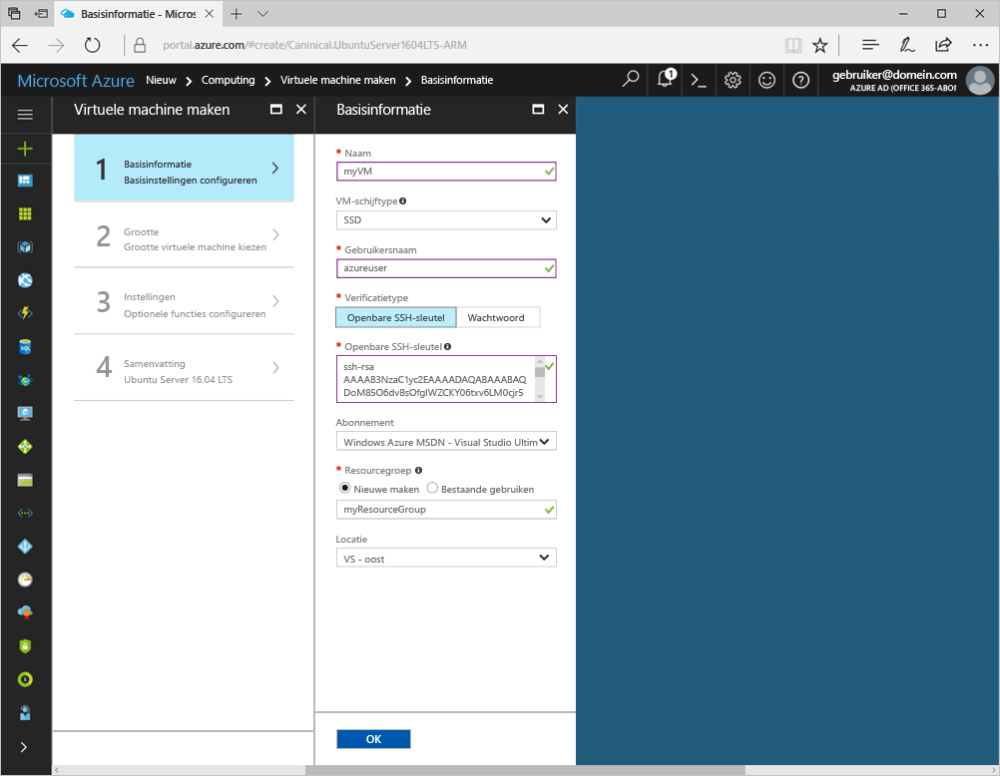
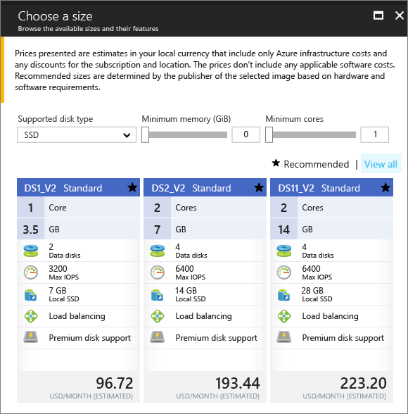

# <a name="create-a-linux-virtual-machine-with-the-azure-portal"></a><span data-ttu-id="7c486-103">Een virtuele Linux-machine maken met Azure Portal</span><span class="sxs-lookup"><span data-stu-id="7c486-103">Create a Linux virtual machine with the Azure portal</span></span>

<span data-ttu-id="7c486-104">Virtuele Azure-machines kunnen worden gemaakt via Azure Portal.</span><span class="sxs-lookup"><span data-stu-id="7c486-104">Azure virtual machines can be created through the Azure portal.</span></span> <span data-ttu-id="7c486-105">Deze methode biedt een gebruikersinterface op basis van een browser voor het maken en configureren van virtuele machines en alle verwante resources.</span><span class="sxs-lookup"><span data-stu-id="7c486-105">This method provides a browser-based user interface for creating and configuring virtual machines and all related resources.</span></span> <span data-ttu-id="7c486-106">In deze Quick Start gaat u een virtuele machine maken en een webserver installeren op de VM.</span><span class="sxs-lookup"><span data-stu-id="7c486-106">This Quickstart steps through creating a virtual machine and installing a webserver on the VM.</span></span>

<span data-ttu-id="7c486-107">Als u nog geen abonnement op Azure hebt, maak dan een [gratis account](https://azure.microsoft.com/free/?WT.mc_id=A261C142F) aan voordat u begint.</span><span class="sxs-lookup"><span data-stu-id="7c486-107">If you don't have an Azure subscription, create a [free account](https://azure.microsoft.com/free/?WT.mc_id=A261C142F) before you begin.</span></span>

## <a name="create-ssh-key-pair"></a><span data-ttu-id="7c486-108">Een SSH-sleutelpaar maken</span><span class="sxs-lookup"><span data-stu-id="7c486-108">Create SSH key pair</span></span>

<span data-ttu-id="7c486-109">U hebt een SSH-sleutelpaar nodig om deze Quick Start te volgen.</span><span class="sxs-lookup"><span data-stu-id="7c486-109">You need an SSH key pair to complete this quick start.</span></span> <span data-ttu-id="7c486-110">Als u een bestaand SSH-sleutelpaar hebt, kunt u deze stap overslaan.</span><span class="sxs-lookup"><span data-stu-id="7c486-110">If you have an existing SSH key pair, this step can be skipped.</span></span>

<span data-ttu-id="7c486-111">In een Bash-shell voert u deze opdracht uit en volgt u de aanwijzingen op het scherm.</span><span class="sxs-lookup"><span data-stu-id="7c486-111">From a Bash shell, run this command and follow the on-screen directions.</span></span> <span data-ttu-id="7c486-112">De uitvoer van de opdracht bevat de bestandsnaam van het bestand met de openbare sleutel.</span><span class="sxs-lookup"><span data-stu-id="7c486-112">The command output includes the file name of the public key file.</span></span> <span data-ttu-id="7c486-113">Kopieer de inhoud van het bestand met de openbare sleutel naar het klembord.</span><span class="sxs-lookup"><span data-stu-id="7c486-113">Copy the contents of the public key file to the clipboard.</span></span>

```bash
ssh-keygen -t rsa -b 2048
```

## <a name="log-in-to-azure"></a><span data-ttu-id="7c486-114">Meld u aan bij Azure.</span><span class="sxs-lookup"><span data-stu-id="7c486-114">Log in to Azure</span></span> 

<span data-ttu-id="7c486-115">Meld u via http://portal.azure.com aan bij Azure Portal.</span><span class="sxs-lookup"><span data-stu-id="7c486-115">Log in to the Azure portal at http://portal.azure.com.</span></span>

## <a name="create-virtual-machine"></a><span data-ttu-id="7c486-116">Virtuele machine maken</span><span class="sxs-lookup"><span data-stu-id="7c486-116">Create virtual machine</span></span>

1. <span data-ttu-id="7c486-117">Klik op de knop **Nieuw** in de linkerbovenhoek van Azure Portal.</span><span class="sxs-lookup"><span data-stu-id="7c486-117">Click the **New** button found on the upper left-hand corner of the Azure portal.</span></span>

2. <span data-ttu-id="7c486-118">Selecteer **Compute** en selecteer vervolgens **Ubuntu Server 16.04 LTS**.</span><span class="sxs-lookup"><span data-stu-id="7c486-118">Select **Compute**, and then select **Ubuntu Server 16.04 LTS**.</span></span> 

3. <span data-ttu-id="7c486-119">Geef de informatie van de virtuele machine op.</span><span class="sxs-lookup"><span data-stu-id="7c486-119">Enter the virtual machine information.</span></span> <span data-ttu-id="7c486-120">Bij **Verificatietype** selecteert u **Openbare SSH-sleutel**.</span><span class="sxs-lookup"><span data-stu-id="7c486-120">For **Authentication type**, select **SSH public key**.</span></span> <span data-ttu-id="7c486-121">Wanneer u uw openbare SSH-sleutel plakt, verwijdert u alle voorloop- en volgspaties.</span><span class="sxs-lookup"><span data-stu-id="7c486-121">When pasting in your SSH public key, take care to remove any leading or trailing white space.</span></span> <span data-ttu-id="7c486-122">Na het voltooien klikt u op **OK**.</span><span class="sxs-lookup"><span data-stu-id="7c486-122">When complete, click **OK**.</span></span>

    

4. <span data-ttu-id="7c486-124">Selecteer een grootte voor de VM.</span><span class="sxs-lookup"><span data-stu-id="7c486-124">Select a size for the VM.</span></span> <span data-ttu-id="7c486-125">Kies om meer groottes weer te geven de optie **Alle weergeven** of wijzig het filter **Ondersteund schijftype**.</span><span class="sxs-lookup"><span data-stu-id="7c486-125">To see more sizes, select **View all** or change the **Supported disk type** filter.</span></span> 

      

5. <span data-ttu-id="7c486-127">Handhaaf op de blade Instellingen de standaardwaarden en klik op **OK**.</span><span class="sxs-lookup"><span data-stu-id="7c486-127">On the settings blade, keep the defaults and click **OK**.</span></span>

6. <span data-ttu-id="7c486-128">Klik op de pagina Overzicht op **OK** om de implementatie van de virtuele machine te starten.</span><span class="sxs-lookup"><span data-stu-id="7c486-128">On the summary page, click **Ok** to start the virtual machine deployment.</span></span>

7. <span data-ttu-id="7c486-129">De VM wordt aan het dashboard van de Azure Portal vastgemaakt.</span><span class="sxs-lookup"><span data-stu-id="7c486-129">The VM will be pinned to the Azure portal dashboard.</span></span> <span data-ttu-id="7c486-130">Zodra de implementatie is voltooid, wordt de samenvattingsblade van de VM automatisch geopend.</span><span class="sxs-lookup"><span data-stu-id="7c486-130">Once the deployment has completed, the VM summary blade automatically opens.</span></span>


## <a name="connect-to-virtual-machine"></a><span data-ttu-id="7c486-131">Verbinding maken met de virtuele machine</span><span class="sxs-lookup"><span data-stu-id="7c486-131">Connect to virtual machine</span></span>

<span data-ttu-id="7c486-132">Maak een SSH-verbinding met de virtuele machine.</span><span class="sxs-lookup"><span data-stu-id="7c486-132">Create an SSH connection with the virtual machine.</span></span>

1. <span data-ttu-id="7c486-133">Klik op de knop **Verbinden** op de blade van de virtuele machine.</span><span class="sxs-lookup"><span data-stu-id="7c486-133">Click the **Connect** button on the virtual machine blade.</span></span> <span data-ttu-id="7c486-134">Op de knop Verbinden wordt een SSH-verbindingsreeks weergegeven die u kunt gebruiken om verbinding te maken met de virtuele machine.</span><span class="sxs-lookup"><span data-stu-id="7c486-134">The connect button displays an SSH connection string that can be used to connect to the virtual machine.</span></span>

     

2. <span data-ttu-id="7c486-136">Voer de volgende opdracht uit om een SSH-sessie te starten.</span><span class="sxs-lookup"><span data-stu-id="7c486-136">Run the following command to create an SSH session.</span></span> <span data-ttu-id="7c486-137">Vervang de verbindingsreeks door de reeks die u uit Azure Portal hebt gekopieerd.</span><span class="sxs-lookup"><span data-stu-id="7c486-137">Replace the connection string with the one you copied from the Azure portal.</span></span>

```bash 
ssh azureuser@40.112.21.50
```

## <a name="install-nginx"></a><span data-ttu-id="7c486-138">NGINX installeren</span><span class="sxs-lookup"><span data-stu-id="7c486-138">Install NGINX</span></span>

<span data-ttu-id="7c486-139">Gebruik het volgende bash-script om pakketbronnen bij te werken en het meest recente NGINX-pakket te installeren.</span><span class="sxs-lookup"><span data-stu-id="7c486-139">Use the following bash script to update package sources and install the latest NGINX package.</span></span> 

```bash 
#!/bin/bash

# update package source
sudo apt-get -y update

# install NGINX
sudo apt-get -y install nginx
```

<span data-ttu-id="7c486-140">Wanneer u klaar bent, sluit u de SSH-sessie af en geeft u de VM-eigenschappen op in de Azure Portal.</span><span class="sxs-lookup"><span data-stu-id="7c486-140">When done, exit the SSH session and return the VM properties in the Azure portal.</span></span>


## <a name="open-port-80-for-web-traffic"></a><span data-ttu-id="7c486-141">Poort 80 openen voor webverkeer</span><span class="sxs-lookup"><span data-stu-id="7c486-141">Open port 80 for web traffic</span></span> 

<span data-ttu-id="7c486-142">Een netwerkbeveiligingsgroep (NSG) beveiligt binnenkomend en uitgaand verkeer.</span><span class="sxs-lookup"><span data-stu-id="7c486-142">A Network security group (NSG) secures inbound and outbound traffic.</span></span> <span data-ttu-id="7c486-143">Wanneer een VM wordt gemaakt in de Azure Portal, wordt een inkomende regel gemaakt op poort 22 voor SSH-verbindingen.</span><span class="sxs-lookup"><span data-stu-id="7c486-143">When a VM is created from the Azure portal, an inbound rule is created on port 22 for SSH connections.</span></span> <span data-ttu-id="7c486-144">Omdat deze VM fungeert als host voor een webserver, moet een NSG-regel worden gemaakt voor poort 80.</span><span class="sxs-lookup"><span data-stu-id="7c486-144">Because this VM hosts a webserver, an NSG rule needs to be created for port 80.</span></span>

1. <span data-ttu-id="7c486-145">Klik op de virtuele machine op de naam van de **Resourcegroep**.</span><span class="sxs-lookup"><span data-stu-id="7c486-145">On the virtual machine, click the name of the **Resource group**.</span></span>
2. <span data-ttu-id="7c486-146">Selecteer de **netwerkbeveiligingsgroep**.</span><span class="sxs-lookup"><span data-stu-id="7c486-146">Select the **network security group**.</span></span> <span data-ttu-id="7c486-147">De NSG kan worden geïdentificeerd met behulp van de kolom **Type**.</span><span class="sxs-lookup"><span data-stu-id="7c486-147">The NSG can be identified using the **Type** column.</span></span> 
3. <span data-ttu-id="7c486-148">Klik op het menu links bij instellingen op **Beveiligingsregels voor binnenkomend verkeer**.</span><span class="sxs-lookup"><span data-stu-id="7c486-148">On the left-hand menu, under settings, click **Inbound security rules**.</span></span>
4. <span data-ttu-id="7c486-149">Klik op **Toevoegen**.</span><span class="sxs-lookup"><span data-stu-id="7c486-149">Click on **Add**.</span></span>
5. <span data-ttu-id="7c486-150">Typ bij **Naam** **http**.</span><span class="sxs-lookup"><span data-stu-id="7c486-150">In **Name**, type **http**.</span></span> <span data-ttu-id="7c486-151">Zorg ervoor dat het **poortbereik** is ingesteld op 80 en **Actie** is ingesteld op **Toestaan**.</span><span class="sxs-lookup"><span data-stu-id="7c486-151">Make sure **Port range** is set to 80 and **Action** is set to **Allow**.</span></span> 
6. <span data-ttu-id="7c486-152">Klik op **OK**.</span><span class="sxs-lookup"><span data-stu-id="7c486-152">Click **OK**.</span></span>


## <a name="view-the-nginx-welcome-page"></a><span data-ttu-id="7c486-153">De welkomstpagina van NGINX weergeven</span><span class="sxs-lookup"><span data-stu-id="7c486-153">View the NGINX welcome page</span></span>

<span data-ttu-id="7c486-154">Als NGINX is geïnstalleerd en poort 80 is geopend voor de VM, is de webserver nu toegankelijk vanaf het internet.</span><span class="sxs-lookup"><span data-stu-id="7c486-154">With NGINX installed, and port 80 open to your VM, the webserver can now be accessed from the internet.</span></span> <span data-ttu-id="7c486-155">Open een webbrowser en voer het openbare IP-adres van de VM in.</span><span class="sxs-lookup"><span data-stu-id="7c486-155">Open a web browser, and enter the public IP address of the VM.</span></span> <span data-ttu-id="7c486-156">U vindt het openbare IP-adres op de blade Virtuele machines in Azure Portal.</span><span class="sxs-lookup"><span data-stu-id="7c486-156">The public IP address can be found on the VM blade in the Azure portal.</span></span>

 

## <a name="clean-up-resources"></a><span data-ttu-id="7c486-158">Resources opschonen</span><span class="sxs-lookup"><span data-stu-id="7c486-158">Clean up resources</span></span>

<span data-ttu-id="7c486-159">Wanneer u de virtuele machine niet meer nodig hebt, verwijdert u de resourcegroep, de machine zelf én alle gerelateerde resources.</span><span class="sxs-lookup"><span data-stu-id="7c486-159">When no longer needed, delete the resource group, virtual machine, and all related resources.</span></span> <span data-ttu-id="7c486-160">Hiervoor selecteert u de resourcegroep op de blade van de virtuele machine en klikt u op **Verwijderen**.</span><span class="sxs-lookup"><span data-stu-id="7c486-160">To do so, select the resource group from the virtual machine blade and click **Delete**.</span></span>

## <a name="next-steps"></a><span data-ttu-id="7c486-161">Volgende stappen</span><span class="sxs-lookup"><span data-stu-id="7c486-161">Next steps</span></span>

<span data-ttu-id="7c486-162">In deze Snel starten hebt u een eenvoudige virtuele machine geïmplementeerd, een netwerkbeveiligingsgroepregel gemaakt en een webserver geïnstalleerd.</span><span class="sxs-lookup"><span data-stu-id="7c486-162">In this quick start, you’ve deployed a simple virtual machine, a network security group rule, and installed a web server.</span></span> <span data-ttu-id="7c486-163">Voor meer informatie over virtuele machines in Azure, gaat u verder met de zelfstudie voor virtuele Linux-machines.</span><span class="sxs-lookup"><span data-stu-id="7c486-163">To learn more about Azure virtual machines, continue to the tutorial for Linux VMs.</span></span>

> [!div class="nextstepaction"]
> [<span data-ttu-id="7c486-164">Zelfstudies over virtuele Linux-machines</span><span class="sxs-lookup"><span data-stu-id="7c486-164">Azure Linux virtual machine tutorials</span></span>](./tutorial-manage-vm.md)
