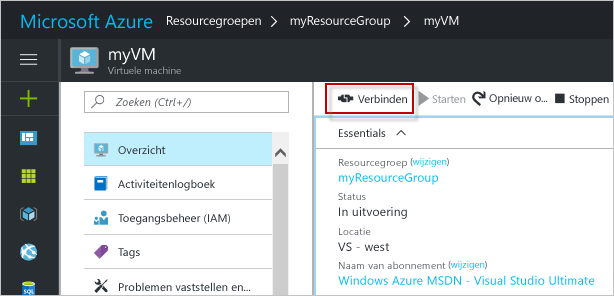

# <a name="create-a-windows-virtual-machine-with-hello-azure-portal"></a><span data-ttu-id="9e4fc-103">Maken van een virtuele machine van Windows Hello Azure-portal</span><span class="sxs-lookup"><span data-stu-id="9e4fc-103">Create a Windows virtual machine with hello Azure portal</span></span>

<span data-ttu-id="9e4fc-104">Azure virtuele machines kunnen worden gemaakt via hello Azure-portal.</span><span class="sxs-lookup"><span data-stu-id="9e4fc-104">Azure virtual machines can be created through hello Azure portal.</span></span> <span data-ttu-id="9e4fc-105">Deze methode biedt een gebruikersinterface op basis van een browser voor het maken en configureren van virtuele machines en alle verwante resources.</span><span class="sxs-lookup"><span data-stu-id="9e4fc-105">This method provides a browser-based user interface for creating and configuring virtual machines and all related resources.</span></span> <span data-ttu-id="9e4fc-106">Met deze stappen Quick Start via een virtuele machine maken en de installatie van een webserver op Hallo VM.</span><span class="sxs-lookup"><span data-stu-id="9e4fc-106">This Quickstart steps through creating a virtual machine and installing a webserver on hello VM.</span></span>

<span data-ttu-id="9e4fc-107">Als u nog geen abonnement op Azure hebt, maak dan een [gratis account](https://azure.microsoft.com/free/?WT.mc_id=A261C142F) aan voordat u begint.</span><span class="sxs-lookup"><span data-stu-id="9e4fc-107">If you don't have an Azure subscription, create a [free account](https://azure.microsoft.com/free/?WT.mc_id=A261C142F) before you begin.</span></span>

## <a name="log-in-tooazure"></a><span data-ttu-id="9e4fc-108">Meld u bij tooAzure</span><span class="sxs-lookup"><span data-stu-id="9e4fc-108">Log in tooAzure</span></span>

<span data-ttu-id="9e4fc-109">Toohello aanmelden met Azure-portal op http://portal.azure.com.</span><span class="sxs-lookup"><span data-stu-id="9e4fc-109">Log in toohello Azure portal at http://portal.azure.com.</span></span>

## <a name="create-virtual-machine"></a><span data-ttu-id="9e4fc-110">Virtuele machine maken</span><span class="sxs-lookup"><span data-stu-id="9e4fc-110">Create virtual machine</span></span>

1. <span data-ttu-id="9e4fc-111">Klik op Hallo **nieuw** knop gevonden op Hallo linkerbovenhoek Hallo Azure-portal.</span><span class="sxs-lookup"><span data-stu-id="9e4fc-111">Click hello **New** button found on hello upper left-hand corner of hello Azure portal.</span></span>

2. <span data-ttu-id="9e4fc-112">Selecteer **Compute** en vervolgens **Windows Server 2016 Datacenter**.</span><span class="sxs-lookup"><span data-stu-id="9e4fc-112">Select **Compute**, and then select **Windows Server 2016 Datacenter**.</span></span> 

3. <span data-ttu-id="9e4fc-113">Geef informatie op Hallo virtuele machine.</span><span class="sxs-lookup"><span data-stu-id="9e4fc-113">Enter hello virtual machine information.</span></span> <span data-ttu-id="9e4fc-114">Hallo-gebruikersnaam en wachtwoord die u hier invoert is gebruikte toolog in toohello virtuele machine.</span><span class="sxs-lookup"><span data-stu-id="9e4fc-114">hello user name and password entered here is used toolog in toohello virtual machine.</span></span> <span data-ttu-id="9e4fc-115">Na het voltooien klikt u op **OK**.</span><span class="sxs-lookup"><span data-stu-id="9e4fc-115">When complete, click **OK**.</span></span>

      

4. <span data-ttu-id="9e4fc-117">Selecteer een grootte voor Hallo VM.</span><span class="sxs-lookup"><span data-stu-id="9e4fc-117">Select a size for hello VM.</span></span> <span data-ttu-id="9e4fc-118">toosee meer grootte en selecteer **weergeven van alle** of wijzig de Hallo **ondersteund schijftype** filter.</span><span class="sxs-lookup"><span data-stu-id="9e4fc-118">toosee more sizes, select **View all** or change hello **Supported disk type** filter.</span></span> 

      

5. <span data-ttu-id="9e4fc-120">Op de blade beleidinstellingen Hallo Hallo standaardinstellingen behouden en klik op **OK**.</span><span class="sxs-lookup"><span data-stu-id="9e4fc-120">On hello settings blade, keep hello defaults and click **OK**.</span></span>

6. <span data-ttu-id="9e4fc-121">Klik op de overzichtspagina Hallo **Ok** implementatie van de virtuele machine toostart Hallo.</span><span class="sxs-lookup"><span data-stu-id="9e4fc-121">On hello summary page, click **Ok** toostart hello virtual machine deployment.</span></span>

7. <span data-ttu-id="9e4fc-122">Hallo VM is vastgemaakt toohello Azure-portaldashboard.</span><span class="sxs-lookup"><span data-stu-id="9e4fc-122">hello VM will be pinned toohello Azure portal dashboard.</span></span> <span data-ttu-id="9e4fc-123">Zodra het Hallo-implementatie is voltooid, wordt automatisch Hallo VM samenvatting blade geopend.</span><span class="sxs-lookup"><span data-stu-id="9e4fc-123">Once hello deployment has completed, hello VM summary blade automatically opens.</span></span>


## <a name="connect-toovirtual-machine"></a><span data-ttu-id="9e4fc-124">Verbinding maken met toovirtual machine</span><span class="sxs-lookup"><span data-stu-id="9e4fc-124">Connect toovirtual machine</span></span>

<span data-ttu-id="9e4fc-125">Maak een verbinding met extern bureaublad toohello virtuele machine.</span><span class="sxs-lookup"><span data-stu-id="9e4fc-125">Create a remote desktop connection toohello virtual machine.</span></span>

1. <span data-ttu-id="9e4fc-126">Klik op Hallo **Connect** knop op de eigenschappen van de virtuele machine Hallo.</span><span class="sxs-lookup"><span data-stu-id="9e4fc-126">Click hello **Connect** button on hello virtual machine properties.</span></span> <span data-ttu-id="9e4fc-127">Er wordt een Remote Desktop Protocol-bestand (.rdp) gemaakt en gedownload.</span><span class="sxs-lookup"><span data-stu-id="9e4fc-127">A Remote Desktop Protocol file (.rdp file) is created and downloaded.</span></span>

     

2. <span data-ttu-id="9e4fc-129">tooconnect tooyour VM, open Hallo gedownload RDP-bestand.</span><span class="sxs-lookup"><span data-stu-id="9e4fc-129">tooconnect tooyour VM, open hello downloaded RDP file.</span></span> <span data-ttu-id="9e4fc-130">Als u hierom wordt gevraagd, klikt u op **Verbinden**.</span><span class="sxs-lookup"><span data-stu-id="9e4fc-130">If prompted, click **Connect**.</span></span> <span data-ttu-id="9e4fc-131">Op een Mac moet u een RDP-client, zoals deze [extern bureaublad-Client](https://itunes.apple.com/us/app/microsoft-remote-desktop/id715768417?mt=12) van Hallo Mac App Store.</span><span class="sxs-lookup"><span data-stu-id="9e4fc-131">On a Mac, you need an RDP client such as this [Remote Desktop Client](https://itunes.apple.com/us/app/microsoft-remote-desktop/id715768417?mt=12) from hello Mac App Store.</span></span>

3. <span data-ttu-id="9e4fc-132">Voer Hallo-gebruikersnaam en wachtwoord die u hebt opgegeven bij het maken van Hallo virtuele machine en klik vervolgens op **Ok**.</span><span class="sxs-lookup"><span data-stu-id="9e4fc-132">Enter hello user name and password you specified when creating hello virtual machine, then click **Ok**.</span></span>

4. <span data-ttu-id="9e4fc-133">Foutbericht een certificaatwaarschuwing tijdens Hallo aanmelden.</span><span class="sxs-lookup"><span data-stu-id="9e4fc-133">You may receive a certificate warning during hello sign-in process.</span></span> <span data-ttu-id="9e4fc-134">Klik op **Ja** of **doorgaan** tooproceed met Hallo-verbinding.</span><span class="sxs-lookup"><span data-stu-id="9e4fc-134">Click **Yes** or **Continue** tooproceed with hello connection.</span></span>


## <a name="install-iis-using-powershell"></a><span data-ttu-id="9e4fc-135">IIS installeren met behulp van PowerShell</span><span class="sxs-lookup"><span data-stu-id="9e4fc-135">Install IIS using PowerShell</span></span>

<span data-ttu-id="9e4fc-136">Op Hallo virtuele machine, een PowerShell-sessie starten en Voer Hallo opdracht tooinstall IIS te volgen.</span><span class="sxs-lookup"><span data-stu-id="9e4fc-136">On hello virtual machine, start a PowerShell session and run hello following command tooinstall IIS.</span></span>

```powershell
Install-WindowsFeature -name Web-Server -IncludeManagementTools
```

<span data-ttu-id="9e4fc-137">Wanneer u klaar bent, sluit u Hallo RDP-sessie en retourneert Hallo VM-eigenschappen in hello Azure-portal.</span><span class="sxs-lookup"><span data-stu-id="9e4fc-137">When done, exit hello RDP session and return hello VM properties in hello Azure portal.</span></span>

## <a name="open-port-80-for-web-traffic"></a><span data-ttu-id="9e4fc-138">Poort 80 openen voor webverkeer</span><span class="sxs-lookup"><span data-stu-id="9e4fc-138">Open port 80 for web traffic</span></span> 

<span data-ttu-id="9e4fc-139">Een netwerkbeveiligingsgroep (NSG) beveiligt binnenkomend en uitgaand verkeer.</span><span class="sxs-lookup"><span data-stu-id="9e4fc-139">A Network security group (NSG) secures inbound and outbound traffic.</span></span> <span data-ttu-id="9e4fc-140">Wanneer een virtuele machine vanuit hello Azure-portal wordt gemaakt, wordt een inkomende regel gemaakt op poort 3389 voor RDP-verbindingen.</span><span class="sxs-lookup"><span data-stu-id="9e4fc-140">When a VM is created from hello Azure portal, an inbound rule is created on port 3389 for RDP connections.</span></span> <span data-ttu-id="9e4fc-141">Omdat deze virtuele machine fungeert als host voor een webserver, moet een regel voor het NSG toobe gemaakt voor poort 80.</span><span class="sxs-lookup"><span data-stu-id="9e4fc-141">Because this VM hosts a webserver, an NSG rule needs toobe created for port 80.</span></span>

1. <span data-ttu-id="9e4fc-142">Klik op de naam van de Hallo HALLO hallo voor virtuele machines **resourcegroep**.</span><span class="sxs-lookup"><span data-stu-id="9e4fc-142">On hello virtual machine, click hello name of hello **Resource group**.</span></span>
2. <span data-ttu-id="9e4fc-143">Selecteer Hallo **netwerkbeveiligingsgroep**.</span><span class="sxs-lookup"><span data-stu-id="9e4fc-143">Select hello **network security group**.</span></span> <span data-ttu-id="9e4fc-144">Hallo NSG kan worden geïdentificeerd met Hallo **Type** kolom.</span><span class="sxs-lookup"><span data-stu-id="9e4fc-144">hello NSG can be identified using hello **Type** column.</span></span> 
3. <span data-ttu-id="9e4fc-145">Klik op het Hallo links menu onder instellingen **inkomende beveiligingsregels**.</span><span class="sxs-lookup"><span data-stu-id="9e4fc-145">On hello left-hand menu, under settings, click **Inbound security rules**.</span></span>
4. <span data-ttu-id="9e4fc-146">Klik op **Toevoegen**.</span><span class="sxs-lookup"><span data-stu-id="9e4fc-146">Click on **Add**.</span></span>
5. <span data-ttu-id="9e4fc-147">Typ bij **Naam** **http**.</span><span class="sxs-lookup"><span data-stu-id="9e4fc-147">In **Name**, type **http**.</span></span> <span data-ttu-id="9e4fc-148">Zorg ervoor dat **poortbereik** too80 is ingesteld en **actie** te is ingesteld,**toestaan**.</span><span class="sxs-lookup"><span data-stu-id="9e4fc-148">Make sure **Port range** is set too80 and **Action** is set too**Allow**.</span></span> 
6. <span data-ttu-id="9e4fc-149">Klik op **OK**.</span><span class="sxs-lookup"><span data-stu-id="9e4fc-149">Click **OK**.</span></span>


## <a name="view-hello-iis-welcome-page"></a><span data-ttu-id="9e4fc-150">Weergave Hallo IIS-welkomstpagina</span><span class="sxs-lookup"><span data-stu-id="9e4fc-150">View hello IIS welcome page</span></span>

<span data-ttu-id="9e4fc-151">Met IIS geïnstalleerd en poort 80 tooyour VM open, Hallo webserver nu toegankelijk zijn vanuit Hallo internet.</span><span class="sxs-lookup"><span data-stu-id="9e4fc-151">With IIS installed, and port 80 open tooyour VM, hello webserver can now be accessed from hello internet.</span></span> <span data-ttu-id="9e4fc-152">Open een webbrowser en voer het openbare IP-adres Hallo Hallo VM.</span><span class="sxs-lookup"><span data-stu-id="9e4fc-152">Open a web browser, and enter hello public IP address of hello VM.</span></span> <span data-ttu-id="9e4fc-153">Hallo openbaar IP-adres, kunt u vinden op Hallo VM blade in hello Azure-portal.</span><span class="sxs-lookup"><span data-stu-id="9e4fc-153">hello public IP address can be found on hello VM blade in hello Azure portal.</span></span>

 

## <a name="clean-up-resources"></a><span data-ttu-id="9e4fc-155">Resources opschonen</span><span class="sxs-lookup"><span data-stu-id="9e4fc-155">Clean up resources</span></span>

<span data-ttu-id="9e4fc-156">Wanneer deze niet langer nodig is, resourcegroep hello, virtuele machine en alle gerelateerde resources verwijderd.</span><span class="sxs-lookup"><span data-stu-id="9e4fc-156">When no longer needed, delete hello resource group, virtual machine, and all related resources.</span></span> <span data-ttu-id="9e4fc-157">toodo dus resourcegroep Hallo Hallo virtuele machine blade selecteren en op **verwijderen**.</span><span class="sxs-lookup"><span data-stu-id="9e4fc-157">toodo so, select hello resource group from hello virtual machine blade and click **Delete**.</span></span>

## <a name="next-steps"></a><span data-ttu-id="9e4fc-158">Volgende stappen</span><span class="sxs-lookup"><span data-stu-id="9e4fc-158">Next steps</span></span>

<span data-ttu-id="9e4fc-159">In deze Snel starten hebt u een eenvoudige virtuele machine geïmplementeerd, een netwerkbeveiligingsgroepregel gemaakt en een webserver geïnstalleerd.</span><span class="sxs-lookup"><span data-stu-id="9e4fc-159">In this quick start, you’ve deployed a simple virtual machine, a network security group rule, and installed a web server.</span></span> <span data-ttu-id="9e4fc-160">toolearn meer informatie over virtuele machines in Azure, blijven toohello zelfstudie voor VM's van Windows.</span><span class="sxs-lookup"><span data-stu-id="9e4fc-160">toolearn more about Azure virtual machines, continue toohello tutorial for Windows VMs.</span></span>

> [!div class="nextstepaction"]
> [<span data-ttu-id="9e4fc-161">Zelfstudies over virtuele Windows-machines</span><span class="sxs-lookup"><span data-stu-id="9e4fc-161">Azure Windows virtual machine tutorials</span></span>](./tutorial-manage-vm.md)
