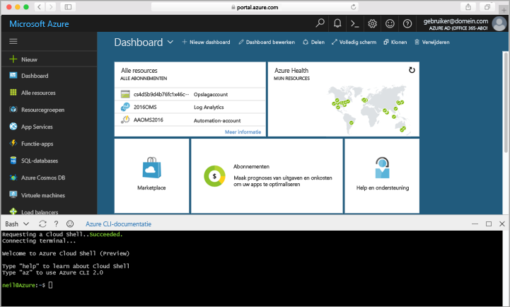

## Azure Cloud Shell startenLaunch Azure Cloud Shell

Hello Azure Cloud Shell is een gratis Bash-shell die u rechtstreeks vanuit hello Azure-portal kunt uitvoeren.hello Azure Cloud Shell is a free Bash shell that you can run directly within hello Azure portal. Hello Azure CLI vooraf is geïnstalleerd en geconfigureerd toouse met uw account heeft.It has hello Azure CLI preinstalled and configured toouse with your account. Klik op Hallo **Cloud Shell** knop op Hallo menu in Hallo rechtsboven Hallo [Azure-portal](https://portal.azure.com).Click hello **Cloud Shell** button on hello menu in hello upper-right of hello [Azure portal](https://portal.azure.com).

Hallo knop Start een interactieve shell waarmee u kunt toorun Hallo alle stappen in dit onderwerp:hello button launches an interactive shell that you can use toorun all of hello steps in this topic:

