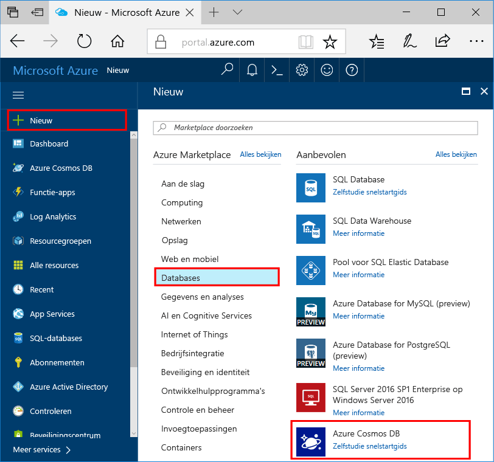
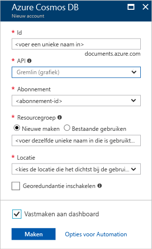

1. In een nieuw venster aanmelden toohello [Azure-portal](https://portal.azure.com/).
2. Klik in het linkerdeelvenster Hallo **nieuw**, klikt u op **Databases**, en klik vervolgens onder **Azure Cosmos DB**, klikt u op **maken**.
   
   

3. In Hallo **nieuwe account** blade Hallo-configuratie die u voor dit account Azure Cosmos DB wilt opgeven. 

    Met Azure Cosmos DB kunt u een van de vier programmeermodellen kiezen: Gremlin (Graph), MongoDB, SQL (DocumentDB) en Tabel (sleutelwaarde). Voor elk van deze modellen is momenteel een afzonderlijk account vereist.
       
    In dit artikel snel starten we programma tegen Hallo Graph API, dus kies **Gremlin (grafiek)** als u Hallo formulier invullen. Als u documentgegevens uit een catalogus-app, sleutelwaardegegevens (tabelgegevens) of gegevens die zijn gemigreerd uit een MongoDB-app hebt, moet u er rekening mee houden dat Azure Cosmos DB een zeer beschikbaar, globaal gedistribueerd databaseserviceplatform kan bieden voor alle bedrijfskritische toepassingen.

    Vul de velden Hallo op Hallo **nieuwe account** blade met Hallo informatie in Hallo volgende screenshot als richtlijn - waarden in de mogelijk anders dan Hallo-waarden in Hallo schermafbeelding.
 
    

    Instelling|Voorgestelde waarde|Beschrijving
    ---|---|---
    Id|*Unieke waarde*|Een unieke naam die dit Azure Cosmos DB-account identificeert. Omdat *documents.azure.com* is de toegevoegde toohello ID op te geven toocreate uw URI en gebruik een unieke maar persoonsgegevens-id. Hallo-ID moet bevatten alleen kleine letters, cijfers en Hallo koppelteken (-) en deze uit 3 too50 tekens moet bevatten.
    API|Gremlin (Graph)|We programma tegen Hallo [Graph API](../articles/cosmos-db/graph-introduction.md) verderop in dit artikel.|
    Abonnement|*Uw abonnement*|Hello Azure-abonnement dat u wilt de toouse voor dit account Azure Cosmos DB. 
    Resourcegroep|*Hallo dezelfde als ID waarde*|Hallo nieuwe Resourcegroepnaam voor uw account. U kunt voor eenvoud, Hallo dezelfde naam gebruiken als uw-ID. 
    Locatie|*Hallo regio dichtstbijzijnde tooyour gebruikers*|Hallo geografische locatie in welke toohost uw Azure DB die Cosmos-account. Hallo-locatie kiezen die het dichtst tooyour gebruikers toogive ze Hallo snelste toegang tot toohello gegevens.

4. Klik op **maken** toocreate Hallo-account.
5. Klik op de bovenste werkbalk Hallo Hallo **meldingen** pictogram  toomonitor Hallo-implementatieproces.

    

6.  Wanneer Hallo meldingen venster geeft aan Hallo implementatie is gelukt, sluit Hallo meldingsvenster en de nieuwe account open Hallo van Hallo **alle Resources** tegel op Hallo Dashboard. 

    
