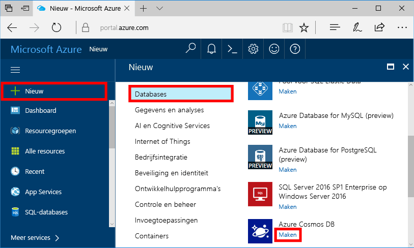
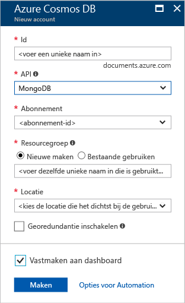
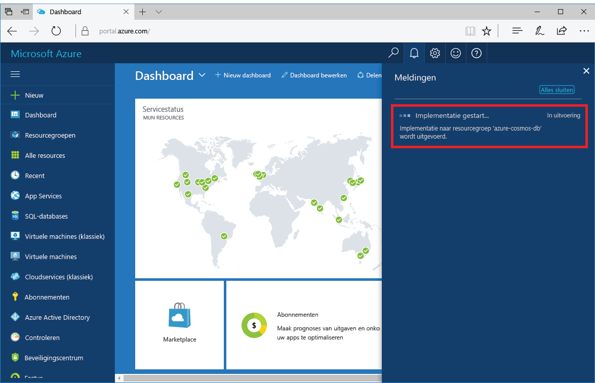
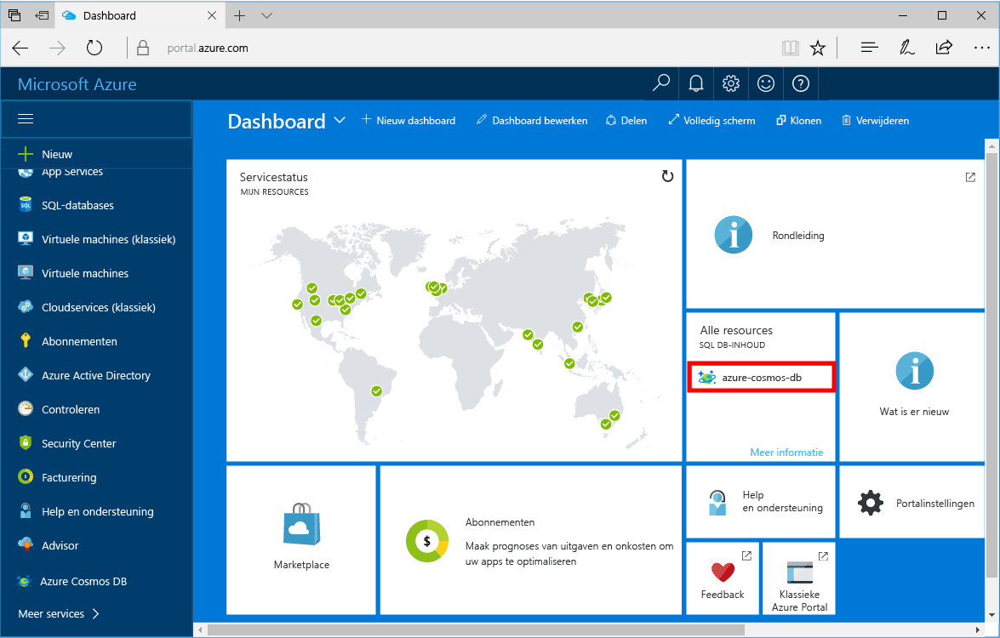

1. In een nieuw venster aanmelden toohello [Azure-portal](https://portal.azure.com/).In a new window, sign in toohello [Azure portal](https://portal.azure.com/).
2. Klik in het linkermenu hello, **nieuw**, klikt u op **Databases**, en klik vervolgens onder **Azure Cosmos DB**, klikt u op **maken**.In hello left menu, click **New**, click **Databases**, and then under **Azure Cosmos DB**, click **Create**.
   
   

3. In Hallo **nieuwe account** blade Hallo gewenste configuratie voor hello Azure DB die Cosmos-account opgeven.In hello **New account** blade, specify hello desired configuration for hello Azure Cosmos DB account. 

    Met Azure Cosmos DB kunt u een van de vier programmeermodellen kiezen: Gremlin (Graph), MongoDB, SQL (DocumentDB) en Tabel (sleutelwaarde).With Azure Cosmos DB, you can choose one of four programming models: Gremlin (graph), MongoDB, SQL (DocumentDB), and Table (key-value). 
       
    In deze snel starten we je worden programmeren tegen Hallo MongoDB-API zodat u kiest **MongoDB** als u Hallo formulier invullen.In this quick start we'll be programming against hello MongoDB API so you'll choose **MongoDB** as you fill out hello form. Maar als u grafiekgegevens voor een sociale media-app hebt, documentgegevens uit een catalogus-app, sleutelwaardegegevens (tabelgegevens), moet u er rekening mee houden dat Azure Cosmos DB een zeer beschikbare, globaal gedistribueerd databaseserviceplatform kan bieden voor alle bedrijfskritische toepassingen.But if you have graph data for a social media app, document data from a catalog app, or key/value (table) data, realize that Azure Cosmos DB can provide a highly available, globally-distributed database service platform for all your mission-critical applications.

    Hallo invullen **nieuwe account** blade Hallo informatie via in Hallo tabel als richtlijn.Fill out hello **New account** blade using hello information in hello table as a guide.
 
    
   
    InstellingSetting|Voorgestelde waardeSuggested value|BeschrijvingDescription
    ---|---|---
    IdID|*Unieke waarde**Unique value*|Een unieke naam u tooidentify hello Azure DB die Cosmos-account.A unique name you choose tooidentify hello Azure Cosmos DB account. *Documents.Azure.com* toegevoegde toohello id u voorzien toocreate uw URI, gebruikt u dus een uniek zijn maar persoonsgegevens-ID.*documents.azure.com* is appended toohello ID you provide toocreate your URI, so use a unique but identifiable ID. Hallo-ID mag alleen kleine letters, cijfers en Hallo bevatten '-' bevatten, en moet tussen 3 en 50 tekens.hello ID may contain only lowercase letters, numbers, and hello '-' character, and must be between 3 and 50 characters.
    APIAPI|MongoDBMongoDB|Er moet worden programming tegen Hallo [MongoDB API](../articles/documentdb/documentdb-protocol-mongodb.md) verderop in dit artikel.We'll be programming against hello [MongoDB API](../articles/documentdb/documentdb-protocol-mongodb.md) later in this article.|
    AbonnementSubscription|*Uw abonnement**Your subscription*|Hallo Azure-abonnement dat u toouse hello Azure DB die Cosmos-account wenst.hello Azure subscription that you want toouse for hello Azure Cosmos DB account. 
    ResourcegroepResource Group|*Hallo dezelfde als ID waarde**hello same value as ID*|Hallo nieuwe Resourcegroepnaam voor uw account.hello new resource group name for your account. U kunt voor eenvoud, Hallo dezelfde naam gebruiken als uw-ID.For simplicity, you can use hello same name as your ID. 
    LocatieLocation|*Hallo regio dichtstbijzijnde tooyour gebruikers**hello region closest tooyour users*|Hallo geografische locatie in welke toohost uw Azure DB die Cosmos-account.hello geographic location in which toohost your Azure Cosmos DB account. Hallo-locatie kiezen die het dichtst tooyour gebruikers toogive ze Hallo snelste toegang tot toohello gegevens.Choose hello location closest tooyour users toogive them hello fastest access toohello data.

4. Klik op **maken** toocreate Hallo-account.Click **Create** toocreate hello account.
5. Op de werkbalk Hallo **meldingen** toomonitor Hallo-implementatieproces.On hello toolbar, click **Notifications** toomonitor hello deployment process.

    

6.  Wanneer het Hallo-implementatie is voltooid, de nieuwe account open Hallo van Hallo alle Resources tegel.When hello deployment is complete, open hello new account from hello All Resources tile. 

    
