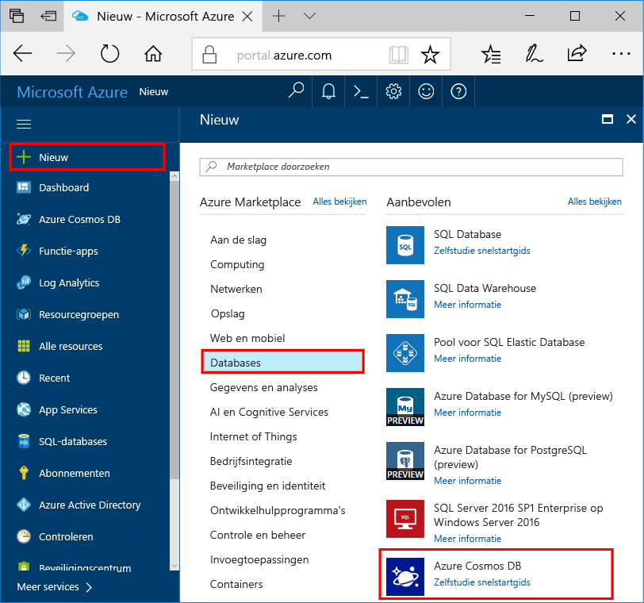

1. In een nieuw venster aanmelden toohello [Azure-portal](https://portal.azure.com/).In a new window, sign in toohello [Azure portal](https://portal.azure.com/).
2. Klik in het linkermenu hello, **nieuw**, klikt u op **Databases**, en klik vervolgens onder **Azure Cosmos DB**, klikt u op **maken**.In hello left menu, click **New**, click **Databases**, and then under **Azure Cosmos DB**, click **Create**.
   
   

3. In Hallo **nieuwe account** blade Hallo gewenste configuratie voor hello Azure DB die Cosmos-account opgeven.In hello **New account** blade, specify hello desired configuration for hello Azure Cosmos DB account. 

    Met Azure Cosmos DB kunt u een van de vier programmeermodellen kiezen: Gremlin (Graph), MongoDB, SQL (DocumentDB) en Tabel (sleutelwaarde).With Azure Cosmos DB, you can choose one of four programming models: Gremlin (graph), MongoDB, SQL (DocumentDB), and Table (key-value). 
    
    In deze snel starten we je worden programmeren tegen Hallo tabel API dus u kiest **tabel (sleutelwaarde)** als u Hallo formulier invullen.In this quick start we'll be programming against hello Table API so you'll choose **Table (key-value)** as you fill out hello form. Maar als u grafiekgegevens voor een sociale media-app hebt, documentgegevens uit een catalogus-app, of gegevens die zijn gemigreerd uit een MongoDB-app, moet u er rekening mee houden dat Azure Cosmos DB een zeer beschikbare, globaal gedistribueerd databaseserviceplatform kan bieden voor alle bedrijfskritische toepassingen.But if you have graph data for a social media app, document data from a catalog app, or data migrated from a MongoDB app, realize that Azure Cosmos DB can provide a highly available, globally-distributed database service platform for all your mission-critical applications.

    Hallo nieuwe blade-account met behulp van Hallo informatie als richtlijn in Hallo schermafbeelding invullen.Fill out hello New account blade using hello information in hello screenshot as a guide. U kiest unieke waarden op als u uw account instellen zodat uw waarden wordt Hallo schermopname niet exact overeenkomen.You will choose unique values as you set up your account so your values will not match hello screenshot exactly. 
 
    

    InstellingSetting|Voorgestelde waardeSuggested value|BeschrijvingDescription
    ---|---|---
    IdID|*Unieke waarde**Unique value*|Een unieke naam u tooidentify hello Azure DB die Cosmos-account.A unique name you choose tooidentify hello Azure Cosmos DB account. *Documents.Azure.com* toegevoegde toohello id u voorzien toocreate uw URI, gebruikt u dus een uniek zijn maar persoonsgegevens-ID.*documents.azure.com* is appended toohello ID you provide toocreate your URI, so use a unique but identifiable ID. Hallo-ID mag alleen kleine letters, cijfers en Hallo bevatten '-' bevatten, en moet tussen 3 en 50 tekens.hello ID may contain only lowercase letters, numbers, and hello '-' character, and must be between 3 and 50 characters.
    APIAPI|Tabel (sleutelwaarde)Table (key-value)|Er moet worden programming tegen Hallo [tabel API](../articles/cosmos-db/table-introduction.md) verderop in dit artikel.We'll be programming against hello [Table API](../articles/cosmos-db/table-introduction.md) later in this article.|
    AbonnementSubscription|*Uw abonnement**Your subscription*|Hallo Azure-abonnement dat u toouse hello Azure DB die Cosmos-account wenst.hello Azure subscription that you want toouse for hello Azure Cosmos DB account. 
    ResourcegroepResource Group|*Hallo dezelfde als ID waarde**hello same value as ID*|Hallo nieuwe Resourcegroepnaam voor uw account.hello new resource group name for your account. U kunt voor eenvoud, Hallo dezelfde naam gebruiken als uw-ID.For simplicity, you can use hello same name as your ID. 
    LocatieLocation|*Hallo regio dichtstbijzijnde tooyour gebruikers**hello region closest tooyour users*|Hallo geografische locatie in welke toohost uw Azure DB die Cosmos-account.hello geographic location in which toohost your Azure Cosmos DB account. Hallo-locatie kiezen die het dichtst tooyour gebruikers toogive ze Hallo snelste toegang tot toohello gegevens.Choose hello location closest tooyour users toogive them hello fastest access toohello data.   

4. Klik op **maken** toocreate Hallo-account.Click **Create** toocreate hello account.
5. Op de werkbalk Hallo **meldingen** toomonitor Hallo-implementatieproces.On hello toolbar, click **Notifications** toomonitor hello deployment process.

    

6.  Wanneer het Hallo-implementatie is voltooid, de nieuwe account open Hallo van Hallo alle Resources tegel.When hello deployment is complete, open hello new account from hello All Resources tile. 

    
