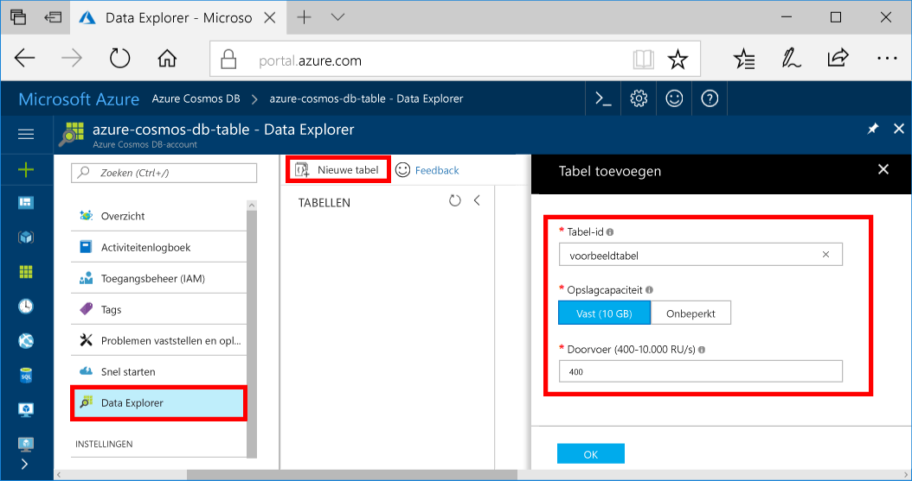

U kunt nu gebruiken van Data Explorer toocreate een tabel en gegevens tooyour database toevoegen. 

1. Klik in de Azure-portal in het navigatiemenu Hallo Hallo op **Data Explorer (Preview)**. 
2. Klik op Hallo Data Explorer blade **nieuwe tabel**, vul vervolgens met behulp van de volgende informatie Hallo Hallo-pagina.

    

    Instelling|Voorgestelde waarde|Beschrijving
    ---|---|---
    Tabel-id|voorbeeldtabel|Hallo-ID voor de nieuwe tabel. Tabelnamen Hallo hebben dezelfde vereisten als de database-id's teken. Databasenamen moeten tussen de 1 en 255 tekens zijn en mogen geen `/ \ # ?` bevatten of eindigen op een spatie.
    Opslagcapaciteit| 10 GB|Laat de standaardwaarde Hallo. Dit is de opslagcapaciteit Hallo van Hallo-database.
    Doorvoer|400 RU‘s|Laat de standaardwaarde Hallo. U kunt opschalen van Hallo [doorvoer](../articles/cosmos-db/request-units.md) hoger als u wilt dat tooreduce latentie.

3. Zodra het Hallo-formulier wordt ingevuld, klikt u op **OK**.
