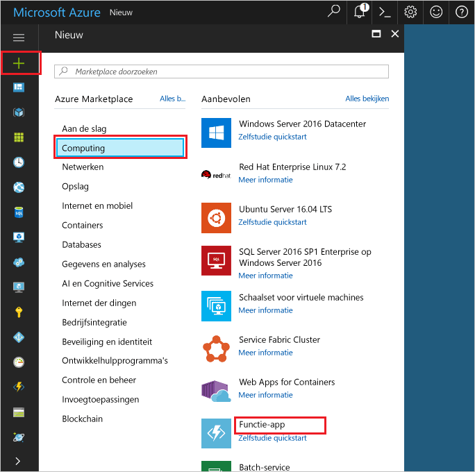

1. Klik op Hallo **nieuw** knop gevonden op Hallo linkerbovenhoek Hallo Azure-portal.Click hello **New** button found on hello upper left-hand corner of hello Azure portal.

1. Klik op **Compute** > **Functie-app**, selecteer uw **Abonnement**.Click **Compute** > **Function App**, select your **Subscription**. Vervolgens Hallo functie app-instellingen gebruikt zoals opgegeven in de tabel Hallo.Then, use hello function app settings as specified in hello table.

    

    | InstellingSetting      | Voorgestelde waardeSuggested value  | BeschrijvingDescription                                        |
    | ------------ |  ------- | -------------------------------------------------- |
    | **Naam van app****App name** | Wereldwijd unieke naamGlobally unique name | Naam waarmee uw nieuwe functie-app wordt aangeduid.Name that identifies your new function app. | 
    | **[Resourcegroep](../articles/azure-resource-manager/resource-group-overview.md)****[Resource Group](../articles/azure-resource-manager/resource-group-overview.md)** |  myResourceGroupmyResourceGroup | Geef een naam voor de nieuwe resourcegroep in welke toocreate Hallo functie-app.Name for hello new resource group in which toocreate your function app. | 
    | **[Hostingplan](../articles/azure-functions/functions-scale.md)****[Hosting plan](../articles/azure-functions/functions-scale.md)** |   VerbruiksabonnementConsumption plan | Hosting plan die definieert hoe tooyour functie-app worden toegewezen.Hosting plan that defines how resources are allocated tooyour function app. In de standaard Hallo **verbruik plannen**, bronnen dynamisch zoals vereist door uw functies zijn toegevoegd.In hello default **Consumption Plan**, resources are added dynamically as required by your functions. U betaalt alleen voor Hallo tijd die uw functies worden uitgevoerd.You only pay for hello time your functions run.   |
    | **Locatie****Location** | West-EuropaWest Europe | Kies een locatie in de buurt of in de buurt van andere services die door uw functies worden gebruikt.Choose a location near you or near other services your functions will access. |
    | **[Opslagaccount](../articles/storage/common/storage-create-storage-account.md#create-a-storage-account)****[Storage account](../articles/storage/common/storage-create-storage-account.md#create-a-storage-account)** |  Wereldwijd unieke naamGlobally unique name |  Naam van Hallo nieuwe opslagaccount die wordt gebruikt door de functie-app.Name of hello new storage account used by your function app. Namen van opslagaccounts moeten tussen 3 en 24 tekens lang zijn en mogen alleen cijfers en kleine letters bevatten.Storage account names must be between 3 and 24 characters in length and may contain numbers and lowercase letters only. U kunt ook een bestaand account gebruiken.You can also use an existing account. |

1. Klik op **maken** tooprovision en Hallo nieuwe functie-app implementeren.Click **Create** tooprovision and deploy hello new function app.
