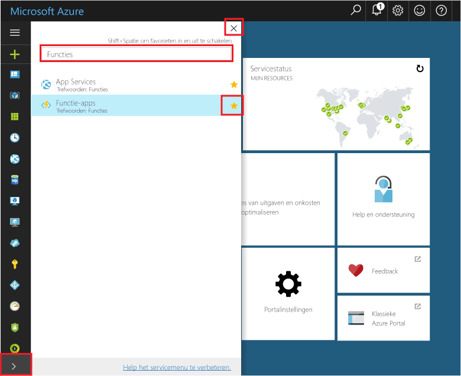

## Functie Apps tooyour portal Favorieten toevoegen 

Als u dit nog niet hebt gedaan, kunt u de functie Apps tooyour Favorieten toevoegen in hello Azure-portal. Dit maakt het eenvoudiger toofind uw apps functie. Als u dit al gedaan hebt, moet u de volgende sectie toohello overslaan. 

1. Meld u bij toohello [Azure-portal](https://portal.azure.com/).

2. Klik op Hallo onder links tooexpand Hallo-pijl alle services, type `Functions` in Hallo **Filter** veld en klik vervolgens op Hallo ster volgende te**functie Apps**.  
 
    

    Hallo functies pictogram toohello menu wordt toegevoegd aan de linkerkant Hallo van Hallo-portal.

3. Hallo menu sluit en schuif naar beneden toohello onder toosee Hallo functies pictogram. Klik op dit pictogram toosee een lijst met alle functie-apps. Klik op de functie app-toowork met functies in deze app. 
 
    
 
     