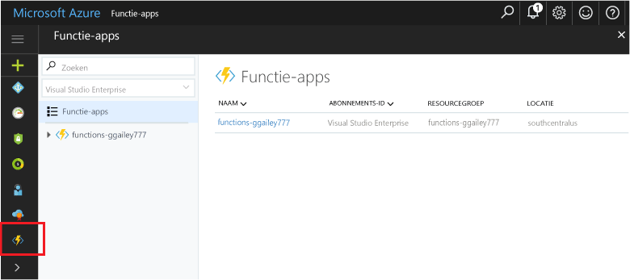

## Functie Apps tooyour portal Favorieten toevoegenAdd Function Apps tooyour portal favorites 

Als u dit nog niet hebt gedaan, kunt u de functie Apps tooyour Favorieten toevoegen in hello Azure-portal.If you haven't already done so, add Function Apps tooyour favorites in hello Azure portal. Dit maakt het eenvoudiger toofind uw apps functie.This makes it easier toofind your function apps. Als u dit al gedaan hebt, moet u de volgende sectie toohello overslaan.If you have already done this, skip toohello next section. 

1. Meld u bij toohello [Azure-portal](https://portal.azure.com/).Log in toohello [Azure portal](https://portal.azure.com/).

2. Klik op Hallo onder links tooexpand Hallo-pijl alle services, type `Functions` in Hallo **Filter** veld en klik vervolgens op Hallo ster volgende te**functie Apps**.Click hello arrow at hello bottom left tooexpand all services, type `Functions` in hello **Filter** field, and then click hello star next too**Function Apps**.  
 
    

    Hallo functies pictogram toohello menu wordt toegevoegd aan de linkerkant Hallo van Hallo-portal.This adds hello Functions icon toohello menu on hello left of hello portal.

3. Hallo menu sluit en schuif naar beneden toohello onder toosee Hallo functies pictogram.Close hello menu, then scroll down toohello bottom toosee hello Functions icon. Klik op dit pictogram toosee een lijst met alle functie-apps.Click this icon toosee a list of all your function apps. Klik op de functie app-toowork met functies in deze app.Click your function app toowork with functions in this app. 
 
    
 
     