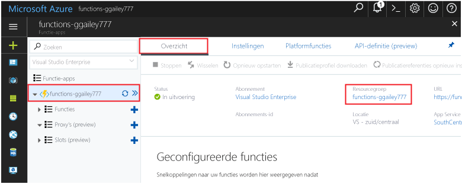

Andere Quick Starts in deze verzameling zijn op deze Quick Start gebaseerd.Other quick starts in this collection build upon this quick start. Als u van plan toocontinue toowork daaropvolgende snel aan de slag of met Hallo zelfstudies bent, Hallo-resources die zijn gemaakt in deze snelle opruimen start niet.If you plan toocontinue on toowork with subsequent quick starts or with hello tutorials, do not clean up hello resources created in this quick start. 

Als u niet van plan toocontinue bent, klikt u op Hallo **resourcegroep** voor functie-app in Hallo-portal en klik op Hallo **verwijderen**.If you do not plan toocontinue, click hello **Resource group** for hello function app in hello portal, and then click **Delete**. 

