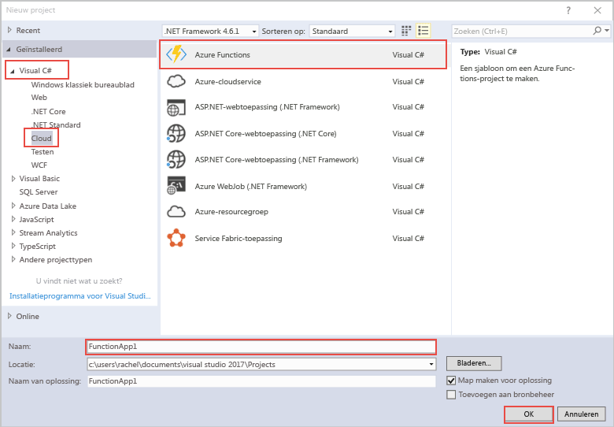

De Azure Functions-projectsjabloon in Visual Studio maakt een project dat kan worden gepubliceerd in een functie-app in Azure.The Azure Functions project template in Visual Studio creates a project that can be published to a function app in Azure. Met een functie-app kunt u functies groeperen in een logische eenheid, zodat u resources eenvoudiger kunt beheren, implementeren en delen.A function app lets you group functions as a logic unit for easier management, deployment, and sharing of resources.   

1. Klik op de rechtermuisknop op het projectknooppunt in **Solution Explorer** en kies  > **Nieuw item****Toevoegen**.Right mouse click on the project node in **Solution Explorer**, then choose **Add** > **New Item**. Kies **Azure-functie** in het dialoogvenster.Choose **Azure Function** from the dialog box.

2. Breid in het dialoogvenster **Nieuw project** **Visual C#**  > **cloud**-knooppunt uit, selecteer **Azure-functies**, typ een **Naam** voor uw project en klik op **OK**.In the **New Project** dialog, expand **Visual C#** > **Cloud** node, select **Azure Functions**, type a **Name** for your project, and click **OK**. De functie-appnaam moet geldig zijn als een C#-naamruimte. Gebruik dus geen onderstrepingstekens, afbreekstreepjes of andere niet-alfanumerieke tekens.The function app name must be valid as a C# namespace, so don't use underscores, hyphens, or any other nonalphanumeric characters. 

    