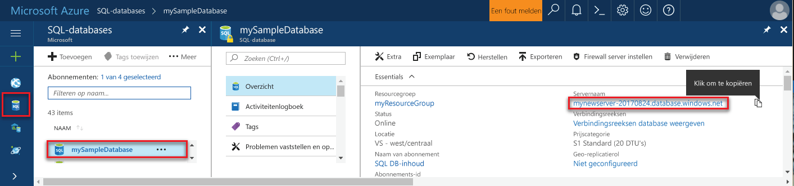

## Aanmelden bij Azure PortalLog in to the Azure portal

Meld u aan bij [Azure Portal](https://portal.azure.com/).Log in to the [Azure portal](https://portal.azure.com/).

## Maak een lege SQL-database met de Azure portalCreate a blank SQL database using the Azure portal

Een Azure SQL-database wordt gemaakt met een gedefinieerde set [reken- en opslagresources](../articles/sql-database/sql-database-service-tiers.md).An Azure SQL database is created with a defined set of [compute and storage resources](../articles/sql-database/sql-database-service-tiers.md). De database is gemaakt in een [Azure-resourcegroep](../articles/azure-resource-manager/resource-group-overview.md) en in een [logische Azure SQL Database-server](../articles/sql-database/sql-database-features.md).The database is created within an [Azure resource group](../articles/azure-resource-manager/resource-group-overview.md) and in an [Azure SQL Database logical server](../articles/sql-database/sql-database-features.md). 

Volg deze stappen voor het maken van een lege SQL-database.Follow these steps to create a blank SQL database. 

1. Klik op de knop **Nieuw** in de linkerbovenhoek van Azure Portal.Click the **New** button found on the upper left-hand corner of the Azure portal.

2. Selecteer **Databases** op de pagina **Nieuw** en selecteer **SQL-database** op de pagina **Databases**.Select **Databases** from the **New** page, and select **SQL Database** from the **Databases** page. 

   

3. Vul het formulier SQL Database in met de volgende informatie, zoals in de voorgaande afbeelding wordt weergegeven:Fill out the SQL Database form with the following information, as shown on the preceding image:   

   | InstellingSetting | Voorgestelde waardeSuggested value | BeschrijvingDescription |
   | --------| --------------- | ----------- | 
   | **Databasenaam****Database name** | mySampleDatabasemySampleDatabase | Zie [Database-id's](https://docs.microsoft.com/sql/relational-databases/databases/database-identifiers) voor geldige databasenamen.For valid database names, see [Database Identifiers](https://docs.microsoft.com/sql/relational-databases/databases/database-identifiers). | 
   | **Abonnement****Subscription** | Uw abonnementYour subscription  | Zie [Abonnementen](https://account.windowsazure.com/Subscriptions) voor meer informatie over uw abonnementen.For details about your subscriptions, see [Subscriptions](https://account.windowsazure.com/Subscriptions). |
   | **Resourcegroep****Resource group** | myResourceGroupmyResourceGroup | Zie [Naming conventions](https://docs.microsoft.com/azure/architecture/best-practices/naming-conventions) (Naamgevingsconventies) voor geldige resourcegroepnamen.For valid resource group names, see [Naming rules and restrictions](https://docs.microsoft.com/azure/architecture/best-practices/naming-conventions). |
   | **Bron selecteren****Select source** | Lege databaseBlank database | Hiermee geeft u op dat een lege database moet worden gemaakt.Specifies that a blank database should be created. |
   ||||

4. Klik op **Server** als u een nieuwe server voor de nieuwe database wilt maken en configureren.Click **Server** to create and configure a new server for your new database. Vul de **nieuwe serverformulier** met de volgende informatie:Fill out the **New server form** with the following information: 

   | InstellingSetting | Voorgestelde waardeSuggested value | BeschrijvingDescription |
   | --------| --------------- | ----------- | 
   | **Servernaam****Server name** | Een globaal unieke naam.Any globally unique name. | Zie [Naming conventions](https://docs.microsoft.com/azure/architecture/best-practices/naming-conventions) (Naamgevingsconventies) voor geldige servernamen.For valid server names, see [Naming rules and restrictions](https://docs.microsoft.com/azure/architecture/best-practices/naming-conventions). | 
   | **Aanmeldgegevens van serverbeheerder****Server admin login** | Een geldige naam.Any valid name. | Zie [Database-id's](https://docs.microsoft.com/sql/relational-databases/databases/database-identifiers) voor geldige aanmeldingsnamen.For valid login names, see [Database Identifiers](https://docs.microsoft.com/sql/relational-databases/databases/database-identifiers).|
   | **Wachtwoord****Password** | Een geldig wachtwoord.Any valid password. | Uw wachtwoord moet ten minste acht tekens bestaan en moet tekens bevatten uit drie van de volgende categorieën: hoofdletters, kleine letters, cijfers en niet-alfanumerieke tekens.Your password must have at least eight characters and must contain characters from three of the following categories: upper case characters, lower case characters, numbers, and non-alphanumeric characters. |
   | **Locatie****Location** | Geen enkele geldige locatie.Any valid location. | Zie [Azure-regio's](https://azure.microsoft.com/regions/) voor informatie over regio's.For information about regions, see [Azure Regions](https://azure.microsoft.com/regions/). |
   ||||

   

5. Klik op **Selecteren**.Click **Select**.

6. Klik op **Prijscategorie** om de servicelaag en het prestatieniveau voor de nieuwe database op te geven.Click **Pricing tier** to specify the service tier and performance level for your new database. Selecteer voor deze zelfstudie **20 dtu's** en **250** GB aan opslagruimte.For this tutorial, select **20 DTUs** and **250** GB of storage.

   

7. Klik op **Toepassen**.Click **Apply**.  

8. Selecteer een **sortering** voor de lege database (Gebruik de standaardwaarde voor deze zelfstudie).Select a **collation** for the blank database (for this tutorial, use the default value). Zie voor meer informatie over sorteringen [sorteringen](https://docs.microsoft.com/sql/t-sql/statements/collations)For more information about collations, see [Collations](https://docs.microsoft.com/sql/t-sql/statements/collations)

9. Klik op **Maken** om de database in te richten.Click **Create** to provision the database. Inrichting vergt over een minuut en een halve te voltooien.Provisioning takes about a minute and a half to complete. 

10. Klik op de werkbalk op **Meldingen** om het implementatieproces te bewaken.On the toolbar, click **Notifications** to monitor the deployment process.

   

## Een firewallregel op serverniveau met de Azure portal makenCreate a server-level firewall rule using the Azure portal

De service SQL Database maakt een firewall op niveau van de server.The SQL Database service creates a firewall at the server-level. De firewall wordt in eerste instantie voorkomen dat externe hulpprogramma's en toepassingen op de server of op alle databases op de server geen verbinding kan maken.Initially the firewall prevents external tools and applications from connecting to the server, or to any databases on the server. Verbindingen zijn toegestaan nadat een firewallregel is gemaakt om te openen, specifieke IP-adressen.Connections are allowed after a firewall rule is created to open specific IP addresses. Volg deze stappen voor het maken van een [SQL-Database firewallregel op serverniveau](../articles/sql-database/sql-database-firewall-configure.md) voor IP-adres van de client, en voor externe verbindingen via de firewall SQL-Database voor uw IP-adres.Follow these steps to create a [SQL Database server-level firewall rule](../articles/sql-database/sql-database-firewall-configure.md) for your client's IP address, and to enable external connectivity through the SQL Database firewall for your IP address only. 

> [!NOTE]
> Azure SQL Database communiceert via poort 1433.Azure SQL Database communicates over port 1433. U kunt verbinding maken met SQL Database pas nadat de firewall van uw netwerk uitgaand verkeer via poort 1433 kunt.You can connect to SQL Database only after the firewall of your network allows outbound traffic through port 1433.

1. Wanneer de implementatie is voltooid, klikt u op **SQL Databases** in het menu aan de linkerkant. Klik vervolgens op de pagina **SQL Databases** op **mySampleDatabase**.After the deployment completes, click **SQL databases** from the left-hand menu and then click **mySampleDatabase** on the **SQL databases** page. De overzichtspagina voor uw database wordt geopend, met de volledig gekwalificeerde servernaam (zoals **mynewserver20170313.database.windows.net**) en opties voor verdere configuratie.The overview page for your database opens, showing you the fully qualified server name (such as **mynewserver20170313.database.windows.net**) and provides options for further configuration. Kopieer deze volledig gekwalificeerde servernaam voor later gebruik.Copy this fully qualified server name for use later.

   > [!IMPORTANT]
   > U hebt deze volledig gekwalificeerde servernaam nodig om in de volgende Quick Starts verbinding te maken met de server en de bijbehorende databases.You need this fully qualified server name to connect to your server and its databases in subsequent quick starts.
   > 

    

2. Klik op de werkbalk op **Serverfirewall instellen** zoals in de vorige afbeelding is weergegeven.Click **Set server firewall** on the toolbar as shown in the previous image. De pagina **Firewallinstellingen** voor de SQL Database-server wordt geopend.The **Firewall settings** page for the SQL Database server opens. 

    

3. Klik op **IP van client toevoegen** op de werkbalk om uw huidige IP-adres aan een nieuwe firewallregel toe te voegen.Click **Add client IP** on the toolbar to add your current IP address to a new firewall rule. Een firewallregel kan poort 1433 openen voor een afzonderlijk IP-adres of voor een aantal IP-adressen.A firewall rule can open port 1433 for a single IP address or a range of IP addresses.

4. Klik op **Opslaan**.Click **Save**. Er wordt een firewallregel op serverniveau gemaakt voor uw huidige IP-adres waarbij poort 1433 op de logische server wordt geopend.A server-level firewall rule is created for your current IP address opening port 1433 on the logical server.

    

4. Klik op **OK** en sluit de pagina **Firewallinstellingen**.Click **OK** and then close the **Firewall settings** page.

U kunt nu verbinding maken met de Azure SQL Database-server en de databases met een hulpprogramma zoals SQL Server Management Studio (SSMS).You can now connect to the Azure SQL Database server and its databases by using a tool such as SQL Server Management Studio (SSMS). De verbinding van deze IP-adres en de eerder gemaakte server-beheerdersaccount wordt gebruikt.The connection is from this IP address, and it uses the server admin account created previously.

> [!IMPORTANT]
> Voor alle Azure-services is toegang via de SQL Database-firewall standaard ingeschakeld.By default, access through the SQL Database firewall is enabled for all Azure services. Klik op **UIT** op deze pagina om dit voor alle Azure-services uit te schakelen.Click **OFF** on this page to disable for all Azure services.

## Verbinding met de Azure portal tekenreekswaarden ophalenGet connection string values using the Azure portal

Haal de volledig gekwalificeerde servernaam van uw Azure SQL Database-server op uit Azure Portal.Get the fully qualified server name for your Azure SQL Database server in the Azure portal. U gebuikt de volledig gekwalificeerde servernaam om verbinding met uw server te maken via SQL Server Management Studio.You use the fully qualified server name to connect to your server using SQL Server Management Studio.

1. Meld u aan bij [Azure Portal](https://portal.azure.com/).Log in to the [Azure portal](https://portal.azure.com/).

2. Selecteer **SQL-databases** in het menu links en klik op uw database op de pagina **SQL-databases**.Select **SQL Databases** from the left-hand menu, and click your database on the **SQL databases** page. 

3. In het deelvenster **Essentials** van de Azure Portal-pagina van uw database kopieert u de **servernaam**.In the **Essentials** pane in the Azure portal page for your database, locate and then copy the **Server name**.

    
